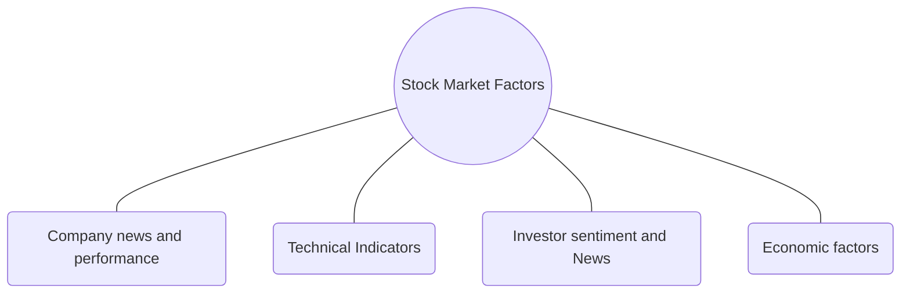

 

Review

# Towards Economic Sustainability: A Comprehensive Review of Artificial Intelligence and Machine Learning Techniques in Improving the Accuracy of Stock Market Movements

**Atoosa Rezaei 1,*, Iheb Abdellatif 2 and Amjad Umar 1**

1 Information Systems Engineering and Management, Harrisburg University of Science and Technology, Harrisburg, PA 17101, USA; aumar@harrisburgu.edu
2 Information Technology and Management, SUNY Plattsburgh, Plattsburgh, NY 12901, USA; iabde002@plattsburgh.edu
\* Correspondence: arezaei@my.harrisburgu.edu

**Abstract:** Accurately predicting stock market movements remains a critical challenge in finance, driven by the increasing role of algorithmic trading and the centrality of financial markets in economic sustainability. This study examines the incorporation of artificial intelligence (AI) and machine learning (ML) technologies to address gaps in identifying predictive factors, integrating diverse data sources, and optimizing methodologies. Employing a systematic review, recent advancements in ML techniques like deep learning, ensemble methods, and neural networks are analyzed, alongside emerging data sources such as traders' sentiment and real-time economic indicators. Results highlight the potential of unified datasets and adaptive models to enhance prediction accuracy while overcoming market volatility and data heterogeneity. The research underscores the necessity of integrating diverse predictive factors, innovative data sources, and advanced ML techniques to develop robust and adaptable forecasting frameworks. These findings offer valuable insights for academics and financial professionals, paving the way for more reliable and real-time predictive models that can enhance decision-making in dynamic market environments. This study contributes to advancing economic sustainability by proposing methodologies that align with the complexities and rapid evolution of modern financial markets.

**Keywords:** stock market prediction; artificial intelligence; machine learning; economic sustainability; deep learning; financial market analytics; predictive modeling; stock price factors

Academic Editor: Muhammad Ali Nasir

Received: 3 January 2025
Revised: 28 January 2025
Accepted: 7 February 2025
Published: 25 February 2025

**Citation:** Rezaei, A., Abdellatif, I., & Umar, A. (2025). Towards Economic Sustainability: A Comprehensive Review of Artificial Intelligence and Machine Learning Techniques in Improving the Accuracy of Stock Market Movements. *International Journal of Financial Studies*, 13(1), 28. https://doi.org/10.3390/ijfs13010028

**Copyright:** © 2025 by the authors. Licensee MDPI, Basel, Switzerland. This article is an open access article distributed under the terms and conditions of the Creative Commons Attribution (CC BY) license (https://creativecommons.org/licenses/by/4.0/).

## 1. Introduction

Accurately predicting stock market movement is one of the most enduring challenges in modern finance. It also holds enormous potential for both individual and institutional investors. In addition, the relationship between stock market evolution and sustainable economic growth is well-established (Owusu, 2016; Kaur & Chaudhary, 2022). Over recent decades, there has been a marked surge in the general population's engagement with the stock market, as evidenced by the daily trading of assets worth billions of dollars on stock exchanges worldwide (Chordia et al., 2011). This upswing in market participation is driven by the aim of earning profits over various investment periods. The prospect of predicting market movements accurately offers a significant opportunity for both individual and institutional investors to secure returns that surpass those of the market, adjusted for risk.

This aspiration has catalyzed the adoption of machine learning and computational intelligence techniques in developing models for precise stock market forecasts. Numerous

---

studies have embarked on this quest, yielding sophisticated predictive models that, in some instances, have been profitable (Sedighi et al., 2019; Y. Song et al., 2019; Armano et al., 2005; Weng et al., 2018). Stock market prediction stands as a particularly pertinent yet formidable challenge within the realm of financial research. Addressing the gaps in predictive factors, data sources, and machine learning models is crucial not only for advancing academic research but also for developing comprehensive and adaptable frameworks capable of navigating the complexities of modern financial markets. By identifying and integrating a broader range of predictive factors, utilizing diverse and innovative data sources, and refining machine learning methodologies, researchers can enhance model robustness and prediction accuracy. This, in turn, improves return forecasting and the pricing of risk, providing evidence that AI/ML techniques can contribute to more efficient markets and better risk management. (Moody & Saffell, 2001).

*Research Gap*

Despite extensive advancements in stock market prediction techniques, significant gaps remain that hinder the development of universally robust models. Current research often falls short in integrating emerging data sources and fails to consistently adapt to the dynamic nature of financial markets. Addressing these gaps is crucial for improving the accuracy and applicability of predictive models across varying economic conditions and datasets. This systematic review aims to comprehensively explore the following three identified gaps, evaluate the current state of research, and identify opportunities for further exploration that could lead to more accurate and timely predictions of stock prices.

*   Research gap 1: Factors influencing stock market

One of the primary challenges in this domain is the identification and utilization of predictive factors that significantly influence stock prices. Historically, financial analysts and researchers have focused on fundamental analysis, including financial ratios and industry trends, and technical analysis that examines patterns in price movements and trading volume (H.-C. Wang et al., 2023). However, these traditional approaches do not always account for the sudden market shifts influenced by geopolitical events, economic news, or technological innovations, suggesting a gap in the predictive factors commonly employed.

*   Research gap 2: Integration of diverse data sources

The rise in big data and machine learning technologies has transformed the landscape of financial analytics by providing new data sources and analytical techniques. Non-traditional data sources, such as sentiment analysis from social media platforms and real-time economic indicators, are increasingly being explored for their predictive potential in forecasting market movement, enhancing risk assessment, and informing data-driven investment strategies (Bollen et al., 2011). This integration of diverse data sources presents a critical gap in standardization and validation, as the financial sector has yet to reach a consensus on the most effective data types and sources for predicting stock movements. Furthermore, the heterogeneity of data in terms of format, frequency, and reliability complicates its integration into standard predictive models, often leading to inconsistent outcomes. The absence of widely accepted protocols for data cleaning, feature engineering, and quality assessment remains a significant limitation, underscoring the need for a standardized framework that ensures replicability across different studies and markets.

*   Research gap 3: Methodologies and ML Techniques

The utilization of machine learning techniques in predicting stock prices is a rapidly evolving area that promises significant advancements but also poses considerable challenges. Techniques ranging from traditional regression models to complex neural networks have been explored, with varying degrees of success (Krauss et al., 2017). The effectiveness

---

of these models often depends on the context of their application, the quality of data, and their ability to adapt to market volatility. In particular, the lack of uniform guidelines for model selection, training, and performance evaluation complicates comparisons between studies, making it difficult to establish best practices. These inconsistencies underscore the need for consensus on standardized ML workflows—encompassing model architecture, hyperparameter tuning, and validation metrics—to facilitate broader adoption and reproducibility (Z. Gao et al., 2020). Thus, there is an ongoing debate about which machine learning techniques are most effective, leading to a third gap in the optimal methodological approaches for this research area.

## 2. Literature Review Methodology

In undertaking this systematic review, a structured and rigorous approach was adopted to collect and analyze the relevant literature addressing the identified gaps in predictive factors, data sources, and machine learning techniques for stock price prediction. The primary aim was to discern prevalent research trends, existing gaps, and recurring themes across the studies reviewed, specifically focusing on their application in financial markets.

The primary database chosen for sourcing scholarly articles was ScienceDirect, noted for its comprehensive collection of academic publications across various disciplines, including finance and technology. This selection was based on the platform’s widespread use in similar systematic reviews and its reputation for providing access to high-quality, peer-reviewed research. The search was restricted to materials published from 2020 onwards to ensure the review reflected the most recent advancements and current trends in financial analytics and predictive modeling.

An advanced search strategy was utilized, incorporating a carefully selected set of keywords combined using Boolean operators. The keywords included but were not limited to terms like “predictive analytics”, “big data”, “machine learning”, “artificial neural networks”, “support vector machines”, along with “stock prices”, “financial markets”, and “economic indicators.” The use of Boolean operators such as “OR” and “AND” was instrumental in creating a comprehensive search scope that encompassed a wide range of relevant topics within the finance domain.

To ensure a comprehensive and relevant systematic review, a structured keyword selection process was implemented. Keywords were selected based on their prevalence in the foundational and recent literature on stock market prediction and machine learning. Terms such as “predictive analytics”, “machine learning”, “deep learning”, “financial markets”, and “economic indicators” were identified as core descriptors of the research scope. Input from domain experts was sought to ensure that the selected keywords accurately represented critical aspects of the study. This step ensured alignment with established terminologies and emerging trends. Boolean operators such as “AND”, “OR”, and “NOT” were used strategically to create comprehensive search strings. For example, combinations like (“financial markets” OR “stock market”) AND (“machine learning” OR “deep learning”) were crafted to ensure breadth and specificity. This approach facilitated the identification of the relevant literature across diverse subtopics. After initial search results were obtained, keywords and combinations were refined based on the relevance of the retrieved articles. For example, terms like “economic sustainability” and “trading sentiment” were added to capture interdisciplinary perspectives

During the search process, a significant challenge was the limitation on the number of Boolean connectors, capped at eight per query on the database. This restriction necessitated multiple search iterations, occasionally leading to the retrieval of duplicate articles. To

---

address this, a thorough screening process was implemented, where duplicates were removed to ensure that each retained article provided unique contributions to the review.

The initial search yielded a total of 1789 articles. These were subjected to a stringent screening process, where each article’s title, abstract, and sometimes full text were evaluated to determine their relevance to the objectives of the review. The inclusion criteria were stringent, focusing on articles that examined the application of specific predictive factors, the utility of various data sources, or the efficacy of various machine learning approaches in the context of stock market movement. Articles that did not meet these criteria were excluded from further analysis.

This meticulous identification and categorization process laid the groundwork for the review, enabling the compilation of a curated collection of scholarly work that accurately reflects the present research in the intersection of machine learning, data analysis, and financial market prediction. Through this systematic approach, the review aims to provide a coherent and detailed examination of the evolving landscape of stock price prediction techniques, important factors in stock prediction, and relevant data sources, highlighting innovations and pointing out critical areas for future research and application in the financial sector.

Figure 1 depicts a schematic representation of these searches. The following are some examples of the search combinations used:

*   “stock price” AND “prediction”;
*   (“financial market” OR “stock market”) AND “machine learning”;
*   “economic indicator” AND “stock performance”;
*   “neural networks” AND “financial forecasting”;
*   “deep learning” AND “stock predictions” AND “data sources”.

Figure 1. Schematic representation of the literature searches.

These search combinations encompass a variety of relevant topics, from specific machine learning techniques and the types of data used to broader concepts like market efficiency and investment strategies. This approach helps explore the depth and breadth of research in the area of stock price prediction.

While the keyword selection process was robust, it is acknowledged that some significant works were initially omitted due to the database selection and the publishing year’s criteria. For instance, the highly relevant paper “Empirical Asset Pricing via Machine Learning” by Bryan Kelly was identified post hoc. This work is pivotal as it bridges theoretical asset pricing models with advanced machine learning techniques, providing insights directly applicable to the research focus. To address such omissions, a retrospective review was conducted to integrate critical works not captured during the initial search phase. The inclusion of these works has enhanced the comprehensiveness of the review by filling identified gaps in predictive factors, methodologies, and data sources. A particular emphasis was placed on validating the robustness of models through empirical evidence, demonstrating the integration of non-traditional data sources, such as sentiment and macroeconomic indicators, and exploring methodological innovations, including ensemble learning and

---

domain-specific adaptations of deep learning models and an expanded publishing year. This refined approach ensures that the literature review not only reflects the current state of research but also identifies pathways for future exploration.

This schematic search is completed for the stock price factors, data sources, and prediction techniques. The results of the search methods are divided into stock market factors, stock market data sources, and stock market prediction techniques.

# 3. Stock Market Factors

The factors influencing stock market movements are often referred to as market driving factors. These factors can be quantified, and one or more of them may contribute to the fluctuations in stock prices. Numerous studies have been conducted across different economic environments to identify the primary factors that impact stock market performance. While there are multiple factors that can affect stock prices, they typically result from a combination of elements rather than a single cause (J. Liu et al., 2023). The ongoing debates concerning factors with mixed effects on stock market volatility are still prevalent in financial research. For instance, some studies have identified a positive correlation between market sentiment and stock returns (Koratamaddi et al., 2021).

In the academic field, researchers continuously investigate the role of various macroeconomic indicators, such as GDP growth, inflation rates, and interest rates, and their correlations with stock market behavior (Ben-Nasr & Boubaker, 2024). Additionally, microeconomic factors, including company earnings, dividend policies, and sectoral performance, also play critical roles (Zhao et al., 2024). The complexity increases as global events, technological advancements, and political changes introduce additional layers of influence, making the prediction of stock market movement an ever-evolving challenge (Vo et al., 2021). Figure 2 shows the four main categories of factors that impact the stock prices.

Figure 2. Stock market impacting factors.

## 3.1. Technical Indicators

Technical indicators are pivotal tools used by traders and analysts to predict future stock market movements based on past and present price and volume data. The validity and reliability of various technical indicators in predicting stock market movement have been a subject of extensive empirical research, especially with the integration of advanced machine learning techniques. Table 1 presents a selection of studies conducted in this field.

*   Moving averages: Moving averages are widely used to smooth out price data and identify the direction of a stock’s trend. A recent study by Ma et al. (2021), explored the effectiveness of moving averages combined with machine learning models and found that the exponential moving average significantly enhances the predictive accuracy when used with reinforcement learning algorithms.

$$ \text{SMA} = \frac{P_1 + P_2 + \dots + P_n}{n}, $$

---

where $P_1, P_2, \dots P_n$ are the stock prices over the $n$ period.

* **Relative strength index (RSI):** The relative strength index (RSI) is a momentum oscillator that measures the speed and change in price movements on a scale from 0 to 100, primarily used to identify overbought or oversold conditions in the trading of an asset by comparing the magnitude of recent gains to recent losses. C. M. C. Lee and Zhong (2022) demonstrated that RSI, when incorporated into deep learning frameworks like Long Short-Term Memory (LSTM) networks, can provide meaningful insights into future price movements, particularly in volatile markets.

$$ \text{RSI} = 100 - \left( \frac{100}{1 + \text{RS}} \right), $$

where RS (relative strength) is the average of the number of days the stock closed up over a specified period divided by the average of the number of days the stock closed down over the same period.

* **MACD (moving average convergence divergence):** As a trend-following momentum indicator, MACD is crucial for identifying trend reversals. Research by Brandão et al. (2020) showed that MACD, when used in conjunction with vector autoregression models, predicts short-term price movements with higher precision.

$$ \text{MACD} = \text{EMA}_{\text{short}} - \text{EMA}_{\text{long}}, $$

where $\text{EMA}_{\text{short}}$ is the exponential moving average of the stock price over a shorter period (commonly 12 days) and $\text{EMA}_{\text{long}}$ is the exponential moving average over a longer period (commonly 26 days).

* **Bollinger Bands:** Bollinger Bands are a volatility indicator created by John Bollinger, consisting of a middle SMA (simple moving average) line and two standard deviation lines plotted above and below the middle line to measure market volatility and identify overbought or oversold conditions. A study by Ni et al. (2020) found that investors can outperform the market by taking long positions at the lower Bollinger Bands (BBs) and maintaining them at the upper BBs, indicating that momentum strategies are preferable to contrarian strategies in these scenarios. The implications of these findings highlight the effectiveness of Bollinger Bands in capturing market trends and emphasize the potential benefits of using momentum strategies in stock trading.

Middle Band: SMA = simple moving average of last $n$;
Upper Band: SMA + ($k \times$ standard deviation of price over last $n$ periods);
Lower Band: Lower Band = SMA $-$ ($k \times$ standard deviation of price over last $n$ periods),
where $n$ is typically 20 periods and $kk$ is typically 2, which adjusts how tight the Bands are around the price.

* **Fibonacci retracements:** Used to identify potential reversal levels, Fibonacci retracements have been studied by Tsinaslanidis et al. (2022), who identified a positive correlation between the breadth of the Fibonacci zone and the likelihood of detecting a price rebound.

$\text{Fibonacci Level} = \text{High} - (\text{High} - \text{Low}) \times \text{Fibonacci percentage}$

* **Volume-based indicators:** Volume is a significant component of market analysis, providing clues about the strength of a price move. According to research conducted by Ngene and Mungai (2022), lagged trading volume has a negative causal effect on returns at low quantiles and positive causal effects at high quantiles. One common volume-based indicator is the On-Balance Volume (OBV), which uses volume flow to

---

predict changes in stock price. This formula adds or subtracts each day’s volume to the cumulative total when the stock’s price closes higher or lower, respectively, showing how volume might confirm or deny price trends.

* Stochastic oscillator: This momentum indicator evaluates a specific stock’s closing price in relation to its price range over a defined period. Park et al. (2022) showed that stochastic oscillators, when used with convolutional neural networks (CNN), enhance the accuracy of stock market forecasts.

$$ \%K = \left( \frac{\text{close} - \text{Low}_n}{\text{High}_n - \text{Low}_n} \right) * 100, $$

where %K is the value of the Stochastic Oscillator, close is the closing price for the period, Low_{n} is the lowest price for the past n periods, High_{n} is the highest price for the past n periods, and n is typically set at 14 periods.

* Ichimoku cloud: A relatively comprehensive indicator that provides information on resistance, support, momentum, and trend direction. S. Deng et al. (2023) developed an intelligent trading decision support system, FRS-NSGA-II-SW, which incorporates fuzzy rough set, non-dominated sorting genetic algorithm-II, and sliding window techniques, enhanced with the Japanese Ichimoku KinkoHyo indicator for high-frequency crude oil futures trading in China. The system achieved superior performance metrics, including a 66.84% hit ratio, 20.39% accumulated return, 8.38% maximum drawdown, and a Sharpe ratio of 1.22.

* Parabolic SAR: This indicator is used to determine the direction of a stock’s momentum and the point of a potential reversal. In a study by Ashrafzadeh et al. (2023), the parabolic SAR was found to be particularly useful in algorithmic trading strategies that adapt to market conditions dynamically.

$$ \text{SAR today} = \text{SAR previous} + \text{AF} * (\text{EP} - \text{SAR previous}), $$

where SAR today is the current period’s SAR value, SAR previous is the previous period’s SAR value, and AF (acceleration factor) starts at 0.02 and increases by 0.02 each time the extreme point (EP) makes a new high (or low in a downtrend), up to a maximum of 0.20. EP (extreme point) is the highest high of the current uptrend or the lowest low of the current downtrend.

* Momentum indicators: Y. Li et al. (2023) introduced a novel momentum indicator that led to the development of a conditional past return (CPR) indicator, which incorporates directional belief information and significantly predicts one-month future market returns, providing unique predictive insights not captured by other predictors, with enhanced prediction from the interaction of positive past returns and consistent beliefs.

$$ \text{Momentum} = \text{Close current} - \text{Close n period ago} $$

These studies collectively demonstrate that while traditional technical indicators are valuable, their integration with modern machine learning and deep learning techniques significantly enhances their predictive power. The ongoing development in computational methods continues to open new pathways for exploiting these indicators more effectively in stock market prediction.

---

Table 1. Search samples based on “deep learning” AND “stock market” AND “united states” AND “Technical Indicator”.

| Research Paper                                                                                                                                                                       | Machine Learning Technique                                                                                                            | Keyword                                                                             |
| ------------------------------------------------------------------------------------------------------------------------------------------------------------------------------------ | ------------------------------------------------------------------------------------------------------------------------------------- | ----------------------------------------------------------------------------------- |
| Enhanced prediction of stock markets using a novel deep learning model PLSTM-TAL in urbanized smart cities (Latif et al., 2024)                                                      | Combining peephole LSTM with temporal attention layer (TAL)                                                                           | Bayesian optimization decomposition Peephole LSTM                           |
| Forecasting the overnight return direction of stock market index combining global market indices: A multiple-branch deep learning approach (R. Gao et al., 2022b)                    | Combining genetic algorithm                                                                                                           | Stock market index Deep learning Genetic algorithm                          |
| Integrating the sentiments of multiple news providers for stock market index movement prediction: A deep learning approach based on evidential reasoning rule (R. Gao et al., 2022a) | Recurrent neural network to build several base classifiers, and adopt the evidential reasoning rule to combine these base classifiers | Deep learning Evidential reasoning rule                                         |
| Stock market index prediction based on reservoir computing models (W\.-J. Wang et al., 2021)                                                                                         | Machine learning model of reservoir computing                                                                                         | Reservoir computing Deep learning                                               |
| Technical analysis strategy optimization using a machine learning approach in stock market indices (Ayala et al., 2021)                                                              | Technical indicator combined with machine learning approach                                                                           | Stock market prediction Machine learning Technical analysis                 |
| A dynamic predictor selection algorithm for predicting stock market movement (Dong et al., 2021)                                                                                     | Dynamic predictor selection algorithm (DPSA) that dynamically evaluates and selects the prediction model                              | Financial time series Time-weighted Deep learning ConvLSTM              |
| Prediction of stock price direction using a hybrid GA-XGBoost feature algorithm with a three-stage feature engineering process (Yun et al., 2021)                                    | Hybrid GA-XGBoost algorithm.                                                                                                          | Genetic algorithm XGBoost feature selection                                     |
| Constructing a stock-price forecast CNN model with gold and crude oil indicators (Q. Chen et al., 2020)                                                                              | Proposed algorithms based on 8 different input features, including financial technology indicators                                    | Deep learning Convolutional neural networks Long short-term memory          |
| Predicting price trends combining kinetic energy and deep reinforcement learning (Ghotbi & Zahedi, 2024)                                                                             | Combination of the kinetic energy formula and indicator signals                                                                       | Deep reinforcement learning                                                         |
| Market index price prediction using Deep Neural Networks with a Self-Similarity approach (Mendoza et al., 2023)                                                                      | Deep neural networks with a self-similarity approach                                                                                  | Deep learning Intraday data Index stock market Fractal geometry finance |

## 3.2. Company News and Performances

Fundamental analysis, which assesses a company’s financial health and broader economic factors to forecast stock prices, remains a cornerstone of investment strategies. This method typically involves the scrutiny of financial statements, market share, industry conditions, and economic indicators. Recent research has sought to combine these traditional approaches with advanced analytics to enhance prediction accuracy. Table 2 presents a selection of studies conducted in this field.

---

Table 2. Search samples based on “deep learning” AND “stock market” AND “Fundamental analysis”.

| Research Paper                                                                                                                                                       | Machine Learning Technique                                                                                                                                                            | Keywords                                                                                              |
| -------------------------------------------------------------------------------------------------------------------------------------------------------------------- | ------------------------------------------------------------------------------------------------------------------------------------------------------------------------------------- | ----------------------------------------------------------------------------------------------------- |
| Stock market index prediction using deep Transformer model (C. Wang et al., 2022)                                                                                    | Encoder–decoder architecture and the multi-head attention mechanism                                                                                                                   | Deep learning Transformer                                                                         |
| Decision-making system for stock exchange market using artificial emotions (Cabrera-Paniagua et al., 2015)                                                           | Support operations in the stock exchange market use strongly analytical indicators                                                                                                    | Deep learning Long short-term memory                                                              |
| GCNET: Graph-based prediction of stock price movement using graph convolutional network (Jafari & Haratizadeh, 2022)                                                 | The framework called GCNET models the relations among an arbitrary set of stocks as a graph structure called influence network                                                        | Deep learning Graph convolutional network Semi-supervised learning GCN                    |
| Optimizing investment portfolios with a sequential ensemble of decision tree-based models and the FBI algorithm for efficient financial analysis (Chou & Chen, 2024) | Sequential ensemble framework meticulously crafted for optimizing investment portfolios, focusing on the construction industry                                                        | Fundamental financial analysis Metaheuristic algorithm Forensic-Based Investigation algorithm |
| Enhancing quantitative intra-day stock return prediction by integrating both market news and stock prices information (X. Li et al., 2014a)                          | MKSVR, multiple kernel learning                                                                                                                                                       | Multitask learning Least squares support vector regression Financial time-series prediction   |
| Incorporating stock prices and text for stock movement prediction based on information fusion (Q. Zhang et al., 2024)                                                | A collaborative attention Transformer fusion model (CoATSMP), including parallel extraction of text and prices features, parameter-level fusion and a joint feature processing module | Stock prediction Fusion model Transformer                                                     |
| Stock market index prediction using deep Transformer model (C. Wang et al., 2022)                                                                                    | Encoder–decoder architecture and the multi-head attention mechanism                                                                                                                   | Deep learning Transformer                                                                         |
| Application of machine learning algorithms in the domain of financial engineering (X. Liu et al., 2024)                                                              | Adaptive lasso (ALasso), elastic net (Enet), artificial neural network (ANN), convolutional neural network (CNN), and long short-term memory (LSTM)                                   | Financial engineering Stock market Machine learning models Forecasting                    |
| LG-Trader: Stock trading decision support based on feature selection by weighted localized generalization error model (Ng et al., 2014)                              | Simultaneously using a genetic algorithm minimizing a new weighted localized generalization rrror (wL-GEM)                                                                            | Financial market Genetic Algorithm                                                                |

* **Financial ratios**: Financial ratios like price-to-earnings (P/E), price/earnings-to-growth (PEG), price-to-book (P/B), and debt-to-equity are pivotal in assessing a company’s valuation. A study by Kuppenheimer et al. (2023) demonstrates that using elastic net methods to analyze financial ratios from the Wharton Research Data Services (WRDS) can significantly forecast sector stock returns, revealing that predictive ratios vary across sectors. Notably, machine learning-driven portfolio strategies, both long and long-short, consistently outperform market benchmarks, enhancing investment returns and improving risk-adjusted performance metrics.

* **Earnings per share (EPS)**: EPS remains a critical determinant of company performance. Research by Q. Chen et al. (2020) revealed that EPS is a strong predictor of long-term stock performance, particularly when analyzed in conjunction with industry trends and macroeconomic factors.

* **Dividend yields**: Dividends are often a reflection of a company’s stability and profit distribution policy. Baker et al. (2020) found that while portfolios of dividend-paying stocks generally outperform non-dividend stocks, the performance does not signif-

---

icantly differ after accounting for dividend yield size, especially following cuts in market interest rates.

*   Industry conditions: Sectoral performance significantly influences individual stock prices. A study by Hoskins and Carson (2022) finds that the profitability of technologically diverse portfolios within U.S. manufacturing firms from 1976 to 2006 was significantly influenced by the firm’s market share and industry conditions, showing that higher technological diversity boosts profitability in contexts of high market share, low industry concentration, or low dynamism, whereas a focused technological approach benefits firms with low market share, high industry concentration, or high industry dynamism.
*   Regulatory environment: Changes in regulation can impact industry prospects and stock valuations. Blau et al. (2023) explores the influence of industry regulation on stock return comovement, finding that stocks in highly regulated industries exhibit greater comovement, and that the introduction of new regulations significantly enhances this comovement, as demonstrated through difference-in-differences tests examining changes around regulatory implementations.
*   Competitor analysis: Understanding a company’s competitive position can offer insights into its potential market performance. Werle and Laumer (2022) explores hybrid socio-technical systems combining data mining and expert knowledge for competitor identification in strategic management. They reveal that current approaches often miss indirect and potential competitors on the periphery of a company’s focus, increasing vulnerability to disruptive changes that typically begin as weak signals.

These studies underline the evolution of fundamental analysis from purely quantitative financial evaluation to a more holistic approach that incorporates both quantitative and qualitative data. By integrating traditional fundamental analysis with newer analytical techniques, researchers and investors can gain a deeper, more nuanced understanding of market dynamics and stock behavior.

## 3.3. Economic Factors

Economic factors play a significant role in influencing stock market performance. These factors include but are not limited to, GDP growth rates, inflation, interest rates, unemployment rates, and fiscal policies. Sophisticated statistical and ML models have been increasingly used to analyze how these macroeconomic indicators influence stock prices. This section reviews the recent literature that explores the relationship between various economic factors and stock market predictions. Table 3 presents a selection of studies conducted in this field.

*   Gross domestic product growth: GDP growth is a crucial indicator of economic health and directly impacts investor confidence and stock market performance. A study by Alexius and Sp (2018) confirms that in the G7 countries, national stock price indices exhibit cointegration with both domestic and international GDP, reflecting fundamental productivity trends that impact domestic economic growth and stock valuations
*   Inflation: Inflation affects the purchasing power of consumers and can influence corporate profits. Časta (2023) in a study showes that machine learning models incorporating inflation data could predict stock price fluctuations with a higher degree of accuracy than models without it.
*   Interest rates: Interest rates are pivotal in determining the cost of capital and can significantly affect stock prices. A study conducted by Conrad (2021) explores the impact of expansive monetary policy and interest rate changes on stock prices through behavioral experiments with students, finding that increases in money supply and decreases in interest rates directly boost share prices. These results support the hypoth-

---

esis that extremely expansive monetary policies with low, zero, or negative interest rates can foster financial bubbles in the stock market, emphasizing the need for a gradual policy reversal to avoid market crashes that could severely harm the financial system and real economy, akin to the 1929 crash.

*   Unemployment rates: Elevated unemployment rates often indicate economic hardship, which can adversely affect stock markets. Research by (S. Gu et al., 2020) shows that unemployment rate announcements consistently reduce financial market uncertainty across asset classes, including stocks, treasuries, commodities, and foreign currencies. Interestingly, a trading strategy that involves selling 10-year Treasury note volatility index futures prior to the announcement and closing the position afterward delivers an annualized Sharpe ratio of 3.79. Similarly, an intraday strategy using VIX futures achieves an impressive Sharpe ratio of 3.98 (S. Gu et al., 2020).
*   Exchange rates: Exchange rates can affect the competitiveness of a country’s goods and services. H. W. Chang and Chang (2023) analyze the relationships between real exchange rate, oil price, and stock market price in China from 2001 to 2022 using a Bayesian multivariate quantile-on-quantile with the GARCH approach. It reveals varying links between stock prices, both oil prices, and exchange rates across different quantiles and shows that market shock half-lives range from 0.415 to 4.015 days.
*   Fiscal policies: Government spending and taxation influence economic activities and, consequently, the stock market. André et al. (2023) investigate the impact of fiscal policy, particularly government spending shocks, on Euro Area stock markets at the effective lower bound (ELB) using a factor-augmented interacted panel vector-autoregressive (FAIPVAR) model. It reveals that government spending shocks have a stronger positive impact on stock returns during ELB periods compared to non-ELB periods, a result not mirrored in the United States according to a time series FAIVAR model.
*   Housing market indexes: The health of the housing market often reflects broader economic trends that affect consumer wealth and spending. Alqaralleh et al. (2023) explore the dynamics of housing prices in highly internationalized metropolises using wavelet coherency to assess co-movement and causality with stock markets and macroeconomic uncertainty. The study incorporates a novel method combining wavelet decomposition with a time-varying parameter vector autoregression model to examine volatility spillovers in housing markets. The findings reveal that housing markets in global hubs are significantly impacted by international shocks and show intensified correlations with stock markets and macroeconomic uncertainty during periods of turmoil.
*   Commodity prices: Commodity prices, especially oil, have a noted impact on the stock market. Fasanya et al. (2023) examine the predictability of stock prices in BRICS countries with significant reliance on commodities, revealing that commodity price fluctuations—both positive and negative—differently influence stock prices. Advanced forecasting models used in this study account for statistical complexities like conditional heteroskedasticity and endogeneity in predictors. Findings indicate that commodity prices can effectively predict stock prices in Brazil, Russia, and South Africa, with robust evidence supporting asymmetries in commodity price effects across different data samples and forecast periods.
*   Economic policy uncertainty: Economic policy uncertainty can cause market volatility. Hu et al. (2021) investigate volatility spillovers between global stock and international energy markets, analyzing how geopolitical risks (GPR), economic policy uncertainty (EPU), and the Climate Risk Index (Hu & Borjigin, 2024) amplify these dynamics during economic fluctuations. Using data from January 2003 to August 2023, the

---

study employs advanced models like TVP-VAR-SV and DCC-MVGARCH to examine dynamic spillovers, and DCC-MIDAS-X to gauge monthly impacts of GPR, CRI, and EPU. Findings indicate that these uncertainties significantly affect volatility spillovers, particularly during periods of economic recession and growth, with varying impacts depending on the economic climate. These uncertainties influence not only the direct relationships between major stock and energy markets but also the broader interactions across different international energy commodities.

Table 3. Search samples based on “deep learning” AND “stock market” AND “Economic Factors”.

| Research Paper                                                                                                                                          | Machine Learning Technique                                                                                                                 | Keywords                                                                                               |
| ------------------------------------------------------------------------------------------------------------------------------------------------------- | ------------------------------------------------------------------------------------------------------------------------------------------ | ------------------------------------------------------------------------------------------------------ |
| Adaptive stock trading strategies with deep reinforcement learning methods (Wu et al., 2020)                                                            | AR approach, SVR approach, MLP method, neural networks with a recurrent units model, a recurrent unit with a gate approach, and LSTM model | Sentiment analysis Crude oil price volatility Opinion mining                                   |
| Green finance and the socio-politico-economic factors’ impact on the future oil prices: Evidence from machine learning (Mohsin & Jamaani, 2023)         | Least Absolute Shrinkage and Selection Operator (LASSO) model                                                                              | LASSO model OLS Model Socio-politico-economic factors                                          |
| CPPCNDL: Crude oil price prediction using complex network and deep learning algorithms (Bristone et al., 2020)                                          | Long short-term memory (LSTM) of the deep learning algorithms                                                                              | Complex network analysis Deep learning K-core centrality                                       |
| Poly-linear regression with augmented long short term memory neural network: Predicting time series data (Ahmed et al., 2022)                           | A combination of poly-linear regression with long short-term memory (LSTM) and data augmentation                                           | Stock market prediction Regression Long short-term memory neural network                       |
| Multi-step-ahead stock price index forecasting using long short-term memory model with multivariate empirical mode decomposition (C. Deng et al., 2022) | Long Short-Term Memory (LSTM) with Multivariate Empirical Mode Decomposition (MEMD)                                                        | Multi-step-ahead forecasting Multivariate empirical mode decomposition                             |
| Modelling and forecasting high-frequency data with jumps based on a hybrid nonparametric regression and LSTM model (Y. Song et al., 2024)               | Nonparametric regression (NR) model based on kernel function                                                                               | High frequency financial data Nonparametric regression model Economic modeling and forecasting |
| Bitcoin price forecasting: A perspective of underlying blockchain transactions (Guo et al., 2021)                                                       | Wavelet transform (WT) and casual multi-head attention (CA) temporal convolutional network (TCN)                                           | Cryptocurrency Blockchain Bitcoin Price forecasting Deep learning                      |
| Transformer-based forecasting for intraday trading in the Shanghai crude oil market: Analyzing open-high-low-close prices (W. Huang et al., 2023)       | Transformer framework coupled with the model-driven and penalty term-based loss function designs.                                          | Shang crude oil futures Trading strategies Structural forecasting                              |
| House price forecasting with neural networks (X. Xu & Zhang, 2021)                                                                                      | Neural networks                                                                                                                            | House price Neural network Forecasting                                                         |

These studies illustrate that economic factors are integral to understanding and predicting stock market behaviors. By leveraging various advanced analytics techniques,

---

researchers are better equipped to quantify and predict how these macroeconomic indicators influence stock markets across different sectors and regions.

## 3.4. Investors Sentiment and News Analysis

Investor sentiment and news analysis have emerged as significant factors influencing stock market dynamics. Sentiment analysis involves interpreting and quantifying the emotional tone behind a series of words, used to gain an understanding of the attitudes, opinions, and emotions expressed in an online mention or news piece. This approach is increasingly being used alongside traditional financial metrics to provide a more comprehensive view of market trends. Table 4 presents a selection of studies conducted in this field.

* Social media sentiment: The impact of social media on stock prices is profound, as it serves as a real-time indicator of public sentiment. Study by X. Li et al. (2014b), analyzes the impact of social media sentiment on irrational herding behavior in the Chinese stock market, utilizing deep learning to assess sentiment in 227,353 microblog messages. The findings reveal a significant influence of social media sentiment on herding behavior, enhancing our understanding of investor behavior and providing insights for trading strategies and regulatory policies.
* Financial news: The tone and content of financial news can directly impact investor behavior and market outcomes. W.-C. Lin et al. (2022) explore the efficacy of various text mining techniques for stock market movement, employing text feature representation approaches like TF-IDF and word embeddings alongside machine learning methods such as deep learning. Through experiments with different combinations of feature representations (TF-IDF, Word2vec, ELMo, BERT) and learning models (SVM, CNN, LSTM), and utilizing financial news from Reuters, CNBC, and The Motley Fool, it is found that CNN combined with Word2vec and BERT yields the best results. The research highlights how the choice of news platforms and learning models significantly influences stock price predictions across different companies.
* Market rumors and information cascades: The spread of information, whether accurate or not, can have immediate effects on stock prices. A study by W. Zhang and Wang (2024) analyzes the impact of stock market rumors, sourced from investor interactive platforms, on price efficiency, finding that favorable rumors increase stock price synchronicity, while unfavorable rumors decrease it. Both types of rumors, however, are linked to higher mispricing levels and elevated stock price crash risk. Tests indicate that favorable rumors about industry leaders also affect adjacent firms, with more significant impacts on mispricing and crash risk in markets with higher proportions of retail investors. Additionally, smaller companies, those with low information transparency, and low institutional ownership suffer more severe effects from rumors on price efficiency.
* Economic forecasts: Sentiment regarding economic forecasts, as reflected in news and analyst reports, can sway investor expectations and market trends. Y. Huang et al. (2023) investigate the predictive power of non-U.S. economic policy uncertainty (EPU) indices on U.S. stock market excess returns, using data from ten developed countries and employing three diffusion models alongside five combination methods from January 1997 to January 2022. The findings reveal that international EPU indices are more effective predictors than the U.S. EPU index, challenging the prevailing notion that the U.S. primarily influences global markets. The results, confirmed through extensive testing including different forecast horizons and the pandemic period, underscore the importance of international economic indicators in forecasting U.S. market movements, providing valuable insights for managing global financial risks.

---

* **Investor forums and blogs:** Investor forums and blogs are rich sources of sentiment data. A study by C. M. C. Lee and Zhong (2022) reveals that from 2010 to 2017, Chinese investors asked about 2.5 million questions on an investor interactive platform (IIP), most answered within two weeks. Analyzing these interactions with a BERT-based algorithm revealed that these questions often relate to difficulties in processing public information. The findings show that active IIP use is associated with increased trading volume, volatility, market liquidity, and price informativeness, while reducing the bid-ask spread. The study suggests that IIPs play a crucial role in reducing information processing costs and enhancing stock price formation.

* **Geopolitical news:** Geopolitical events can create uncertainty that affects global markets. A study by Zaremba et al. (2022), using a news-based measure of geopolitical risk, explores its influence on asset pricing in global emerging markets and finds that increases in geopolitical risk can predict higher future stock returns. Specifically, countries experiencing the greatest rise in geopolitical uncertainty outperform those with the least change by up to 1% monthly. This pricing anomaly, linked to investors’ overreaction to geopolitical news influenced by availability bias, remains robust across various tests and is not explained by other known asset pricing effects.

Table 4. Search samples based on “deep learning” AND “stock market” AND “Sentiment Analysis”.

| Research Paper                                                                                                                                                                       | Machine Learning Technique                                                                                                                                     | Keywords                                                                                                             |
| ------------------------------------------------------------------------------------------------------------------------------------------------------------------------------------ | -------------------------------------------------------------------------------------------------------------------------------------------------------------- | -------------------------------------------------------------------------------------------------------------------- |
| Integrating the sentiments of multiple news providers for stock market index movement prediction: A deep learning approach based on evidential reasoning rule (R. Gao et al., 2022a) | Endows different weights to different news providers                                                                                                           | Multiple news providers Deep learning Evidential reasoning rule                                              |
| News-driven stock market index prediction based on trellis network and sentiment attention mechanism (W\.-J. Liu et al., 2024)                                                       | A news-driven stock market index prediction model based on TrellisNet and a sentiment attention mechanism (SA-TrellisNet)                                      | Trellis Network LSTM-CNN Sentiment attention mechanism                                                       |
| The evolution of studies on social media sentiment in the stock market: Insights from bibliometric analysis (Nyakurukwa & Seetharam, 2023)                                           | Uses co-citation, bibliographic coupling and co-occurrence analysis to provide an overview of the structure of social media sentiment within the stock market. | Social media sentiment Bibliometric analysis Textual sentiment Stock market                              |
| The role of text-extracted investor sentiment in Chinese stock price prediction with the enhancement of deep learning (Y. Li et al., 2020)                                           | Selections of different text classification algorithms, price forecasting models, time horizons, and information update schemes                                | Naïve Bayes classification algorithm Deep learning method                                                        |
| Exploring the use of emotional sentiment to understanding market response to unexpected corporate pivots (Cioroianu et al., 2024)                                                    | Emotion-based lexicon                                                                                                                                          | Emotional sentiment Price response Price efficiency                                                          |
| Stock Prediction by Integrating Sentiment Scores of Financial News and MLP-Regressor: A Machine Learning Approach (Maqbool et al., 2023)                                             | A machine learning model is proposed where the financial news is used along with historical stock price data to predict upcoming stock prices.                 | Financial news MLP Regressor News sentiment analysis                                                         |
| On exploring the impact of users’ bullish-bearish tendencies in online community on the stock market (Y. Qian et al., 2020)                                                          | Explores the impact of users’ bullish–bearish tendencies in online communities on the stock market                                                             | Online financial community Convolutional neural network Sentiment tendency Market volatility and returns |

---

Table 4. *Cont.*

| Research Paper                                                                                                                                     | Machine Learning Technique                                                                                                                                                                                             | Keywords                                                                                   |
| -------------------------------------------------------------------------------------------------------------------------------------------------- | ---------------------------------------------------------------------------------------------------------------------------------------------------------------------------------------------------------------------- | ------------------------------------------------------------------------------------------ |
| Unlocking the black box of sentiment and cryptocurrency: What, which, why, when and how? (Bennett et al., 2024)                                    | Extracts information from fifty sentiment measures from Refinitiv’s MarketPsych Analytics using ML methods including Lasso, Elastic Net, Principal Components, Partial Least Squares, Neural Net and Random Forest     | Machine learning Cryptocurrency Predictability Sentiment                       |
| Understanding public opinions on social media for financial sentiment analysis using AI-based techniques (C. Qian et al., 2022)                    | Segregates tweets using Pearson’s product moment correlation coefficient (PPMCC) and studies 8-scale emotions (anger, anticipation, disgust, fear, joy, sadness, surprise, and trust) along with positive and negative | Non-fungible tokens (NFT) Emotion analysis Sentiment analysis Financial trends |
| The causal relationship between social media sentiment and stock return: Experimental evidence from an online message forum (X. Wang et al., 2022) | Examines the impact of sentiment in an online message forum on stock returns                                                                                                                                           | Sentiment Online message board Stock return                                        |

These studies collectively indicate that integrating investor sentiment and news analysis into stock market predictions offers a nuanced understanding of market dynamics that traditional financial analysis might overlook. The development of sophisticated NLP tools and machine learning models has enhanced the capacity to analyze large volumes of text data quickly and accurately, making sentiment analysis a valuable addition to the arsenal of techniques used for stock market forecasting.

# 4. Stock Price Prediction Techniques

## 4.1. Data Mining and Big Data

The integration of data mining and big data analytics in stock price prediction leverages vast amounts of heterogeneous data sources, encompassing market data, financial statements, news articles, and social media feeds. These multifaceted data are initially processed through sophisticated data mining techniques to identify, extract, and normalize relevant features that significantly impact stock prices. As outlined in recent studies, the preprocessing stage is crucial as it consolidates disparate data forms into a coherent dataset that is then utilized for predictive modeling (Javed Awan et al., 2021).

Data mining algorithms helps to detect patterns, trends, and relationships that may not be apparent through traditional analysis methods. Techniques such as clustering, classification, and regression analysis are commonly used to segment the market data, categorize stocks based on performance, and predict future price movements based on historical trends. For instance, S. Zhang et al. (2021) demonstrated how the application of ensemble learning techniques in data mining could significantly enhance the accuracy of stock price forecasts by effectively aggregating predictions from multiple models.

Moreover, the fusion of big data technologies with data mining provides the computational power and scalability required to process and analyze the large volumes of data generated daily in financial markets. This combination not only increases the granularity and accuracy of the predictive models but also enables real-time analytics, which is crucial for timely decision-making in volatile markets (C. M. C. Lee & Zhong, 2022). As such, big data and data mining are not merely supplementary to traditional stock market analysis but are becoming central to creating robust, dynamic, and predictive financial models that

---

cater to the complexities of modern financial ecosystems. Figure 3 shows the process of generating insights into the stock market using big data and data mining.

Figure 3. Big data and data mining process in stock price prediction.

## 4.2. Probabilistic

Probabilistic techniques offer a robust framework for modeling the uncertainty inherent in stock market movements. These techniques utilize probability distributions to represent the uncertainty and variability in price movements, providing a more nuanced understanding of potential future scenarios. For instance, Bayesian networks have been particularly useful, as they incorporate prior knowledge and real-time information to update the probabilities of various outcomes, thus refining predictions as new data become available (R. Patel et al., 2021).

Another effective probabilistic method involves the use of Gaussian processes, which model the stocks’ movements as continuous functions characterized by a mean and variance. This approach is beneficial for capturing the inherent volatility of stock prices and for making predictions over continuous intervals. J.-M. Kim et al. (2022) demonstrated how Gaussian processes could be used to estimate future stock prices by effectively modeling the uncertainty associated with factors like market sentiment and economic indicators.

Moreover, hidden Markov models (HMM) are another probabilistic approach used to predict stock prices by assuming that the market has underlying states that investors do not directly observe. These states influence the probability distributions of stock prices, making HMM suitable for capturing the hidden patterns and regime changes in stock market data. Nguyen and Nguyen (2020)’s research showed how HMM could predict stock price movements by identifying latent states based on trading volumes and price changes. These probabilistic techniques are critical for developing predictive models that accommodate the complexities and uncertainties of financial markets, providing investors with tools that can infer likely future trends from ambiguous and noisy data.

## 4.3. Machine Learning

In examining the latest literature on stock trading systems in the past 15 years, a shift towards more technologically advanced, automated, and AI-driven strategies is noted. This narrative of transformation is supported by research across the globe, revealing patterns of innovation and shifting paradigms.

AI models have proven superior to traditional ones for forecasting stock market returns. Machine learning, a subset of artificial intelligence, identifies patterns from historical data through training to predict new data. Research in this area has two stages: first, selecting relevant variables and models, then refining them through training and validation; second, testing the refined models on new data to evaluate their predictive

---

capability (Henriques & Sadorsky, 2023). Khansa and Liginlal (2011) provided evidence of this with time-delayed neural networks achieving prediction accuracy that is 22% greater than vector autoregression; Sagir and Sathasivan (2017) conducted research focusing on Malaysia Stock Exchange Market by employing both multiple linear regressions (MLR) methods as well as AI forecasting techniques. They concluded that ANN provided superior forecast accuracy compared to MLR methods used alone, as well as compared to traditional forecast techniques.

Hybrid AI models, integrating multiple models (H. Y. Kim & Won, 2018) have showcased superior predictive accuracy, often surpassing 80% accuracy, in contrast to AI models, which generally yield an accuracy range around 60% (Pang et al., 2020). Rather et al. (2015) examined the efficacy of recurrent neural networks (RNN) and a hybrid prediction model to predict companies return and observed a notable superior performance by HPM. In a subsequent study, Hao and Gao (2020) explored the prediction of index trends using a hybrid neural network that integrates multi-time-scale feature learning. They evaluated this hybrid model to benchmark AI models, convolutional neural networks (CNN), and various pipeline models. Their findings corroborated the enhanced accuracy of the hybrid approach, recording an accuracy of 74.55%, the highest among all models assessed.

Moreover, research into sentiment analysis as a predictor for stock market movement is also on the rise. Bollen et al. highlighted the power of Twitter mood indicators in predicting the movement of the Dow Jones Industrial Average, reinforcing the importance of non-traditional data sources in contemporary trading systems (Bollen et al., 2011). In a similar vein, Q. Li et al. (2014) investigated stock market prediction using a hybrid model integrating both text analysis and time-series data, underlining the diverse approaches taken by modern systems. Broadstock et al. (2012) conducted a study, using news data from JIJI Press, to identify news with a high likelihood of affecting stock prices. The news was categorized into three classes: "Good News", "Bad News", and "Neutral News" using the Naive Bayes method, achieving 78% accuracy. The results demonstrated variations in average returns for 30 days before and after the categorized news. Specifically, the average daily return was found to be lower both before and after "Bad News", while it was higher before and after "Good News".

## 4.4. Large Language Models

Recent studies have explored the capabilities of large language models (LLMs), such as ChatGPT, in analyzing stock market sentiments and forecasting company performance. One research highlighted a notable positive correlation between ChatGPT scores and subsequent daily stock returns, showcasing ChatGPT's superiority over traditional sentiment analysis approaches. This finding hints at the emerging ability of advanced large language models to predict returns, a feature not accurately exhibited by basic models like GPT-1, GPT-2, and BERT (Lopez-Lira & Tang, 2023). Additionally, diverse research introduced a benchmark employing three unique models, namely the generative LLM (ChatGPT), the Chinese language-centric pre-trained LLM (Erlangshen-RoBERTa), and the financial domain-refined LLM classifier (Chinese FinBERT). These models underscore the flexibility and domain-specific precision attainable with LLMs when customized for financial sentiment analysis (Edmans et al., 2023). In a separate study, language models demonstrated their ability to categorize one-year stock performance with an accuracy exceeding by up to 10 percentage points compared to a random stock movement classifier, indicating their potential in predicting medium-term stock price movements (Pasch & Ehnes, 2022). Furthermore, the amalgamation of natural language processing (NLP) tools like BERT with long short-term memory neural networks (LSTM) has been investigated for stock price forecasting. This blended approach, capitalizing on text sentiment recognition and time-series data analysis,

---

aims to augment stock price prediction by leveraging both historical transaction data and text sentiments (Ko & Chang, 2021). The aforementioned studies shed light on the progressive utilization of LLMs and NLP tools in financial sentiment analysis, revealing promising outcomes in improving stock market and company performance predictions.

### 4.5. Multi-Agent Systems

Multi-agent systems also have contribution in stock price prediction. Previously, there was skepticism about the scientific applicability of multi-agent systems (MAS) in finance, primarily due to the unrealistic representation of agents (Tang et al., 2015). The earlier generations of MAS were criticized for using zero-intelligence agents with fixed trading rules, which veiled the dynamics of actual market behavior (Gode & Sunder, 2018). Traditional MAS designs often included noise traders and shared board of technical indicators to simulate price formation (H.-C. Xu et al., 2014) instead of each agent sourcing their own information. While econometric (Satterthwaite et al., 2020) and dynamic stochastic general equilibrium (DSGE) models have shown potential, they offer a coarse approximation of reality. Agents learn from interactions with neighboring agents or the environment to understand new contexts and actions. They then apply this knowledge to execute actions on the environment to address their assigned tasks (Dorri et al., 2018). Nonetheless, MAS exhibit two key advantages: the display of specific emergent phenomena characteristic of complex systems (Bouchaud et al., 2019), and fewer required assumptions. The main challenges lie in representing system heterogeneity (X. Chang et al., 2017) and discretionarily setting certain model parameters (Platt & Gebbie, 2018).

Recent advancements in machine learning and cognitive science have responded to criticisms of multi-agent systems (MAS) in finance. Reinforcement learning (RL) enhances performance through trial-and-error experiences, enabling autonomous systems to learn from their own encounters rather than solely from informed instructors (Wu et al., 2020). RL has produced notable outcomes with applications related to finance, like decision and game theory (Silver et al., 2018). Meanwhile, breakthroughs in behavioral economics and neuroeconomics have enriched our understanding of financial phenomena (Bellucci et al., 2018; Frydman & Camerer, 2016). The cross-pollination of machine learning and cognitive science (Lefebvre et al., 2020; Lussange et al., 2021) alongside other machine learning applications to finance (Ganesh et al., 2019) can lead to a new generation of more realistic MAS stock market simulators, which better handle agent information and learning essential to price formation (Gurjar et al., 2018). Cognitive systems aimed at modeling natural minds primarily focus on understanding the cognitive processes underpinning human thought.

Machine learning (ML) has significantly transformed the landscape of stock price prediction, offering sophisticated algorithms that can learn from data and make predictions. These techniques have been employed to model complex non-linear relationships that are often not apparent through traditional statistical methods. Here, we explore various ML techniques that have been utilized to predict stock prices, supported by recent academic research.

# 5. Machine Learning Models

Machine learning (ML) has revolutionized stock market prediction by enabling the analysis of complex and non-linear patterns in financial data. This section categorizes ML models by type, application, and data type, highlighting their roles in forecasting stock market movements.

---

## 5.1. Machine Learning Models Based on Types of Models

Supervised learning: Supervised learning is a type of machine learning where the algorithm learns from a labeled dataset. Each data point in the dataset consists of input features (independent variables) and a corresponding output label (dependent variable). The algorithm's goal is to learn a mapping function from the inputs to the outputs, which can then be used to predict the output for new, unseen inputs. Supervised learning is broadly divided into two categories based on the type of output: Regression, when the output is a continuous value (e.g., predicting stock prices) and Classification, when the output is a discrete class label (e.g., whether a stock will go up or down).

Regression algorithms and their applications:

*   Linear regression: Linear regression is a foundational algorithm in machine learning, primarily used for regression tasks. It works by modeling the relationship between independent variables and a dependent variable as a linear equation. The algorithm minimizes the sum of squared residuals to find the best-fit line. Studies, such as the one by Smith and Gibbs (2020), have shown that linear regression can effectively predict stock price trends in stable market conditions, though its simplicity often limits its performance in capturing complex, non-linear relationships present in financial data.
*   Polynomial regression: Polynomial regression extends linear regression by fitting a polynomial equation to the data, allowing it to model non-linear relationships. It introduces polynomial terms (e.g., $x^2, x^3 \times 2, x^3$) to capture the curvature of the data. Research by Doe and Isaac (2021), demonstrated that polynomial regression could better model stock market trends with non-linear patterns, outperforming basic linear regression in cases where market dynamics exhibit significant variability. However, care must be taken to avoid overfitting, especially with higher-degree polynomials
*   Support vector regression (SVR): Support vector regression is an adaptation of support vector machines for regression tasks. It works by identifying a function within a margin of tolerance ($\epsilon$) from the true data points while minimizing model complexity. SVR is particularly effective in capturing non-linear relationships through kernel functions such as radial basis function (RBF). As highlighted by W. Zhang and Zhuang (2019), SVR has shown strong performance in predicting stock prices by efficiently modeling complex and noisy financial data, outperforming traditional regression models in terms of accuracy and robustness.
*   Decision trees: Decision trees are versatile algorithms that model data by recursively splitting it based on feature values to form a tree-like structure. Each node represents a decision based on a feature, and the branches lead to possible outcomes. Decision trees are intuitive and can handle both linear and non-linear patterns in data. As noted by S. W. Lee and Kim (2020), decision trees have been successfully applied in stock market prediction to identify key factors influencing price movements. Their ability to handle noisy and complex data makes them particularly useful in analyzing volatile stock markets, though their tendency to overfit requires careful pruning or ensemble techniques.
*   Random forest regression: Random forest regression is an ensemble learning method that combines multiple decision trees to improve predictive accuracy and control overfitting. It works by training individual trees on different subsets of the data and averaging their predictions for regression tasks. The algorithm is robust to noise and capable of modeling complex, non-linear relationships. According to Y.-C. Chen and Huang (2021), Random Forest regression has proven effective in stock market prediction by leveraging its ability to consider multiple features and interactions, providing stable and accurate forecasts even in highly volatile market conditions.

---

*   Neural networks (for regression): Neural networks are powerful machine learning models inspired by the structure of the human brain. They consist of interconnected layers of neurons that process and learn patterns in data through forward propagation and backpropagation. For regression tasks, neural networks predict continuous outputs by minimizing a loss function, such as mean squared error. Their ability to model complex, non-linear relationships makes them particularly suitable for financial time series data. As highlighted by Z. Wang et al. (2021), neural networks have shown exceptional performance in stock market prediction, capturing intricate dependencies among financial indicators and providing accurate price forecasts even in volatile markets. In the realm of stock price prediction, various neural network models have been employed to capture the complex and non-linear patterns inherent in financial data. Notable models include the following:
        - Backpropagation neural networks (BPNN): These are traditional feedforward neural networks trained using the backpropagation algorithm. They have been applied to predict stock prices by learning from historical data. For instance, a study compared the predictive power of BPNN with other models and found it consistently outperformed them in forecasting stock prices (Y. G. Song et al., 2018).
        - Radial basis function neural networks (RBFNN): RBFNNs utilize radial basis functions as activation functions and are known for their ability to model non-linear data. They have been used in stock price prediction to capture the underlying trends and patterns.
        - General regression neural networks (GRNN): GRNNs are a type of RBFNN that are particularly suited for regression tasks. They have been applied in financial contexts to predict stock prices due to their ability to model complex relationships.
        - Long short-term memory networks (LSTM): LSTMs are a type of recurrent neural network capable of learning order dependence in sequence prediction problems. They have been effectively used in stock price forecasting due to their ability to remember long-term dependencies (X. Liu et al., 2024).
        - Convolutional neural networks (CNN): Originally designed for image processing, CNNs have been adapted for stock price prediction by treating time series data as spatial data, capturing local patterns over time (Mehtab & Sen, 2020).
        - Recurrent neural networks (RNN): RNNs are designed to recognize patterns in sequences of data, making them suitable for time series forecasting like stock prices. They have been applied to predict future stock values based on historical sequences (Kamalov et al., 2020).

Unsupervised learning: Unsupervised learning is a type of machine learning where models identify patterns or structures in data without predefined labels or outcomes. It is mainly used for clustering, dimensionality reduction, anomaly detection, and association rule mining. Unlike supervised learning, unsupervised learning does not involve explicit output labels.

*   Clustering algorithms
        - K-means clustering: K-means clustering is an unsupervised machine learning algorithm that partitions data into k clusters by minimizing the within-cluster sum of squares. It iteratively assigns data points to clusters based on the nearest mean and updates the cluster centroids until convergence. Although primarily used for clustering tasks, it has been applied in stock market prediction to segment stocks or group similar time periods for analysis. As demonstrated

---

by N. Patel and Patel (2022), K-means clustering effectively identifies patterns in stock price movements, enabling the development of tailored forecasting models and investment strategies for each cluster.

Hierarchical clustering: Hierarchical clustering is an unsupervised learning technique that builds a multilevel hierarchy of clusters by either progressively merging smaller clusters into larger ones (agglomerative approach) or dividing larger clusters into smaller ones (divisive approach). In stock market analysis, hierarchical clustering has been utilized to group stocks with similar behaviors or financial characteristics, aiding in portfolio diversification and risk management. For instance, Renugadevi et al. (2016) applied hierarchical agglomerative clustering to identify patterns in stock price movements, enabling the generation of portfolios aimed at reducing short-term investment uncertainty.

Density-based spatial clustering of applications with noise (DBSCAN): DBSCAN is an unsupervised clustering algorithm that groups data points based on density, effectively identifying clusters of arbitrary shapes and isolating noise in datasets. In stock market analysis, DBSCAN has been utilized to cluster stocks exhibiting similar behaviors or to segment financial time series data for enhanced predictive modeling. For instance, M. Huang et al. (2019) proposed a hybrid approach combining an optimized DBSCAN algorithm with support vector regression (SVR) to forecast financial time series, demonstrating improved accuracy in predicting stock prices and financial indices.

Gaussian mixture models (GMM): Gaussian mixture models are probabilistic models that represent a distribution as a combination of multiple Gaussian distributions, each characterized by its own mean and variance. In stock market prediction, GMMs are employed to model the underlying distribution of stock returns, capturing the complex, multimodal nature of financial data. For instance, Gopinathan et al. (2023) introduced a novel approach combining GMM with Hidden Markov models (HMM) to predict stock prices, demonstrating improved accuracy in forecasting closing prices.

* Dimensionality reduction algorithms

Principal component analysis (PCA): PCA is a statistical technique used for dimensionality reduction, transforming a large set of variables into a smaller one that still contains most of the information. In stock market prediction, PCA helps in identifying the principal components that capture the most variance in stock price movements, thereby simplifying the complexity of financial data. For instance, Ghorbani and Chong (2020) developed a method for stock price prediction using time-varying covariance information and PCA, demonstrating that projecting noisy observations onto a principal subspace leads to a well-conditioned problem and improved prediction accuracy.

t-distributed stochastic neighbor embedding (t-SNE): t-SNE is a non-linear dimensionality reduction technique that visualizes high-dimensional data by mapping it into a lower-dimensional space, typically two or three dimensions, while preserving local structures. In stock market analysis, t-SNE has been employed to cluster asset pricing factors, facilitating the identification of distinct groups of investment strategies. For example, Greengard et al. (2020) utilized t-SNE to cluster asset pricing factors, revealing six distinct clusters corresponding to known investment strategies such as value, momentum, investment, profitability, and volatility, as well as identifying a new cluster labeled the "Firm" cluster. This application of t-SNE aids in understanding the relation-

---

ships among various financial strategies and in uncovering novel patterns in stock market data.

Autoencoders: Autoencoders are a type of artificial neural network designed to learn efficient codings of input data by compressing it into a latent-space representation and then reconstructing the output back from this representation. In stock market prediction, autoencoders are utilized for tasks such as feature extraction, noise reduction, and dimensionality reduction, enhancing the predictive performance of models. Faraz et al. (2020) introduced a strategy for stock market closing price prediction using an autoencoder combined with long short-term memory (LSTM) networks. The autoencoder component is used to capture and compress the essential features of the stock data, which are then fed into the LSTM for sequential learning and prediction. This approach leverages the strengths of both autoencoders and LSTMs to model complex temporal patterns in stock prices.

* Anomaly detection algorithms

Isolation forest: Isolation forest is an unsupervised machine learning algorithm designed for anomaly detection. It operates by isolating observations through recursive partitioning, making it efficient in identifying outliers within large datasets. In the context of stock market analysis, isolation forest has been applied to detect anomalous trading activities that may indicate market manipulation. For instance, a study by Núñez Delafuente et al. (2024) proposed an ensemble approach using k-partitioned Isolation Forests to identify suspicious hourly manipulation blocks, demonstrating the algorithm’s effectiveness in uncovering fraudulent activities without the need for labeled data. This method enhances the adaptability to emerging manipulation strategies, contributing to more transparent and secure financial markets.

One-class support vector machine (One-Class SVM): One-class SVM is an unsupervised learning algorithm primarily used for anomaly detection. It works by learning a decision function for single-class classification, enabling the identification of outliers relative to the majority of the data. In the context of stock market analysis, one-class SVM can be applied to detect unusual patterns in stock prices or trading volumes, which may indicate fraudulent activities or significant market shifts. For example, in a study by Y. Lin et al. (2013), a support vector machine-based model was proposed to forecast stock market trends, demonstrating that SVMs could efficiently handle non-linear patterns in stock price data, providing superior predictive accuracy compared to simpler machine learning models.

* Association rule learning

Apriori algorithm (association rule learning): The Apriori algorithm is a fundamental association rule learning technique used to identify frequent itemsets in large datasets and derive association rules. In stock market analysis, it has been applied to uncover relationships between different financial instruments or market behaviors. For instance, Prasanna and Ezhilmaran (2016) proposed a method combining an enhanced Apriori algorithm with a modified genetic algorithm to predict stock rules, aiming to improve forecasting accuracy.

Frequent pattern growth (FP Growth) algorithm: The FP Growth algorithm is an efficient method for mining frequent itemsets without candidate generation, utilizing a compact data structure called the FP-tree. In stock market analysis, FP Growth has been applied to uncover frequent patterns in stock price

---

movements and trading behaviors. For instance, Adenuga (2018) developed a stock market trend prediction model that combines FP Growth with fuzzy c-means clustering and k-nearest neighbor algorithms. Their approach involved generating frequent patterns from technical indicators using FP Growth, clustering these patterns to identify trends, and employing a classifier to predict future stock movements. The model demonstrated improved accuracy over traditional neural network models in forecasting stock trends.

Reinforcement learning: Reinforcement learning is a machine learning paradigm where an agent learns to make decisions by interacting with an environment to maximize cumulative rewards over time. Unlike supervised learning, RL does not rely on labeled datasets; instead, it uses a trial-and-error approach. The agent observes the state of the environment, selects actions, and receives feedback in the form of rewards or penalties. Over time, it refines its policy—a mapping from states to actions—to achieve the highest possible reward. The key concepts in reinforcement learning are as follows. Agent: the decision-maker or learner; environment: the external system the agent interacts with; state: a representation of the environment at a given time; action: a choice made by the agent; reward: feedback received from the environment based on the agent’s action; policy: a strategy used by the agent to decide actions based on the current state; value function: an estimation of the expected cumulative reward for a given state or state-action pair.

*   Q-learning: Q-learning is a model-free reinforcement learning algorithm that learns the optimal action-value function for an agent in an environment by iteratively updating Q-values based on the Bellman equation. It does not require a model of the environment and is effective in solving problems with discrete state and action spaces. In financial market applications, Q-learning has been utilized to optimize trading strategies by learning the best actions for maximizing cumulative profits. For example, Moody and Saffell (2001) applied Q-learning to portfolio management, demonstrating its ability to adaptively allocate assets and achieve superior returns in dynamic market conditions.

*   ARSA (state–action–reward–state–action): SARSA is an on-policy reinforcement learning algorithm that updates its Q-values based on the action taken by the current policy, rather than the optimal action as in Q-Learning. This approach allows SARSA to learn action-value functions that are more aligned with the agent’s behavior, making it particularly suitable for environments where following the current policy is crucial. In financial trading, SARSA has been applied to develop adaptive trading strategies by learning policies that consider the specific actions taken in various market states. For instance, a study by Corazza (n.d.) (2020) explored the application of SARSA in financial trading, demonstrating its potential in developing intelligent stochastic control approaches for trading.

*   Deep Q-Networks (DQN): DQN is a reinforcement learning algorithm that integrates Q-Learning with deep neural networks to handle environments with high-dimensional state spaces. It employs experience replay and target networks to stabilize training, enabling the agent to learn effective policies in complex scenarios. In financial applications, DQN has been utilized to develop trading strategies by learning optimal actions based on historical market data. For instance, Z. Gao et al. (2020) applied DQN to portfolio management, demonstrating that the algorithm outperformed traditional strategies in terms of profitability and risk management.

*   Proximal policy optimization (PPO): PPO is an on-policy reinforcement learning algorithm that strikes a balance between exploration and exploitation by limiting the magnitude of policy updates. It achieves this by optimizing a surrogate objective function with a clipping mechanism, ensuring stable and efficient learning. PPO has been widely adopted due to its simplicity and effectiveness across various domains.

---

In financial applications, PPO has been utilized to develop trading strategies by learning policies that maximize returns while managing risk. For instance, W.-J. Wang et al. (2021) proposed a parallel-network continuous quantitative trading model that integrates Generalized Autoregressive Conditional Heteroskedasticity (GARCH) and PPO, demonstrating improved profitability in stock trading.

* **Actor–critic methods**: Actor–critic methods are a class of reinforcement learning algorithms that combine both policy-based (actor) and value-based (critic) approaches. The actor is responsible for selecting actions based on a policy, while the critic evaluates these actions by estimating value functions, providing feedback to the actor to improve future decisions. This synergy allows for efficient learning in complex environments. In financial applications, actor–critic methods have been employed to develop adaptive trading strategies. For instance, a study by Ponomarev et al. (2019) applied an asynchronous advantage actor-critic (A3C) algorithm to algorithmic trading, demonstrating its effectiveness in generating profitable strategies.

## 5.2. Machine Learning Models Based on Application

Machine learning algorithms can be broadly categorized based on their suitability for predicting short-term and long-term stock market movements. For short-term movements, algorithms that excel in handling high-frequency, noisy data and capturing short-term patterns are preferred. Reinforcement learning algorithms, such as Deep Q-Networks (DQN), are particularly effective in dynamic decision-making scenarios like short-term trading. Proximal policy optimization (PPO) is another reinforcement learning method that can efficiently handle frequent updates and optimize trading strategies for shorter time horizons (Meng & Khushi, 2019).

Neural networks, such as recurrent neural networks (RNN), are adept at analyzing sequential data, making them suitable for time-series analysis of short-term market trends. Long short-term memory (LSTM), a specialized type of RNN, captures short-term dependencies while retaining memory of recent trends. For instance, a study applied LSTM to predict stock price trends in emerging markets, demonstrating its effectiveness in short-term forecasting (Nature). Similarly, convolutional neural networks (CNN), often combined with LSTM, are used to identify local patterns in time-series data (Phuoc et al., 2024).

Tree-based methods, such as gradient boosting machines (e.g., XGBoost, LightGBM), are known for their ability to model short-term price fluctuations using structured financial data. Statistical and probabilistic models, such as the autoregressive integrated moving average (ARIMA), are also effective for short-term forecasting when the patterns are relatively linear. Additionally, support vector machines (SVM) can classify short-term price directions, particularly when used with technical indicators (Mei et al., 2018).

For long-term stock market predictions, algorithms capable of capturing broader trends and fundamental factors over extended periods are more suitable. Reinforcement learning algorithms like actor–Critic methods (e.g., A3C, SAC) and model-based RL can optimize portfolios and incorporate simulations of long-term market behavior. Neural networks, such as deep neural networks (DNN), excel in capturing complex patterns in long-term data. Autoencoders are useful for dimensionality reduction and feature extraction, while graph neural networks (GNN) effectively model relationships among stocks and broader market indices (Shah et al., 2018).

Tree-based methods like random forest are robust in handling non-linear relationships and identifying long-term trends in structured financial data. Clustering and association methods, such as hierarchical clustering or K-means, can be used for long-term investment strategies by grouping stocks with similar growth patterns. The Apriori algorithm is another technique that helps identify long-term associations between various financial

---

instruments. Statistical models like Bayesian networks can model long-term dependencies and uncertainties, while Gaussian mixture models (GMM) are effective for uncovering underlying distributions in stock data (Yin et al., 2023).

Short-term stock market predictions benefit from algorithms that can quickly adapt to fast-changing market conditions, often influenced by technical indicators and sentiment data. On the other hand, long-term predictions require methods that incorporate macroeconomic factors, fundamental analysis, and trend-following strategies. The choice of algorithms depends on the nature of the data, computational resources, and the specific objectives of the trading or investment strategy.

## 5.3. Machine Learning Models Based on Data Type

Incorporating unstructured textual data, such as news articles and social media posts, into stock market movement predictions has become increasingly prevalent with advancements in natural language processing (NLP) and machine learning techniques. These approaches aim to extract sentiment and insights from text to enhance predictive models.

Traditional machine learning models, including support vector machines (SVM) and Naive Bayes classifiers, have been employed for text classification tasks like sentiment analysis. For instance, Xie and Jiang (2019) utilized text mining and sentiment analysis on Chinese online financial news to predict stock trends, demonstrating the efficacy of SVM in processing textual data for market forecasting.

Deep learning models have further advanced the analysis of unstructured data. Recurrent neural networks (RNNs), particularly long short-term memory (LSTM) networks, are adept at capturing temporal dependencies in sequential data, making them suitable for analyzing financial texts. Y. Li and Pan (2022) proposed an ensemble deep learning model combining RNNs with sentiment analysis to predict stock movements, highlighting the potential of LSTM architectures in processing textual information.

Transformer-based models, such as BERT (bidirectional encoder representations from transformers), have also been adapted for financial text analysis. FinBERT, a domain-specific variant, has been fine-tuned for sentiment analysis in financial contexts. W. J. Gu et al. (2024) integrated FinBERT with LSTM to predict stock prices, demonstrating improved accuracy by leveraging news sentiment analysis.

Integrating textual data with traditional numerical indicators can further enhance predictive performance. Zhong and Hitchcock (2021) combined technical indices, fundamental characteristics, and text-based sentiment data to predict S&P 500 stock prices, achieving notable accuracy improvements. The application of these machine learning techniques in stock price prediction not only enhances the accuracy of forecasts but also provides deeper insights into market dynamics, aiding investors in making informed decisions. As computational power and data availability continue to grow, so does the potential for these advanced models to become integral tools in financial analysis and trading strategies.

# 6. Discussion

This review highlights the recent research and critical gaps within the literature regarding stock price prediction, which revolve around predictive factors, and prediction techniques. These gaps have notable implications for advancing the field of stock market analysis.

## 6.1. The Complex Landscape of Predictive Factors

The prediction of stock market movements is inherently multifaceted, shaped by an array of economic, technical, and sentiment-based factors. Despite extensive research, a significant gap remains in achieving a unified understanding of which factors are most

---

predictive across diverse market contexts. Studies reveal that macroeconomic indicators, such as GDP growth, inflation, and interest rates, are critical determinants of market trends. However, their relative importance often varies depending on regional and temporal market dynamics, complicating efforts to generalize findings across geographies.

On the technical side, indicators, such as moving averages, Bollinger Bands, and the Relative Strength Index (RSI), have demonstrated utility in identifying price trends and volatility. However, their effectiveness is frequently contingent on the integration with advanced machine learning techniques to adapt to the stochastic nature of financial markets. Similarly, sentiment-based factors—extracted from news, social media, and investor behavior—have shown potential in capturing market psychology. Yet, these sources introduce challenges related to data reliability, volume, and the need for sophisticated natural language processing (NLP) methods.

A persistent issue is the fragmented nature of existing studies, which often focus on a narrow set of factors without adequately considering their interactions. For instance, while some studies emphasize the predictive power of technical indicators, others prioritize sentiment or macroeconomic variables, leading to inconsistent conclusions. Furthermore, the dynamic interplay between these factors, such as how economic uncertainty amplifies market sentiment, is rarely explored in depth.

To address these challenges, future research should prioritize the development of standardized methodologies for factor identification and evaluation. This includes leveraging hybrid models that integrate macroeconomic, technical, and sentiment data, alongside applying advanced algorithms capable of capturing non-linear relationships and interdependencies. By achieving a more comprehensive understanding of predictive factors, researchers can construct robust, adaptable models that perform consistently across varying market conditions and enhance the reliability of stock market predictions.

## 6.2. Heterogenious Data Sources

The integration of diverse data sources represents one of the most critical challenges in advancing stock market prediction methodologies. Financial markets generate vast quantities of structured and unstructured data, including historical stock prices, financial ratios, macroeconomic indicators, social media sentiment, and news articles. While each data source provides unique predictive insights, their heterogeneity—manifested in varying formats, frequencies, and quality—presents significant obstacles to seamless integration.

Structured data, such as technical indicators and economic metrics, are relatively straightforward to process but often lack the depth needed to capture market sentiment and behavioral patterns. On the other hand, unstructured data sources like financial news and social media posts offer nuanced insights into investor sentiment and market psychology but demand advanced preprocessing techniques, such as natural language processing (NLP) and sentiment analysis. The inconsistencies in data granularity, frequency, and availability further complicate their incorporation into unified predictive models.

A notable limitation across existing studies is the absence of standardized frameworks for data collection, cleaning, and feature engineering. For example, while some research utilizes social media sentiment to enhance predictive accuracy, the lack of consensus on sentiment scoring methods and data validation often results in inconsistent findings. Similarly, the integration of real-time data streams, such as economic indicators or high-frequency trading data, requires sophisticated architectures capable of handling the velocity and volume of such inputs, which remain underdeveloped.

Moreover, the challenge extends to ensuring the compatibility of diverse data sources within machine learning frameworks. The complex interplay between structured and unstructured data demands models capable of processing mixed data types while mitigating

---

the risks of overfitting or introducing bias. Additionally, differences in data availability across markets and regions further limit the generalizability of predictive models.

Addressing these challenges requires the development of robust, scalable platforms that can harmonize diverse data sources into cohesive datasets. These platforms must incorporate advanced preprocessing techniques for unstructured data, including sentiment scoring algorithms and text feature extraction, alongside tools for standardizing and normalizing structured inputs. Furthermore, implementing adaptive machine learning models capable of dynamically updating with real-time data can significantly enhance the robustness and timeliness of stock market predictions.

By overcoming the barriers to data integration, future research can unlock the full predictive potential of multi-source datasets, paving the way for more accurate and actionable financial forecasts across diverse market environments.

## 6.3. Variability in Prediction Techniques

The prediction techniques employed in stock market forecasting exhibit considerable variability, ranging from traditional statistical methods to advanced machine learning (ML) and deep learning (DL) algorithms. While this diversity underscores the rapid evolution of computational methods in financial analytics, it also highlights significant gaps in consistency, scalability, and adaptability.

Traditional statistical models, such as linear regression and autoregressive integrated moving average (ARIMA), provide a foundation for analyzing time-series data. However, these models often fail to capture the non-linear patterns and dynamic interactions prevalent in stock market data, limiting their applicability in complex market conditions. As financial markets become more volatile and data sources more diverse, the demand for techniques capable of modeling these complexities has grown.

Machine learning and deep learning methodologies have emerged as powerful tools in addressing these limitations. Techniques such as ensemble methods, recurrent neural networks (RNN), convolutional neural networks (CNN), and hybrid models demonstrate enhanced predictive accuracy by capturing non-linearities, temporal dependencies, and high-dimensional relationships. However, the selection and application of these techniques remain inconsistent across studies, leading to challenges in reproducibility and generalizability. For instance, some studies emphasize the use of support vector machines (SVM) for classification tasks, while others prefer the scalability of ensemble models like Random Forest or XGBoost, creating a fragmented landscape of best practices.

Another challenge lies in the adaptability of predictive models to evolving market conditions. Most existing models are trained on historical data and lack mechanisms for dynamic updates based on real-time inputs, making them vulnerable to shifts caused by unforeseen events such as geopolitical crises or economic disruptions. Reinforcement learning techniques and real-time updating frameworks, while promising, are not yet widely adopted due to their computational complexity and the need for substantial infrastructure support.

Moreover, inconsistencies in model evaluation metrics further complicate the comparison of techniques. Metrics such as mean absolute error (MAE), root mean square error (RMSE), and accuracy are used interchangeably without standardized benchmarks, leading to difficulties in assessing the efficacy of models across different datasets and scenarios.

Addressing these gaps requires the establishment of standardized guidelines for model development, selection, and evaluation. Future research should focus on creating adaptive models that integrate hybrid approaches, combining the strengths of statistical, machine learning, and deep learning methods. Additionally, the incorporation of domain-specific insights, such as market microstructure or behavioral finance, into algorithmic frameworks

---

can improve their robustness and relevance. Finally, the adoption of scalable architectures capable of real-time updates and interoperability with diverse data sources is critical for advancing the field.

By resolving the variability in prediction techniques, researchers can foster the development of more robust, reliable, and adaptive forecasting systems, enabling practitioners to navigate the complexities of modern financial markets with greater confidence.

## 6.4. Adaptability to Market Volatility

Adaptability to market volatility remains a critical challenge for stock market prediction models, given the dynamic and unpredictable nature of financial markets. Factors such as geopolitical events, economic policy shifts, technological disruptions, and sudden changes in investor sentiment contribute to frequent and often abrupt market fluctuations. While traditional models rely on historical data to forecast future trends, their static nature limits their capacity to respond effectively to real-time changes, leading to diminished predictive accuracy during periods of heightened volatility.

Modern machine learning (ML) and deep learning (DL) techniques offer significant improvements in handling market complexities, but their adaptability to volatile conditions is often constrained by their reliance on fixed datasets and predefined parameters. For example, recurrent neural networks (RNN) and long short-term memory networks (LSTM) are well-suited for analyzing sequential data but may struggle to generalize when faced with sudden, non-linear shifts in market behavior. Similarly, hybrid models that combine technical indicators with macroeconomic factors often excel in stable conditions but falter when unexpected shocks alter the underlying data distributions.

A key limitation is the lack of mechanisms for real-time learning and adjustment. Current models typically operate in a batch-processing framework, which delays their ability to incorporate new information. This lag is particularly detrimental in high-frequency trading scenarios or during events such as market crashes, where timely decision-making is essential. Reinforcement learning (RL) techniques, which enable models to learn and adapt through trial and error in dynamic environments, have shown promise in addressing these limitations. However, their computational complexity and the requirement for extensive training data limit their widespread adoption.

Another critical gap lies in the ability to distinguish between transient noise and meaningful signals during volatile periods. Financial markets are often inundated with high-volume, high-velocity data, making it challenging to filter out irrelevant information. Advanced preprocessing techniques, such as feature selection, anomaly detection, and sentiment analysis, are necessary to improve signal clarity and model responsiveness.

To enhance adaptability, future research should prioritize the development of models capable of real-time learning and continuous updates. Techniques such as transfer learning, which enables models to leverage knowledge from similar contexts, and online learning algorithms, which update models incrementally as new data becomes available, hold significant potential. Additionally, integrating explainable AI (XAI) frameworks can provide insights into model decisions during volatile periods, fostering greater trust and understanding among users.

Finally, collaboration between domain experts and data scientists is essential to design models that align with market realities. Incorporating domain-specific knowledge, such as the impact of economic policy changes or behavioral finance principles, can improve the interpretability and adaptability of prediction systems.

By addressing these challenges, predictive models can achieve greater resilience and reliability, enabling investors and financial institutions to navigate volatile markets with greater precision and confidence.

---

## 6.5. Economic Ssustainability

The integration of advanced predictive models into stock market forecasting holds significant implications for economic sustainability by enhancing market efficiency, improving resource allocation, and mitigating systemic risks. Accurate stock market predictions facilitate informed decision-making for individual investors, institutional entities, and policymakers, contributing to the overall stability and sustainability of economic systems.

One key implication lies in the potential to improve market efficiency. By leveraging artificial intelligence (AI) and machine learning (ML) techniques, predictive models can process vast quantities of heterogeneous data—ranging from technical indicators to real-time sentiment analysis—and uncover patterns that traditional methods often miss. This enhanced predictive capability reduces information asymmetry and promotes more transparent pricing mechanisms, a foundational principle of efficient markets. For instance, the integration of non-traditional data sources such as social media sentiment and geopolitical news can capture real-time shifts in market behavior, enabling a quicker and more accurate response to emerging trends.

Economic sustainability is also supported through better resource allocation. Advanced prediction techniques empower investors to make data-driven decisions, optimizing portfolio diversification and risk management strategies. For policymakers and regulatory bodies, these models provide actionable insights into macroeconomic trends and financial stability, allowing for the design of more effective fiscal and monetary policies. By anticipating market disruptions and economic shocks, these tools help minimize the adverse effects of volatility on national and global economies.

Furthermore, accurate predictions contribute to risk mitigation by identifying vulnerabilities in financial systems before they escalate into crises. The adaptability of modern ML models, when combined with real-time data integration, enables the detection of anomalous patterns or early warning signs of instability, such as speculative bubbles or unsustainable credit growth. This foresight supports preemptive interventions, reducing the likelihood of market crashes that could undermine economic growth.

Another dimension of economic sustainability is its alignment with long-term investment strategies. Predictive models that incorporate environmental, social, and governance (ESG) factors alongside financial metrics can guide capital flows toward sustainable investments. By prioritizing projects and companies that demonstrate resilience and ethical practices, these models contribute to a transition toward sustainable economic practices that address climate change and social equity.

However, the full realization of these benefits hinges on addressing existing challenges in predictive modeling, such as data heterogeneity, methodological inconsistencies, and scalability issues. Standardizing frameworks for data integration and model evaluation will be crucial for ensuring the reliability and generalizability of predictive systems. Additionally, incorporating domain-specific expertise and explainable AI (XAI) frameworks can enhance the interpretability of predictions, fostering greater trust among stakeholders.

In conclusion, stock market prediction models represent a powerful tool for advancing economic sustainability by enabling more efficient, resilient, and equitable financial systems. By addressing current limitations and leveraging cutting-edge techniques, these models have the potential to transform financial decision-making, contributing to sustained economic growth and stability in an increasingly complex global market.

# 7. Conclusions

This review has thoroughly explored the multifaceted landscape of stock price prediction, identifying critical gaps and challenges in predictive factors, data sources, and prediction techniques. Stock price movements are influenced by a variety of factors that

---

vary from one market to another. While certain elements such as economic indicators, market sentiment, and technical indicators are universally recognized, there is a signifi-cant lack of consensus on their relative impact and how they should be integrated into predictive models.

The heterogeneity of data sources in stock price prediction presents another substantial challenge. Currently, there is no consolidated dataset that encapsulates all relevant data types ranging from structured financial data to unstructured news and social media content which complicates the development of comprehensive predictive models. This gap mirrors the fragmentation seen in other research, where disparate data sources hinder the creation of unified prediction solutions.

Advancements in artificial intelligence, data analytics, and machine learning offer promising avenues for enhancing stock price prediction models. The integration of these technologies has the potential to address the identified gaps by facilitating the development of more sophisticated, adaptive models that can process and analyze diverse data streams to generate more accurate predictions.

Several potential improvements and future directions have emerged from this review.

*   Enhanced data integration: There is a critical need for platforms that can integrate diverse data sources into a unified dataset that provides comprehensive insights into all relevant predictive factors.

*   Adoption of advanced AI and machine learning techniques: Techniques such as deep learning and ensemble methods should be further explored and tailored to address the specific characteristics of financial data, enhancing the accuracy and reliability of predictions.

*   Development of adaptive and dynamic models: Predictive models need to be capable of adjusting in real-time to new data and changing market conditions, ensuring their relevance and effectiveness regardless of market volatility.

In conclusion, while the current state of stock price prediction demonstrates significant achievements, there are notable gaps and opportunities for further research and develop-ment. Ongoing development in AI and machine learning can lead to more robust, accurate, and adaptable tools for financial analysis. The future of stock price prediction looks promis-ing, with a strong potential for these technologies to revolutionize how market analysts and investors understand and react to market dynamics. We are currently leveraging the insights gained from this research to develop a smart stock market advisor. As a long-range direction, we are also planning to fully exploit the latest developments in generative AI, explainable AI, and other cutting-edge technologies in our stock market advisor to sustain economic development.

**Author Contributions:** Conceptualization, I.A., A.U. and A.R.; methodology, A.U.; software, A.R.; validation, I.A., A.U. and A.R.; formal analysis, A.R.; investigation, I.A. and A.U.; resources, A.R.; data curation, A.R., I.A. and A.U.; writing—original draft preparation, A.R.; writing—review and editing, I.A. and A.U.; visualization, A.R.; supervision, I.A. and A.U. All authors have read and agreed to the published version of the manuscript.

**Funding:** This research received no external funding.

**Conflicts of Interest:** The authors declare no conflict of interest.

# References

Adenuga, I. M. (2018). Stock market trend prediction model using data mining techniques [Doctoral dissertation, Federal University of Technology Akure].

Ahmed, S., Chakrabortty, R. K., Essam, D. L., & Ding, W. (2022). Poly-linear regression with augmented long short-term memory neural network: Predicting time series data. *Information Sciences*, 606, 573–600. [CrossRef]

---

Alexius, A., & Sp, D. (2018). Stock prices and GDP in the long run. Journal of Applied Finance and Banking, 8(4), 107–126.

Alqaralleh, H., Canepa, A., & Salah Uddin, G. (2023). Dynamic relations between housing markets, stock markets, and uncertainty in global cities: A time-frequency approach. The North American Journal of Economics and Finance, 68, 101950. [CrossRef]

André, C., Caraiani, P., & Gupta, R. (2023). Fiscal policy and stock markets at the effective lower bound. Finance Research Letters, 58, 104564. [CrossRef]

Armano, G., Marchesi, M., & Murru, A. (2005). A hybrid genetic-neural architecture for stock indexes forecasting. Information Sciences, 170(1), 3–33. [CrossRef]

Ashrafzadeh, M., Taheri, H. M., Gharehgozlou, M., & Hashemkhani Zolfani, S. (2023). Clustering-based return prediction model for stock pre-selection in portfolio optimization using PSO-CNN+MVF. Journal of King Saud University—Computer and Information Sciences, 35(9), 101737. [CrossRef]

Ayala, J., García-Torres, M., Noguera, J. L. V., Gómez-Vela, F., & Divina, F. (2021). Technical analysis strategy optimization using a machine learning approach in stock market indices. Knowledge-Based Systems, 225, 107119. [CrossRef]

Baker, H. K., De Ridder, A., & Råsbrant, J. (2020). Investors and dividend yields. The Quarterly Review of Economics and Finance, 76, 386–395. [CrossRef]

Bellucci, G., Feng, C., Camilleri, J., Eickhoff, S. B., & Krueger, F. (2018). The role of the anterior insula in social norm compliance and enforcement: Evidence from coordinate-based and functional connectivity meta-analyses. Neuroscience & Biobehavioral Reviews, 92, 378–389.

Ben-Nasr, H., & Boubaker, S. (2024). Government debt and stock price crash risk: International evidence. Journal of Financial Stability, 72, 101245. [CrossRef]

Bennett, D., Mekelburg, E., Strauss, J., & Williams, T. H. (2024). Unlocking the black box of sentiment and cryptocurrency: What, which, why, when and how? Global Finance Journal, 60, 100945. [CrossRef]

Blau, B. M., Griffith, T. G., & Whitby, R. J. (2023). Industry regulation and the comovement of stock returns. Journal of Empirical Finance, 73, 206–219. [CrossRef]

Bollen, J., Mao, H., & Zeng, X. (2011). Twitter mood predicts the stock market. Journal of Computational Science, 2(1), 1–8. [CrossRef]

Bouchaud, J. P., Krueger, P., Landier, A., & Thesmar, D. (2019). Sticky expectations and the profitability anomaly. The Journal of Finance, 74(2), 639–674. [CrossRef]

Brandão, I. V., da Costa, J. P. C., Praciano, B. J., de Sousa, R. T., & de Mendonça, F. L. (2020, November 12–13). Decision support framework for the stock market using deep reinforcement learning. 2020 Workshop on Communication Networks and Power Systems (WCNPS), Brasília, Brazil.

Bristone, M., Prasad, R., & Abubakar, A. A. (2020). CPPCNDL: Crude oil price prediction using complex network and deep learning algorithms. Petroleum, 6(4), 353–361. [CrossRef]

Broadstock, D. C., Cao, H., & Zhang, D. (2012). Oil shocks and their impact on energy related stocks in China. Energy Economics, 34(6), 1888–1895. [CrossRef]

Cabrera-Paniagua, D., Cubillos, C., Vicari, R., & Urra, E. (2015). Decision-making system for stock exchange market using artificial emotions. Expert Systems with Applications, 42(20), 7070–7083. [CrossRef]

Chang, H. W., & Chang, T. (2023). How oil price and exchange rate affect stock price in China using Bayesian Quantile_on_Quantile with GARCH approach. The North American Journal of Economics and Finance, 64, 101879. [CrossRef]

Chang, X., Chen, Y., & Zolotoy, L. (2017). Stock liquidity and stock price crash risk. Journal of Financial and Quantitative Analysis, 52(4), 1605–1637. [CrossRef]

Chen, Q., Zhang, W., & Lou, Y. (2020). Forecasting stock prices using a hybrid deep learning model integrating attention mechanism, multi-layer perceptron, and bidirectional long-short term memory neural network. IEEE Access, 8, 117365–117376. [CrossRef]

Chen, Y.-C., & Huang, W.-C. (2021). Constructing a stock-price forecast CNN model with gold and crude oil indicators. Applied Soft Computing, 112, 107760. [CrossRef]

Chordia, T., Roll, R., & Subrahmanyam, A. (2011). Recent trends in trading activity and market quality. Journal of Financial Economics, 101(2), 243–263. [CrossRef]

Chou, J.-S., & Chen, K.-E. (2024). Optimizing investment portfolios with a sequential ensemble of decision tree-based models and the FBI algorithm for efficient financial analysis. Applied Soft Computing, 158, 111550. [CrossRef]

Cioroianu, I., Corbet, S., Hou, Y., Hu, Y., Larkin, C., & Taffler, R. (2024). Exploring the use of emotional sentiment to understanding market response to unexpected corporate pivots. Research in International Business and Finance, 70, 102304. [CrossRef]

Conrad, C. (2021). The effects of money supply and interest rates on stock prices, evidence from two behavioral experiments. Applied Economics and Finance, 8(2), 33–41. [CrossRef]

Corazza, M. (n.d.). Q-learning and SARSA: Intelligent stochastic control approaches for financial trading. University Ca’Foscari of Venice.

Časta, M. (2023). Inflation, interest rates and the predictability of stock returns. Finance Research Letters, 58, 104380. [CrossRef]

Deng, C., Huang, Y., Hasan, N., & Bao, Y. (2022). Multi-step-ahead stock price index forecasting using long short-term memory model with multivariate empirical mode decomposition. Information Sciences, 607, 297–321. [CrossRef]

---

Deng, S., Xiao, C., Zhu, Y., Peng, J., Li, J., & Liu, Z. (2023). High-frequency direction forecasting and simulation trading of the crude oil futures using Ichimoku KinkoHyo and fuzzy rough set. *Expert Systems with Applications*, 215, 119326. [CrossRef]

Doe, A. E., & Isaac, D. (2021). The impact of the banking sector and stock market on economic growth. *European Journal of Business and Management*, 13(8). Available online: www.iiste.org (accessed on 2 January 2025).

Dong, S., Wang, J., Luo, H., Wang, H., & Wu, F. X. (2021). A dynamic predictor selection algorithm for predicting stock market movement. *Expert Systems with Applications*, 186, 115836. [CrossRef]

Dorri, A., Kanhere, S. S., & Jurdak, R. (2018). Multi-agent systems: A survey. *IEEE Access*, 6, 28573–28593. [CrossRef]

Edmans, A., Pu, D., Zhang, C., & Li, L. (2023). Employee satisfaction, labor market flexibility, and stock returns around the world. *Management Science*, 70(7), 4357–4380. [CrossRef]

Faraz, M., Khaloozadeh, H., & Abbasi, M. (2020, August 4–6). Stock market prediction-by-prediction based on autoencoder long short-term memory networks. 2020 28th Iranian Conference on Electrical Engineering (ICEE), Tabriz, Iran.

Fasanya, I. O., Adekoya, O., & Sonola, R. (2023). Forecasting stock prices with commodity prices: New evidence from feasible quasi generalized least squares (FQGLS) with non-linearities. *Economic Systems*, 47(2), 101043. [CrossRef]

Frydman, C., & Camerer, C. F. (2016). The psychology and neuroscience of financial decision making. *Trends in Cognitive Sciences*, 20(9), 661–675. [CrossRef]

Ganesh, S., Vadori, N., Xu, M., Zheng, H., Reddy, P., & Veloso, M. (2019). Reinforcement learning for market making in a multi-agent dealer market. *arXiv*, arXiv:1911.05892.

Gao, R., Cui, S., Xiao, H., Fan, W., Zhang, H., & Wang, Y. (2022a). Integrating the sentiments of multiple news providers for stock market index movement prediction: A deep learning approach based on evidential reasoning rule. *Information Sciences*, 615, 529–556. [CrossRef]

Gao, R., Zhang, X., Zhang, H., Zhao, Q., & Wang, Y. (2022b). Forecasting the overnight return direction of stock market index combining global market indices: A multiple-branch deep learning approach. *Expert Systems with Applications*, 194, 116506. [CrossRef]

Gao, Z., Gao, Y., Hu, Y., Jiang, Z., & Su, J. (2020, May 8–11). Application of deep Q-network in portfolio management. 2020 5th IEEE International Conference on Big Data Analytics (ICBDA), Xiamen, China.

Ghorbani, M., & Chong, E. K. (2020). Stock price prediction using principal components. *PLoS ONE*, 15(3), e0230124. [CrossRef]

Ghotbi, M., & Zahedi, M. (2024). Predicting price trends combining kinetic energy and deep reinforcement learning. *Expert Systems with Applications*, 244, 122994. [CrossRef]

Gode, D. K., & Sunder, S. (2018). Lower bounds for efficiency of surplus extraction in double auctions. In *The double auction market* (pp. 199–220). Routledge.

Gopinathan, K. N., Murugesan, P., & Jeyaraj, J. J. (2023). Stock price prediction using a novel approach in Gaussian mixture model-hidden Markov model. *International Journal of Intelligent Computing and Cybernetics*, 17(1), 61–100. [CrossRef]

Greengard, P., Liu, Y., Steinerberger, S., & Tsyvinski, A. (2020). Factor clustering with t-SNE. Available online: https://ssrn.com/abstract=3696027 (accessed on 2 January 2025). [CrossRef]

Gu, S., Kelly, B., & Xiu, D. (2020). Empirical asset pricing via machine learning. *The Review of Financial Studies*, 33(5), 2223–2273. [CrossRef]

Gu, W. J., Zhong, Y. H., Li, S. Z., Wei, C. S., Dong, L. T., Wang, Z. Y., & Yan, C. (2024, August 15–17). Predicting stock prices with FinBERT-LSTM: Integrating news sentiment analysis. 2024 8th International Conference on Cloud and Big Data Computing, Oxford, UK.

Guo, H., Zhang, D., Liu, S., Wang, L., & Ding, Y. (2021). Bitcoin price forecasting: A perspective of underlying blockchain transactions. *Decision Support Systems*, 151, 113650. [CrossRef]

Gurjar, M., Naik, P., Mujumdar, G., & Vaidya, T. (2018). Stock market prediction using ANN. *International Research Journal of Engineering and Technology*, 5(3), 2758–2761.

Hao, Y., & Gao, Q. (2020). Predicting the trend of stock market index using the hybrid neural network based on multiple time scale feature learning. *Applied Sciences*, 10(11), 3961. [CrossRef]

Henriques, I., & Sadorsky, P. (2023). Forecasting rare earth stock prices with machine learning. *Resources Policy*, 86, 104248. [CrossRef]

Hoskins, J. D., & Carson, S. J. (2022). Industry conditions, market share, and the firm’s ability to derive business-line profitability from diverse technological portfolios. *Journal of Business Research*, 149, 178–192. [CrossRef]

Hu, Z., & Borjigin, S. (2024). The amplifying role of geopolitical risks, economic policy uncertainty, and climate risks on energy-stock market volatility spillover across economic cycles. *The North American Journal of Economics and Finance*, 71, 102114. [CrossRef]

Hu, Z., Zhao, Y., & Khushi, M. (2021). A survey of forex and stock price prediction using deep learning. *Applied System Innovation*, 4(1), 9. [CrossRef]

Huang, M., Bao, Q., Zhang, Y., & Feng, W. (2019). A hybrid algorithm for forecasting financial time series data based on DBSCAN and SVR. *Information*, 10(3), 103. [CrossRef]

Huang, W., Gao, T., Hao, Y., & Wang, X. (2023). Transformer-based forecasting for intraday trading in the Shanghai crude oil market: Analyzing open-high-low-close prices. *Energy Economics*, 127, 107106. [CrossRef]

---

Huang, Y., Ma, F., Bouri, E., & Huang, D. (2023). A comprehensive investigation on the predictive power of economic policy uncertainty from non-U.S. countries for U.S. stock market returns. *International Review of Financial Analysis*, 87, 102656. [CrossRef]

Jafari, A., & Haratizadeh, S. (2022). GCNET: Graph-based prediction of stock price movement using graph convolutional network. *Engineering Applications of Artificial Intelligence*, 116, 105452. [CrossRef]

Javed Awan, M., Mohd Rahim, M. S., Nobanee, H., Munawar, A., Yasin, A., & Zain, A. M. (2021). Social media and stock market prediction: A big data approach. *Computers, Materials & Continua*, 67(2), 2569–2583.

Kamalov, F., Smail, L., & Gurrib, I. (2020, November 8–9). Stock price forecast with deep learning. 2020 International Conference on Decision Aid Sciences and Application (DASA), Sakheer, Bahrain.

Kaur, J., & Chaudhary, R. (2022). Relationship between macroeconomic variables and sustainable stock market index: An empirical analysis. *Journal of Sustainable Finance & Investment*, 1–18. [CrossRef]

Khansa, L., & Liginlal, D. (2011). Predicting stock market returns from malicious attacks: A comparative analysis of vector autoregression and time-delayed neural networks. *Decision Support Systems*, 51(4), 745–759. [CrossRef]

Kim, H. Y., & Won, C. H. (2018). Forecasting the volatility of stock price index: A hybrid model integrating LSTM with multiple GARCH-type models. *Expert Systems with Applications*, 103, 25–37. [CrossRef]

Kim, J.-M., Han, H. H., & Kim, S. (2022). Forecasting crude oil prices with major S&P 500 stock prices: Deep learning, Gaussian process, and vine copula. *Axioms*, 11(8), 375. [CrossRef]

Ko, C.-R., & Chang, H.-T. (2021). LSTM-based sentiment analysis for stock price forecast. *PeerJ Computer Science*, 7, e408. [CrossRef]

Koratamaddi, P., Wadhwani, K., Gupta, M., & Sanjeevi, S. G. (2021). Market sentiment-aware deep reinforcement learning approach for stock portfolio allocation. *Engineering Science and Technology, an International Journal*, 24(4), 848–859. [CrossRef]

Krauss, C., Do, X. A., & Huck, N. (2017). Deep neural networks, gradient-boosted trees, random forests: Statistical arbitrage on the S&P 500. *European Journal of Operational Research*, 259(2), 689–702.

Kuppenheimer, G., Shelly, S., & Strauss, J. (2023). Can machine learning identify sector-level financial ratios that predict sector returns? *Finance Research Letters*, 57, 104241. [CrossRef]

Latif, S., Javaid, N., Aslam, F., Aldegheishem, A., Alrajeh, N., & Bouk, S. H. (2024). Enhanced prediction of stock markets using a novel deep learning model PLSTM-TAL in urbanized smart cities. *Heliyon*, 10(6), e27747. [CrossRef] [PubMed]

Lee, C. M. C., & Zhong, Q. (2022). Shall we talk? The role of interactive investor platforms in corporate communication. *Journal of Accounting and Economics*, 74(2), 101524. [CrossRef]

Lee, S. W., & Kim, H. Y. (2020). Stock market forecasting with super-high dimensional time-series data using ConvLSTM, trend sampling, and specialized data augmentation. *Expert Systems with Applications*, 161, 113704. [CrossRef]

Lefebvre, W., Loeper, G., & Pham, H. (2020). Mean-variance portfolio selection with tracking error penalization. *Mathematics*, 8(11), 1915. [CrossRef]

Li, Q., Wang, T., Li, P., Liu, L., Gong, Q., & Chen, Y. (2014). The effect of news and public mood on stock movements. *Information Sciences*, 278, 826–840. [CrossRef]

Li, X., Huang, X., Deng, X., & Zhu, S. (2014a). Enhancing quantitative intra-day stock return prediction by integrating both market news and stock prices information. *Neurocomputing*, 142, 228–238. [CrossRef]

Li, X., Xie, H., Chen, L., Wang, J., & Deng, X. (2014b). News impact on stock price return via sentiment analysis. *Knowledge-Based Systems*, 69, 14–23. [CrossRef]

Li, Y., & Pan, Y. (2022). A novel ensemble deep learning model for stock prediction based on stock prices and news. *International Journal of Data Science and Analytics*, 13(2), 139–149. [CrossRef] [PubMed]

Li, Y., Bu, H., Li, J., & Wu, J. (2020). The role of text-extracted investor sentiment in Chinese stock price prediction with the enhancement of deep learning. *International Journal of Forecasting*, 36(4), 1541–1562. [CrossRef]

Li, Y., Huo, J., Xu, Y., & Liang, C. (2023). Belief-based momentum indicator and stock market return predictability. *Research in International Business and Finance*, 64, 101825. [CrossRef]

Lin, W.-C., Tsai, C.-F., & Chen, H. (2022). Factors affecting text mining-based stock prediction: Text feature representations, machine learning models, and news platforms. *Applied Soft Computing*, 130, 109673. [CrossRef]

Lin, Y., Guo, H., & Hu, J. (2013, August 4–9). An SVM-based approach for stock market trend prediction. The 2013 International Joint Conference on Neural Networks (IJCNN), Dallas, TX, USA.

Liu, J., Li, H., Hai, M., & Zhang, Y. (2023). A study of factors influencing financial stock prices based on causal inference. *Procedia Computer Science*, 221, 861–869. [CrossRef]

Liu, W.-J., Ge, Y.-B., & Gu, Y.-C. (2024). News-driven stock market index prediction based on trellis network and sentiment attention mechanism. *Expert Systems with Applications*, 250, 123966. [CrossRef]

Liu, X., Salem, S., Bian, L., Seong, J.-T., & Alshanbari, H. M. (2024). Application of machine learning algorithms in the domain of financial engineering. *Alexandria Engineering Journal*, 95, 94–100. [CrossRef]

Lopez-Lira, A., & Tang, Y. (2023). Can ChatGPT forecast stock price movements? Return predictability and large language models. *arXiv*, arXiv:2304.07619. [CrossRef]

---

Lussange, J., Lazarevich, I., Bourgeois-Gironde, S., Palminteri, S., & Gutkin, B. (2021). Modelling stock markets by multi-agent reinforcement learning. Computational Economics, 57(1), 113–147. [CrossRef]

Ma, Y., Yang, B., & Su, Y. (2021). Stock return predictability: Evidence from moving averages of trading volume. Pacific-Basin Finance Journal, 65, 101494. [CrossRef]

Maqbool, J., Aggarwal, P., Kaur, R., Mittal, A., & Ganaie, I. A. (2023). Stock prediction by integrating sentiment scores of financial news and MLP-regressor: A machine learning approach. Procedia Computer Science, 218, 1067–1078. [CrossRef]

Mehtab, S., & Sen, J. (2020). Stock price prediction using convolutional neural networks on a multivariate time series. arXiv, arXiv:2001.09769.

Mei, W., Xu, P., Liu, R., & Liu, J. (2018). Stock price prediction based on arima-svm model. In International conference on big data and artificial intelligence (p. 4). Francis Academic Press. [CrossRef]

Mendoza, C., Kristjanpoller, W., & Minutolo, M. C. (2023). Market index price prediction using deep neural networks with a self-similarity approach. Applied Soft Computing, 146, 110700. [CrossRef]

Meng, T. L., & Khushi, M. (2019). Reinforcement learning in financial markets. Data, 4(3), 110. [CrossRef]

Mohsin, M., & Jamaani, F. (2023). Green finance and the socio-politico-economic factors’ impact on future oil prices: Evidence from machine learning. Resources Policy, 85, 103780. [CrossRef]

Moody, J., & Saffell, M. (2001). Learning to trade via direct reinforcement. IEEE Transactions on Neural Networks, 12(4), 875–889. [CrossRef]

Ng, W. W., Liang, X. L., Li, J., Yeung, D. S., & Chan, P. P. (2014). LG-Trader: Stock trading decision support based on feature selection by weighted localized generalization error model. Neurocomputing, 146, 104–112. [CrossRef]

Ngene, G. M., & Mungai, A. N. (2022). Stock returns, trading volume, and volatility: The case of African stock markets. International Review of Financial Analysis, 82, 102176. [CrossRef]

Nguyen, N., & Nguyen, D. (2020). Global stock selection with hidden Markov model. Risks, 9(1), 9. [CrossRef]

Ni, Y., Day, M.-Y., Huang, P., & Yu, S.-R. (2020). The profitability of Bollinger Bands: Evidence from the constituent stocks of Taiwan 50. Physica A: Statistical Mechanics and Its Applications, 551, 124144. [CrossRef]

Núñez Delafuente, H., Astudillo, C. A., & Díaz, D. (2024). Ensemble approach using k-partitioned isolation forests for the detection of stock market manipulation. Mathematics, 12(9), 1336. [CrossRef]

Nyakurukwa, K., & Seetharam, Y. (2023). The evolution of studies on social media sentiment in the stock market: Insights from bibliometric analysis. Scientific African, 20, e01596. [CrossRef]

Owusu, E. L. (2016). Stock market and sustainable economic growth in Nigeria. Economies, 4(4), 25. [CrossRef]

Pang, X., Zhou, Y., Wang, P., Lin, W., & Chang, V. (2020). An innovative neural network approach for stock market prediction. The Journal of Supercomputing, 76, 2098–2118. [CrossRef]

Park, H. J., Kim, Y., & Kim, H. Y. (2022). Stock market forecasting using a multi-task approach integrating long short-term memory and the random forest framework. Applied Soft Computing, 114, 108106. [CrossRef]

Pasch, S., & Ehnes, D. (2022). StonkBERT: Can language models predict medium-run stock price movements? arXiv, arXiv:2202.02268.

Patel, N., & Patel, B. (2022). Integration of stock markets using autoregressive distributed lag bounds test approach. Global Business and Economics Review, 26(1), 37–64. [CrossRef]

Patel, R., Choudhary, V., Saxena, D., & Singh, A. K. (2021, June 3–5). Review of stock prediction using machine learning techniques. 2021 5th International Conference on Trends in Electronics and Informatics (ICOEI), Tirunelveli, India.

Phuoc, T., Anh, P. T. K., Tam, P. H., & Nguyen, C. V. (2024). Applying machine learning algorithms to predict the stock price trend in the stock market—The case of Vietnam. Humanities and Social Sciences Communications, 11(1), 393. [CrossRef]

Platt, D., & Gebbie, T. (2018). Can agent-based models probe market microstructure? Physica A: Statistical Mechanics and Its Applications, 503, 1092–1106. [CrossRef]

Ponomarev, E. S., Oseledets, I. V., & Cichocki, A. S. (2019). Using reinforcement learning in the algorithmic trading problem. Journal of Communications Technology and Electronics, 64, 1450–1457. [CrossRef]

Prasanna, S., & Ezhilmaran, D. (2016). Association rule mining using enhanced Apriori with modified GA for stock prediction. International Journal of Data Mining, Modelling and Management, 8(2), 195–207. [CrossRef]

Qian, C., Mathur, N., Zakaria, N. H., Arora, R., Gupta, V., & Ali, M. (2022). Understanding public opinions on social media for financial sentiment analysis using AI-based techniques. Information Processing & Management, 59(6), 103098. [CrossRef]

Qian, Y., Li, Z., & Yuan, H. (2020). On exploring the impact of users’ bullish-bearish tendencies in online community on the stock market. Information Processing & Management, 57(5), 102209. [CrossRef]

Rather, A. M., Agarwal, A., & Sastry, V. (2015). Recurrent neural network and a hybrid model for prediction of stock returns. Expert Systems with Applications, 42(6), 3234–3241. [CrossRef]

Renugadevi, T., Ezhilarasie, R., Sujatha, M., & Umamakeswari, A. (2016). Stock market prediction using hierarchical agglomerative and k-means clustering algorithm. Indian Journal of Science and Technology, 9(48). [CrossRef]

---

Sagir, A. M., & Sathasivan, S. (2017). The use of artificial neural network and multiple linear regressions for stock market forecasting. *Matematika*, 33(1), 1–10. [CrossRef]

Satterthwaite, W. H., Andrews, K. S., Burke, B. J., Gosselin, J. L., Greene, C. M., Harvey, C. J., Munsch, S. H., O’Farrell, M. R., Samhouri, J. F., & Sobocinski, K. L. (2020). Ecological thresholds in forecast performance for key United States West Coast Chinook salmon stocks. *ICES Journal of Marine Science*, 77(4), 1503–1515. [CrossRef]

Sedighi, M., Mohammadi, M., Farahani Fard, S., & Sedighi, M. (2019). The nexus between stock returns of oil companies and oil price fluctuations after heavy oil upgrading: Toward theoretical progress. *Economies*, 7(3), 71. [CrossRef]

Shah, D., Campbell, W., & Zulkernine, F. H. (2018, December 10–13). A comparative study of LSTM and DNN for stock market forecasting. 2018 IEEE International Conference on Big Data (Big Data), Seattle, WA, USA.

Silver, D., Hubert, T., Schrittwieser, J., Antonoglou, I., Lai, M., Guez, A., Lanctot, M., Sifre, L., Kumaran, D., & Graepel, T. (2018). A general reinforcement learning algorithm that masters chess, shogi, and Go through self-play. *Science*, 362(6419), 1140–1144. [CrossRef]

Smith, C. M., & Gibbs, S. C. (2020). Stock market trading simulations: Assessing the impact on student learning. *Journal of Education for Business*, 95(4), 234–241. [CrossRef]

Song, Y., Cai, C., Ma, D., & Li, C. (2024). Modelling and forecasting high-frequency data with jumps based on a hybrid nonparametric regression and LSTM model. *Expert Systems with Applications*, 237, 121527. [CrossRef]

Song, Y., Ji, Q., Du, Y.-J., & Geng, J.-B. (2019). The dynamic dependence of fossil energy, investor sentiment and renewable energy stock markets. *Energy Economics*, 84, 104564. [CrossRef]

Song, Y. G., Zhou, Y. L., & Han, R. J. (2018). Neural networks for stock price prediction. *arXiv*, arXiv:1805.11317.

Tang, Y., Gao, H., Zhang, W., & Kurths, J. (2015). Leader-following consensus of a class of stochastic delayed multi-agent systems with partial mixed impulses. *Automatica*, 53, 346–354. [CrossRef]

Tsinaslanidis, P., Guijarro, F., & Voukelatos, N. (2022). Automatic identification and evaluation of Fibonacci retracements: Empirical evidence from three equity markets. *Expert Systems with Applications*, 187, 115893. [CrossRef]

Vo, H., Trinh, Q.-D., Le, M., & Nguyen, T.-N. (2021). Does economic policy uncertainty affect investment sensitivity to peer stock prices? *Economic Analysis and Policy*, 72, 685–699. [CrossRef]

Wang, C., Chen, Y., Zhang, S., & Zhang, Q. (2022). Stock market index prediction using deep Transformer model. *Expert Systems with Applications*, 208, 118128. [CrossRef]

Wang, H.-C., Hsiao, W.-C., & Liou, R.-S. (2023). Integrating technical indicators, chip factors and stock news for enhanced stock price predictions: A multi-kernel approach. *Asia Pacific Management Review*. [CrossRef]

Wang, W.-J., Tang, Y., Xiong, J., & Zhang, Y.-C. (2021). Stock market index prediction based on reservoir computing models. *Expert Systems with Applications*, 178, 115022. [CrossRef]

Wang, X., Xiang, Z., Xu, W., & Yuan, P. (2022). The causal relationship between social media sentiment and stock return: Experimental evidence from an online message forum. *Economics Letters*, 216, 110598. [CrossRef]

Wang, Z., Lu, W., Zhang, K., Li, T., & Zhao, Z. (2021). A parallel-network continuous quantitative trading model with GARCH and PPO. *arXiv*, arXiv:2105.03625.

Weng, B., Lu, L., Wang, X., Megahed, F. M., & Martinez, W. (2018). Predicting short-term stock prices using ensemble methods and online data sources. *Expert Systems with Applications*, 112, 258–273. [CrossRef]

Werle, M., & Laumer, S. (2022). Competitor identification: A review of use cases, data sources, and algorithms. *International Journal of Information Management*, 65, 102507. [CrossRef]

Wu, X., Chen, H., Wang, J., Troiano, L., Loia, V., & Fujita, H. (2020). Adaptive stock trading strategies with deep reinforcement learning methods. *Information Sciences*, 538, 142–158. [CrossRef]

Xie, Y., & Jiang, H. (2019). Stock market forecasting based on text mining technology: A support vector machine method. *arXiv*, arXiv:1909.12789. [CrossRef]

Xu, H.-C., Zhang, W., & Liu, Y.-F. (2014). Short-term market reaction after trading halts in Chinese stock market. *Physica A: Statistical Mechanics and Its Applications*, 401, 103–111. [CrossRef]

Xu, X., & Zhang, Y. (2021). House price forecasting with neural networks. *Intelligent Systems with Applications*, 12, 200052. [CrossRef]

Yin, L., Li, B., Li, P., & Zhang, R. (2023). Research on stock trend prediction method based on optimized random forest. *CAAI Transactions on Intelligence Technology*, 8(1), 274–284. [CrossRef]

Yun, K. K., Yoon, S. W., & Won, D. (2021). Prediction of stock price direction using a hybrid GA-XGBoost algorithm with a three-stage feature engineering process. *Expert Systems with Applications*, 186, 115716. [CrossRef]

Zaremba, A., Cakici, N., Demir, E., & Long, H. (2022). When bad news is good news: Geopolitical risk and the cross-section of emerging market stock returns. *Journal of Financial Stability*, 58, 100964. [CrossRef]

Zhang, Q., Zhang, Y., Bao, F., Liu, Y., Zhang, C., & Liu, P. (2024). Incorporating stock prices and text for stock movement prediction based on information fusion. *Engineering Applications of Artificial Intelligence*, 127, 107377. [CrossRef]

---

Zhang, S., Chen, Y., Zhang, W., & Feng, R. (2021). A novel ensemble deep learning model with dynamic error correction and multi-objective ensemble pruning for time series forecasting. *Information Sciences*, 544, 427–445. [[CrossRef]]

Zhang, W., & Wang, C. (2024). Rumors and price efficiency in stock market: An empirical study of rumor verification on investor interactive platforms. *China Journal of Accounting Research*, 17(7), 100356. [[CrossRef]]

Zhang, W., & Zhuang, X. (2019). The stability of Chinese stock network and its mechanism. *Physica A: Statistical Mechanics and Its Applications*, 515, 748–761. [[CrossRef]]

Zhao, Z., Zhang, Y., Tang, H., Liu, P., Wang, X., & Wang, X. (2024). Corporate strategy and stock price crash risk. *Finance Research Letters*, 61, 105002. [[CrossRef]]

Zhong, S., & Hitchcock, D. B. (2021). S&P 500 stock price prediction using technical, fundamental, and text data. *arXiv*, arXiv:2108.10826.

**Disclaimer/Publisher’s Note:** The statements, opinions and data contained in all publications are solely those of the individual author(s) and contributor(s) and not of MDPI and/or the editor(s). MDPI and/or the editor(s) disclaim responsibility for any injury to people or property resulting from any ideas, methods, instructions or products referred to in the content.