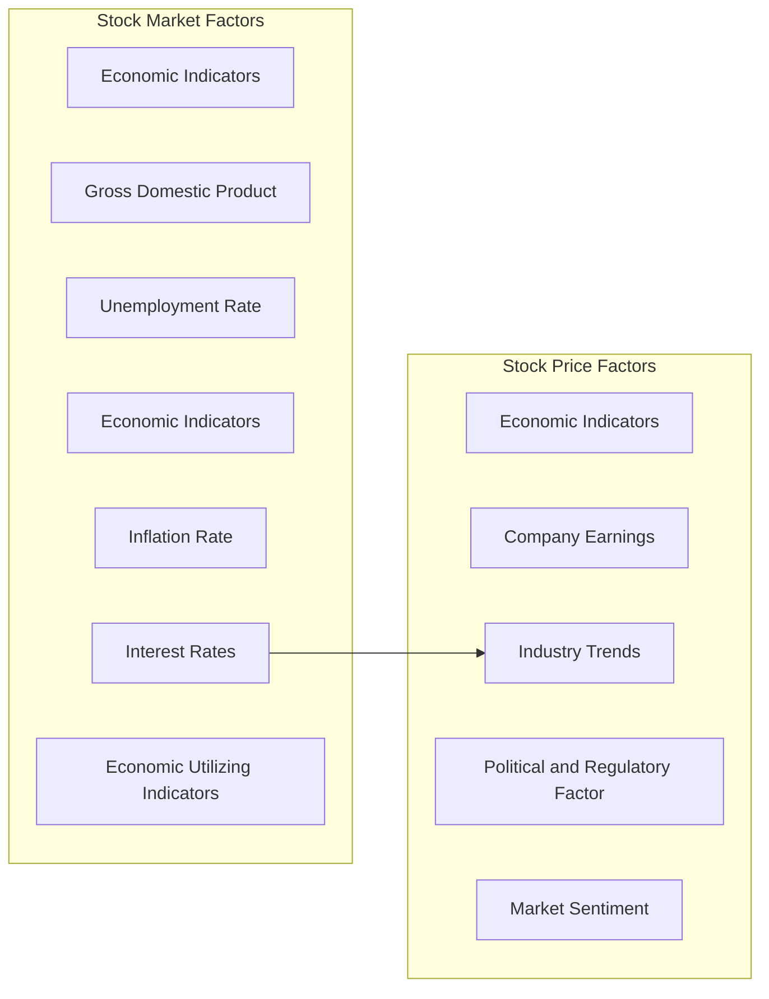
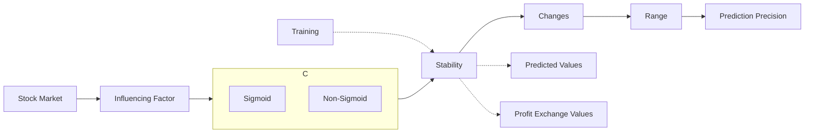
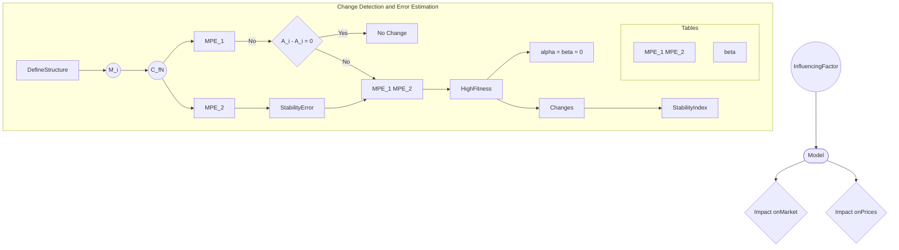

# scientific reports

# OPEN Multifactor prediction model for stock market analysis based on deep learning techniques

**Kangyi Wang**

Stock market stability relies on the shares, investors, and stakeholders’ participation and global commodity exchanges. In general, multiple factors influence the stock market stability to ensure profitable returns and commodity transactions. This article presents a contradictory-factor-based stability prediction model using the sigmoid deep learning paradigm. Sigmoid learning identifies the possible stabilizations of different influencing factors toward a profitable stock exchange. In this model, each influencing factor is mapped with the profit outcomes considering the live shares and their exchange value. The stability is predicted using sigmoid and non-sigmoid layers repeatedly until the maximum is reached. This stability is matched with the previous outcomes to predict the consecutive hours of stock market changes. Based on the actual changes and predicted ones, the sigmoid function is altered to accommodate the new range. The non-sigmoid layer remains unchanged in the new changes to improve the prediction precision. Based on the outcomes the deep learning’s sigmoid layer is trained to identify abrupt changes in the stock market.

**Keywords** Influencing factors, Deep learning, Sigmoid function, Stability prediction, Stock market

The stock market is influenced by a myriad of factors, hence complex and dynamic. Some of the important drivers that tend the market include economic indicators, interest rates, inflation, and gross domestic product growth¹. Then there are the political events elections and policy changes which have huge impacts on the performance of the market². Global events such as geopolitical tensions, pandemics, and natural disasters can see fluctuations in the market to a very large extent³. Effects are further complicated by the added complexity of request sentiment, which is influenced by investor behavior and psychological factors. Then, there are the technological developments and industry-specific events that add layers of complexity to stock prices and market movements⁴. Understanding the interplay of these diverse factors is thus important for investors, policymakers, and analysts to be able to move through the stock market effectively. It is further segmented into market liquidity and trading volumes, which may be said to impact stock prices, thereby making market conditions continually different and uncertain⁵,⁶.

Stock Request prediction is an all-inclusive job that involves several sources of data and ways. Profitable data, fiscal reports, and news-related papers present significant coffers about the conditions and the possible impact on the request⁷. Traditionally, statistical models and econometric styles have been used to identify correlations and hence prognosticate the request trend⁸. Advanced analytics tools raise the delicacy of prognostications by testing complicated patterns and connections within the data. These may be combined with conventional forms of understanding the relations of colorful variables impacting request performance with the power of real-time data analysis⁹. Social media sentiment and news sentiment analysis could enable an assessment of request sentiment and trends in real-time. By applying a wide range of data and styles of analysis, it becomes possible to rightly prognosticate request movements¹⁰. The integration of multiple sources of data provides a holistic view of the request and allows for the picking out of nuances that otherwise would have been lost in a single-system analysis. It contributes to the development of further robust and dependable request prediction, critical for strategic investment opinions¹¹,¹². The multifactor prediction model has several stock market analysis and trading applications. Integrating it into algorithmic trading systems automates market-change-based trades. Second, it aids portfolio management. It can help allocate assets and adjust positions for market volatility. Lastly, the technique can help investors identify risks and build successful hedging strategies. Traders can also use it for market timing tactics to determine when to join and quit the market to maximize profits. The model can help with sentiment analysis by including social media and news data, which helps measure how public sentiment

Computer Science Department, Changzhi University, Changzhi 046011, Shanxi, China. email: kangyi_wang@hotmail.com

---

affects stock prices. Finally, it might help create futures and options based on projected market swings and stability, giving investors more specialized investing options.

Deep Learning (DL) has emerged as one of the most important tools in prognosticating the factors that impact the stock request from this area of machine literacy¹³. DL models are major neural networks, which can reuse vast quantities of data and learn complex variable connections¹⁴. Similar models can dissect literal request data, news sentiment, and social media trends among other types of information to prognosticate better. With increased literacy and adaptiveness, DL algorithms raise the prophetic delicacy¹⁵. Therefore, it helps the critic conclude important deeper perceptivity about the dynamics of the requests and makes them more informed while making opinions. It would indicate that the infusion of DL into stock request analysis means great value in enabling stronger and further dependable prognostications within requests¹³,¹⁶. DL underlines a much better understanding of the dynamics and motorists of change in the requests, hence making it possible to apply investment strategies and manage pitfalls more precisely. Further, the nonstop development of new models will bring further enhancement in the capability to read requests¹⁷,¹⁸. Deep learning for stock market stability prediction has many benefits. First, deep learning algorithms automatically identify stock price trends and correlations. Extracting complicated features from huge datasets without feature engineering achieves this. Second, these models excel at managing high-dimensional data, allowing them to analyze several factors. Economic data, trading volumes, and pricing trends are examples. RNNs and other deep learning methods excel with time-series data. Thus, they can easily identify stock market trend temporal correlations. As new data becomes available, deep learning models can modify and improve, improving predictions. Finally, using unstructured data in prediction improves investment decisions. Because it improves precision. This includes news and social media mood. Figure 1 presents the factors influencing stock market and stock prices.

About the above-influencing factors, the need for stock market stability analysis can be understood. In contrast to more conventional methods, the model’s stability prediction strategy makes use of deep learning to discover and internalize complicated, non-linear patterns in data autonomously. This approach constantly adjusts to changing market conditions, unlike traditional statistical methods that frequently depend on predefined indicators or linear models. A more sophisticated examination of stock stability is achieved by integrating many data sources and nonlinear interactions. Compared to more conventional, indicator-based approaches, it provides a more complete picture of market dynamics by handling massive, unstructured datasets like social media sentiment or news feeds. Thus, the following contributions highlight the theme of the article to meet the stability analysis demands:

(a) A brief presentation of the works discussing the concepts/ proposals of stock market stability analysis and prediction methods using different algorithms and methods
(b) The introduction, discussion, and illustration of the proposed model using a novel deep learning paradigm with the knowledge of the stock market influencing factors and profit outcomes
(c) The discussion of the proposed model’s effect using a case study with real-time data inferred from different sources
(d) A comparative analysis presentation and discussion to verify and prove the proposed model’s efficacy with the other methods

**Related works**

Kabbani and Duman¹⁹ developed a deep reinforcement learning (DRL) approach for training automation in the stock market. The approach is used to generate effective traders in stock markets. The developed approach predicts the marketing problems that cause damage to stock market performance. It minimizes the computational cost of allocation and prediction processes. The developed DRL approach improves the precision of the decision-making process.

Fig. 1. Factors influencing stock market and stock prices.

---

Peivandizadeh et al.²⁰ proposed a transductive long short-term memory (TLSTM) based stock market prediction model. A social media sentiment analysis technique is also employed in the model to analyze the scenarios of the markets. The imbalance caused in the market is identified and TLSTM provides relevant solutions to solve the issues. The proposed model increases the accuracy level of prediction.

Albahli et al.²¹ designed a deep learning (DL) method with a hierarchical attention network (HANet) classifier for stock market prediction. Important features and patterns are extracted from news articles. The extracted patterns are used as inputs which minimize the computational cost and latency in performing tasks in stock markets. The designed method maximizes the precision ratio of the prediction process.

Alizadeh et al.²² introduced a hybrid multi-population optimization algorithm for stock market prediction. The unique characteristics of the markets are calculated using a global optimizer. The calculated datasets are used in the algorithm which decreases the energy consumption level of the prediction process. Experimental results show that the introduced algorithm enhances the accuracy and performance of the prediction systems.

Bai et al.²³ proposed a local multi-granularity fuzzy rough set (LMGFRS) method for multi-attribute decision-making in stock markets. An LSTM algorithm is implemented in the method to optimize the hyper-parameters for the process. The LSTM algorithm constructs the structure of the process which reduces the latency in the computation. The proposed LMFGRS method improves the feasibility and efficiency level of decision-making processes.

Hafiz et al.²⁴ designed a multi-criteria approach for stock market forecasting. The designed approach uses technical indicators that extract the optimal characteristics from the market. It is explicit that the sparsity dimension of the system elevates the capability of the systems. The designed approach maximizes the overall precision ratio of the forecasting systems.

Chatziloizos et al.²⁵ developed a deep learning (DL) model using sentiment and technical analysis for stock market prediction. Both textural and numerical datasets are analyzed to get optimal information for prediction. The technique analysis approach is used here to predict the price and quality level of products in stock markets. Compared with others, the developed model increases the accuracy of the prediction process.

An improved version of²⁵ is proposed by Lee et al.²⁶ natural language processing. The integrating environmental, social, and governance (ESG) information is extracted from social media feedback. The proposed model analyses the investor’s intention and future goals in stock markets. The proposed model enlarges the feasibility and significance level of the prediction process. In Table 1, the rest of the references are summarized.

| Authors                           | Approach                                                                                                   | Features                                                                                   | Technique used                                                                                                             | Results                                                                                            |
| --------------------------------- | ---------------------------------------------------------------------------------------------------------- | ------------------------------------------------------------------------------------------ | -------------------------------------------------------------------------------------------------------------------------- | -------------------------------------------------------------------------------------------------- |
| Shaban et al.²⁷                   | A new stock market prediction method using DL algorithm for trend forecasting                              | It predicts the exact price level of the markets                                           | LSTM algorithm is employed here to detect the closing price of the stock markets                                           | Improves the precision in the prediction process                                                   |
| Wang et al.²⁸                     | Deep transformer model for stock market index prediction                                                   | The market dynamics and characteristics are calculated to get relevant data for prediction | DL model extracts the important explicit features for prediction                                                           | Maximizes the performance level of the markets                                                     |
| Hafiz et al.²⁹                    | A co-evolution approach using neural architecture for stock market forecasting                             | It is used for the forecasting selection process                                           | A neural architecture search is implemented in the approach to select the optimal features                                 | Enhances the performance of the forecasting systems                                                |
| Wang et al.³⁰                     | A spatio-temporal multi-graph convolutional neural network (MGCNN) for stock market index trend prediction | It is used to normalize the functional capabilities of the markets                         | MGCNN is used here to extract the historical transaction data for prediction                                               | Increase the precision ratio of the systems                                                        |
| Liu et al.³¹                      | A new stock market index prediction model using TrellisNet                                                 | It is used to reduce the challenges which cause issues in the markets                      | A CNN and LSTM algorithm is employed here to analyze the sentiment index for the prediction process                        | Improves the feasibility level of the systems                                                      |
| Wu et al.³²                       | A hybrid stock market prediction model using growing neural gas (GNS) and reinforcement learning           | It is used to pass trading information from one user to another                            | The GNS algorithm is used in the model to restructure trading information                                                  | Maximizes the performance level of the markets                                                     |
| Wang et al.³³                     | A new stock market prediction model                                                                        | It is used as an accurate stock prediction model, eliminating the latency in further tasks | A multi-view stock data feature with dynamic market correlation information (MDF-DMC) mixes the information for prediction | Increases the accuracy of the prediction process                                                   |
| Li et al.³⁴                       | A DL and hierarchical frequency decomposition-based stock market forecasting model                         | The forecasting model reduces the noises that are presented in the information             | Variational mode decomposition (VMD) is used here to analyze the sentimental factors for the prediction process            | Increase the effectiveness of the systems                                                          |
| Ahelegbey, D. F., & Giudici, P.³⁵ | Construction of NetVIX to measure global market risk via interconnectedness                                | Network volatility and contagion effects                                                   | Multiplicative and additive decomposition                                                                                  | NetVIX correlates with VIX, amplifies market risks during crises, and highlights high-risk markets |
| Babaei et al.³⁶                   | Introduction of a rank graduation box for SAFE AI                                                          | Risk evaluation in AI systems                                                              | Statistical rank analysis and risk modelling                                                                               | Provides a robust ranking mechanism for AI system safety, improving transparency and reliability   |
| Giudici, P.³⁷                     | Exploration of safe machine learning methodologies                                                         | Risk mitigation in ML models                                                               | Statistical safety frameworks                                                                                              | Highlights techniques to ensure safe and reliable ML applications, mitigating risks effectively    |

**Table 1.** References summary.

---

# Contradictory-factor-based stability prediction model

This article presents a novel stock market analysis model for its stability considering different impacting factors based on stocks and prices. The model is introduced to improve the prediction precision of the market stability irrespective of the adverse and non-adverse impacts. For this purpose, a sigmoid and non-sigmoid-based deep learning process is introduced and used in this article. The contradictory-factor-based stability prediction model is technically presented in Fig. 2.

The prediction strategy carefully aligns each variable with its impact on stock market stability and profitability to develop a relationship between profit variables and their results. The model seeks to detect economic data, investor attitude, trade volumes, and geopolitical events that affect market dynamics. These are just few factors evaluated. Quantifying and numericalizing these features prepares them for deep learning layers. The multifactor prediction model examines positive and negative correlations between each element and historical loss and profit data using sigmoid and non-sigmoid learning methods. The sigmoid function can predict whether an input will be stable (profitable) or unstable (loss-prone) by translating these values into a probability range. However, non-sigmoid layers can detect market activity that deviates more significantly. The model adjusts weights based on historical profit results iteratively to accommodate for short-term fluctuations and long-term patterns. This helps the model understand how each component affects profitability. This mapping method helps the model better match market conditions with expected profit results, resulting in more accurate estimates. The stock market stability is analyzed by following 4 steps. First, the precise stock market shares, stakeholder participation, investors, and commodity exchanges are appropriately related to market stability that is chosen for identifying the influencing factors. Influencing factors such as supply and demand, interest rate, economic and political factors, natural calamities, inflation, technical changes, market trends, rumors, etc. generate changes in the stock market and product prices. Secondly, through the influencing factors, the previously stable stock market addressed period is identified. Then, the stability is predicted through sigmoid and non-sigmoid layers. Thirdly, the stock market changes are found based on the matching of the current stability with the previous outcomes to describe the stock value exchange during the influencing factors addressed in periods. Finally, the stock market stability is to be required by checking the validity of the contradictory-factor-based stability prediction model against the present market from which the stability prediction is done by identifying the consecutive hours of stock market changes between the actual values and predicted values using the sigmoid deep learning. Here, the predicted values are required by applying the best-fit model to the current market. Stable stock markets promote profitable returns and risk-free commodity transactions by reducing volatility and increasing predictability. This is because market stability reduces volatility. Market security encourages traders and investors to invest long-term. Increased cash flow leads to growth. Market stability attracts institutional investors, who contribute liquidity and stability to the sector. Stock prices better reflect asset values and corporate performance in stable markets. These conditions help firms plan expansion and capital rising. Stable commodities markets help manufacturers and consumers sell items at fair prices, discourage speculative trading, and prevent sudden price rises. When the stock market is stable and investors and the economy can make good investments, everyone wins. Economic variables including GDP growth, inflation, and interest rates affect stock market stability. These realities impact investor trust and company revenues. Elections and policy changes cause market volatility can impact markets. Pandemics, natural disasters, and geopolitical tensions also affect investor sentiment and markets. Trading volume and liquidity also affect price stability and transaction convenience. Investor behaviour and psychological factors like herd mentality and mood swings increase short-term trading volatility. Market performance depends on product or stock availability and demand. Technological advances and industry news can also drive industry changes. Knowing these traits helps predict stability and mitigate risks in volatile markets. After finishing this analysis, the related probabilities are calculated to identify the abrupt changes. The above-mentioned four steps are presented in detail.

**Step 1: Identification of influencing factors.**

The multiple factors that affect the stock market stability are identified based on the information observed from the current market. The influencing factors are mapped with the profit outcomes to accurately detect the internal and external shocks of the financial market. After identifying the influencing factors, a profitable stock exchange, in which the predicted stability of the stock market stays stable, must be selected to ensure profitable returns and commodity transactions. In general, influencing factors in the stock market at the time of sharing

Fig. 2. Technical representation of the proposed model.

---

and their exchanging values observations from the predicted stability show changes similar to sigmoid learning. Of course, the stock market conditions are based on economic fundamentals, and the profit outcomes are taken into consideration for reaching the maximum stability.

**Step 2: Model structure and fitness.**

Model structure and its fitness can be analyzed with standard procedures such as the possible stabilizations of different influencing factors identification, mapping, and prediction. Let us consider the chosen model M and their influencing factors observed from the previous period are represented as $M_1, \dots, M_N$. With the influencing factors, an appropriate stability prediction model is implemented to describe the stock market changes in the previous period. In this manner, we employ the analytical model is defined as

$$M_i = Cf_N (M_{i-1}, \dots, M_{i-N}) + \exists_F, i = 1, 2, \dots, N \tag{1}$$

In Eq. (1), $\lim_N, Cf_N = Cf$ is a contradictory factor-based stability function and $\exists_F$ is an error process identified from any period. This CFBSP model is used for analyzing the sigmoid and non-sigmoid learning process in varying time series for accurate stability prediction of the stock market. Using the proposed model to select the best fitting learning with profit and stock exchange value information, $M_1, \dots, M_N$ and $Cf_N$. It is worth describing that deep learning plays a key role in stock market stability prediction because its inability will affect the model for proper stability analysis. Therefore, the stability is predicted using sigmoid and non-sigmoid repeatedly until reaches the maximum.

The proposed prediction model dynamically links real-time trade data to its deep learning framework, allowing it to incorporate current shares and their exchange values. To begin, it determines the immediate effect of the indicated factors on market stability by mapping live share prices and exchange values to them. These elements include supply–demand dynamics and investor attitude. The model then determines if the market is stable or volatile based on the current trading patterns using the sigmoid function. The non-sigmoid layer detects sudden shifts in stock prices and modifies forecasts appropriately. This integration keeps the model adaptable to changing market conditions by letting it account for real-time changes in share value, which improves its stability predictions.

**Step 3: Stability Computation.**

Let $A_i$ is the actual value at time different period $i$ and $P_i = Cf_N (M_{i-1}, \dots, M_{i-N})$ is the predicted value at any period $i$ that is validated with the appropriate fitted learning identified in above Step 2. Multiple factors are available for predicting stock market stability or checking the validity of the proposed model against the current stock market changes. Such factors are average error ($\alpha$), root mean square error ($\beta$) and the sequence of mean absolute percentage error ($MPE_1, MPE_2$) is given as

$$\alpha = \sqrt{\sum_{i=1}^{\Delta} \frac{(A_i - \overline{A_i})^2}{P_i}} \tag{2}$$

$$\beta = \sum_{i=1}^{\Delta} \frac{|A_i - \overline{A_i}|}{\Delta} \tag{3}$$

$$MPE_1 = \frac{1}{\Delta} \sum_{i=1}^{\Delta} \frac{|A_i - \overline{A_i}|}{A_i} \times 100 \tag{4a}$$

$$MPE_2 = \frac{1}{\Delta} \sum_{i=1}^{\Delta} \frac{|A_i - \overline{A_i}|}{\overline{A_i}} \times 100 \tag{4b}$$

where $\emptyset_t$ is a set of values depending on the period $t$ and $\Delta$ is the cardinality of a set of observed values. If the condition of $\emptyset_t = (t - \Delta + 1, \dots, t)$ and then the current cardinality of the stock market is used for stability computation in the given period. Here, scaling the stock market value via actual value is prominent since the influencing factors should be accounted for in terms of the present stock market. For example, even a single influencing factor like commodity risk might be important, if the actual value is small.

**Step 3: Stock Market Changes.**

An ideal profitable stock exchange would be a standard that appropriately represents the current stock market stability by calculating the scale changes between the actual and the predicted values. In this manner, recall the predicted values that are validated using the best-fit learning. For the assessment of stock market stability, we develop a monthly stock market stability index from which compute the stock market stability index for every month at the end. Indeed, when the current stock market time $t_i$ belongs to the month $m_i$, the stock market stability index ($\xi$) is calculated for each month is given as

$$\xi(m) = \frac{1}{\Delta_t} \sum_{i=1}^{\Delta_m} \frac{|A_i - \overline{A_i}|}{A_i} \times 100 \tag{5}$$

---

In Eq. (5), $\Delta_m$ is the number of stock market changes addressed in the current month. The stock market faces a difficult task in attempting to predict the level of stability of the stock market. One problem is that it’s hard to predict sudden and unpredictable changes in the stock market because of its intrinsic volatility and randomness. Economic crises and shifts in global politics are two instances of such occurrences. Several elements, such as worldwide trends, investor mood, and macroeconomic data, among many others, may make pattern recognition more difficult. Thirdly, overfitting reduces the model’s performance on new data by teaching it to learn noise instead of real trends. Reducing the efficacy of feature extraction leads to decreased accuracy; similarly, noisy and high-dimensional data can have the same effect. The lack of training data for uncommon events like surges or crashes causes the model’s failure to generalize in extreme cases. So, in the most extreme circumstances, the model cannot generalize. Calculate the current stock market performance to stabilise different contradictory factors towards a profitable stock exchange. The stock market stability analyzing model’s change detection and error estimation process is presented in Fig. 3.

From the Step 1 to Step 4 definition, the $\alpha$, $\beta$, and $\Delta_m$ are mathematically analyzed as represented in Fig. 3. The $lim_N \forall Cf_N$ is confirmed under $(A_i - \bar{A}_i = 0)$ condition provided $P_i$ and the actual resemblance values are different. Using $MPE_1$ and $MPE_2$ for $\phi \in \{Cf_N\}$, the $\Delta$ failing outputs are used to compute $\alpha$ and $\beta$. If both $\alpha$ and $\beta$ are not balanced, then the result is the change imposed on the stock market and prices. Besides, the stability index computed using Eq. (5) encloses the error estimation for which range detection is mandatory. Thus, the new stability index influences the market with appropriate range variations for successive predictions.

Predicting stock market movements over several hours is crucial due to several factors. Stock market movements help traders and investors make better decisions by showing them when to enter and quit a market to optimize earnings. Second, precise estimates allow investors to make quick strategy changes, reducing risk. Knowing short-term price movements can also help algorithmic trading systems complete contracts. Finally, these estimates add to market research and illuminate investor habits and market trends, which are crucial for future investment planning.

### Calculation of related probability

Since a large-scale stock market changes between the small and large value of the stability index would represent the current stock market situation, it is quite different from the previous one. Similarly, the distribution of stock market stability changes; stability is the input for the statistics test, and the sigmoid layer of stock market stability value remains similar when assuming the proposed model. The prediction shows the current market stability and inability. By computing the possible stabilizations of the stock market stability index under hypothesis ($Hyp_i$), one may require the predicted value for a given $\xi(t) = z$ is as follows;

$$ \rho(t) = P(Stb(t) \geq z | Hyp_i) \tag{6} $$

In Eq. (6), $\rho(t)$ signifies the probability of stabilization and $Stb(t) = z$ implies the improbable value. This value is observed when the stock market situation is stable. In this term, $P(t)$ is the probability that the stock market

Fig. 3. Change detection and error estimation process of $M_i$.

---

is stable. The profitable stock exchange is performed using the current stock market stability under $Hyp_i$. For mapping $Cf_N$ with profit outcomes, we consider the live share $L_s$ and their exchange value $EX_v$ in the current time $t$, i.e., the sequence of possible stabilizations is computed. For computing $L_s$ and $EX_v$ for both sigmoid and non-sigmoid function is performed. For the sigmoid function $x$, one may predict an appropriate influencing factor based on stability $\xi_t$ and then retain that risk factor $r_t$ with stock exchange value that is given as

$$x_t(z) = \xi(z, r_t), \text{ if } z \in x \eqno(7)$$

For the non-sigmoid function $y$, its profit or loss-based stock exchange might be used. Hence, it is expressed as

$$y_t(z) = \frac{1}{Nt} \sum_{i=1}^{Nt} \Delta_m (\xi(i) \le z), \text{ for } z \in y \eqno(8)$$

Now the predicted stability value for the current period with $\xi(t) = z$ is detected by either $x$ or $y$,

$$P(t) = 1 - \int_0^z x_t(z) dz \text{ or } 1 - y_t(z) \eqno(9)$$

The current stock market stability and the influencing factors are predicted under the hypothesis. Stock market stability prediction relies heavily on the sigmoid deep learning paradigm. This is because it successfully models non-linear relationships among economic indicators, investor sentiment, trading volumes, and other influencing factors, leading to more accurate predictions of market movements. An excellent tool for probability prediction and stability state discrimination, the sigmoid function maps input information into a restricted range (0 to 1). When used in set stable stock markets, the sigmoid function may learn from past data and dynamically adjust to catch both small and large market changes. Stability projections benefit from this flexibility, which is essential for projecting slow trends and sharp spikes. Strategic investment decisions and risk management rely on the sigmoid function, which iteratively refines its decision limits when combined with deep learning layers. This allows the model to discriminate between stable and volatile periods, identifying and mitigating them through the sigmoid function.

Combine sigmoid and non-sigmoid layers to improve stability prediction by utilising each activation function's strengths. By providing smooth and constrained outputs, sigmoid layers normalize forecasts and lower the chance of extreme values that could cause model instability. ReLU and other non-sigmoid layers make the model non-linear, improving its ability to learn complex patterns. Combining the two can enhance gradient flow during training, which helps deep neural networks with fading gradients. This connection enhances learning, which improves system predictability and stability.

Teaching the sigmoid layer to respond differently to data changes can help spot stock market moves. As it trains to exaggerate slight changes near its midway, the sigmoid function becomes more sensitive to rapid stock price or trend changes. Due to its versatility, the model can detect key events, such as sudden spikes or declines, which may suggest trend change or market volatility. The sigmoid layer may distinguish between market fluctuations and major shifts by changing its output range to catch minute inflexion points. The model can better detect quick shifts, which helps decision-making in changing market conditions.

The sigmoid function helps anticipate stock prices by normalizing forecasts and making them probabilities by shifting input values to a small range between 0 and 1. Because it translates inputs to probabilities, this function is crucial for classifying stock price movements as "buy," "hold," or "sell." Gradient-based optimization uses the smooth, continuous sigmoid function. Thus, sigmoid-trained models converge more reliably. Because it highlights significant input data changes, the model can efficiently react to market changes. The sigmoid function helps the model discover and predict the nonlinear dynamics of stock market swings.

In this case, the stability output from two sources is used to address contradictory factors using deep learning until it reaches maximum stability. The sigmoid and non-sigmoid functions based on stability analysis using profit and exchange values are presented in Fig. 4.

The stability using $x_t$ and $y_t$ is defined in Eq. (9) using $Cf_N$ and $s$ for $L_s$ and $A_i$ outputs. The first representation is the $x_t(Z)$ defined for all $\zeta(Z, r_t)$ and the second $y_t(Z)$ is defined by $\Delta_m$. This refers to the different $\phi_t$ that influence the stock market stability through $MPE_1$ and $MPE_2$. The layers are segregated as $\int x_t(Z) = x_t(Z) dy$ and $y_t(Z) dy = \int y_t(x)$ split by different conditions. These conditions include $P(Stb(t) < |Hyp_i|)$ and $\xi(t) \neq y$ for which exchange (stock) and risk ($r_t$) are re-visited. Incorporating these changes and conditions using $x_t(Z)$ and $y_t(Z)$, the $(A_i - \bar{A}_i)$ differences are used to train the sigmoid layers. Therefore, the $\rho(t)$ is the joint input for $Hyp_i$ and $Stb(t)$ factors satisfying $z$. This ensures minimal error rates for predicted stability using price and stock exchange rates (Fig. 4).

Combining sigmoid and non-sigmoid layers, like ReLU, improves the model's pattern recognition capabilities. Recognizing minute shifts in market stability is a breeze with sigmoid layers because of their utility in producing probabilities and handling binary or multi-class classification problems. Improved gradient propagation, non-vanishing gradients, and non-linearity brought about by non-sigmoid layers like ReLU let the model learn more complicated relationships. By combining these layers, the model can learn complex stock market data efficiently while also maintaining smooth decision boundaries, leading to more accurate and robust stability forecasts.

1. The market might respond strongly to economic announcements such as changes in interest rates, job figures, or updates on GDP.

---

Fig. 4. Sigmoid and non-sigmoid function representation for stability analysis.

2. Markets are susceptible to wild swings in response to geopolitical events such as wars, trade disputes, or political unrest.

3. Stock price fluctuations are common in response to corporate earnings reports, which can reveal surprisingly strong or poor financial performance.

4. Hurricanes, earthquakes, and pandemics are examples of natural disasters that can significantly influence markets, supply networks, and investor confidence.

5. Factors Affecting Market Sentiment and Behavioral Patterns: Herd behavior, speculation, or fear can accelerate extremely short-term volatility.

**Significance from a Shareholder’s perspective**

Stability prediction is important to investors since it allows for effective risk management by anticipating market volatility and price fluctuations. This insight will enable investors to proactively change their portfolios to reduce exposure to risk during periods of volatility. Further, identifying stable market conditions allows for the strategic allocation of assets, thereby increasing the likelihood of achieving optimum returns. The model brings together, therefore, such diverse factors as economic indicators, investor sentiment, and geopolitical events into a comprehensive understanding of the dynamics of markets that enables informed investment decisions. Furthermore, advanced deep learning techniques ensure higher predictive accuracy than traditional methods and further increase confidence among investors in the reliability of market forecasts.

**Reference value for future investments**

Stability prediction provides immense value in planning and executing future investments. It allows for pinpointing market timing, where investors can determine the best times to enter or exit the market to maximize profitability. The real-time predictions of the model also power algorithmic trading systems, enabling fast and efficient automated decision-making. These stability insights can be leveraged to optimise long-term investment strategies by identifying new growth opportunities or hedging during volatile market phases. Further, the model’s ability to analyze and adapt to numerous factors ensures highly tailored predictions, which give investors an upper hand over other investors. With a reduced emotional bias in decision-making, the model also contributes to better overall investment outcomes.

**Deep learning based on $x$ and $y$ layers**

The possible stabilizations of multiple factors are addressed using a sigmoid function to improve the profitable stock exchange and reduce the impacting factors based on live shares and their stock exchange value. The proposed model implies identifying the abrupt changes in the stock market using the sigmoid and non-sigmoid layers. Moreover, on a large scale, the stock market, the output of the issues of consecutive hours of stock market changes based on actual and predicted changes, the sigmoid function is modified (altered) to accommodate the

---

new range. Using predicted stability for a current stock market, the sigmoid and non-sigmoid layers are required to improve the global commodity exchanges and thereby reduce the changes under the hypothesis.

$$ P(\xi)_t = (P(\xi)_1, \dots, P(\xi)_n, \dots, P(\xi)_N) \to max, n = 1, \overline{N} \tag{10} $$

where $(P(\xi)_1, \dots, P(\xi)_n, \dots, P(\xi)_N)$ is the number of stock market stability calculations performed in the current period. The influence factors are mapped at the time of stability prediction in the stock market. Based on the stock market changes, utilizing the sigmoid layers $x = (x_1, \dots, x_n, \dots, x_N)$, non-sigmoid layers $y = (y_1, \dots, y_n, \dots, y_N)$, and mapping each influencing factor $Cf = (Cf_1, \dots, Cf_n, \dots, Cf_N)$ are used for precisely calculating the appropriate stability. The stability is predicted as the number of stock market changes observed at any time instances. In this case, the factors influencing the stock market are less profitable returns or losses and commodity transactions. Where, $\theta_t$ implies the calculation time of current stock market stability based on their ideal profitable stock exchange. This stability analysis differentiates the sigmoid and non-sigmoid layers based on the stock exchange values and defines the actual changes $A = (A_1, \dots, A_n, \dots, A_N) \in \emptyset_t$ in the same ratio. The sigmoid function $x$ and non-sigmoid function $y$ are repeatedly processed: for the condition, if $A_1$ and $A_N$ that implies mapped influencing factors and $A_1, A_N \in \theta_t$ takes place in $(x(A_1)) \in (y(A_N))$ if and only if

$$ \left. \begin{array}{c} \theta_t = \frac{1}{\Delta} \sum_{i=1}^{\Delta} \left( \frac{x(A_1) + y(A_N)}{Stb(t)} \right) \\ where, \\ x(A_1) = \frac{1}{\sqrt{N}} \int_0^x \frac{x(A_1) \cdot \theta_t}{\theta_t} d\theta_t \\ and \\ y(A_N) = \frac{1}{\sqrt{N}} \int_0^y \frac{y(A_N) \cdot \theta_t}{\theta_t} d\theta_t \end{array} \right\} \tag{11} $$

Such that,

$$ M(x(A_1)) \cup (y(A_N)) \tag{12} $$

The above equations calculate current stock market stability, and influencing factors are mapped to define the profit outcomes. Where, $M$ is the matching of current stability value with previous outcomes, and that matching output is used to predict the consecutive hours of stock market changes. The particular layer either satisfies the sigmoid function or the non-sigmoid function. Multiple factors are considered to reduce the actual changes. The mechanism for minimizing the abrupt changes in stock market values can be prevented using the following procedures. The learning model incorporating the sigmoid and non-sigmoid functions for changes estimation between $A_i$ and $\overline{A_i}$ is given in Fig. 5.

The deep learning process incorporating $x_t(Z)$ and $y_t(Z)$ for $N$ and $\phi_t$ is portrayed in Fig. 5. The layers are keen on optimizing $Stb(t)$ for the combinations $[x(A_1), x(A_N)]$ and $[y(A_1), y(A_N)]$. Using these combinations, the sigmoid outputs for $r_t$ and $\Delta_m$ are extracted by identifying $(A_i - \overline{A_i})$ and $(\rho(t) - P_i)$ differences. These differences intended for $\Delta_m$ and prediction outputs to analyze $\phi_t$ possibilities. The possibility is (stability) ava, and closely if $\Delta_m = A = 1$ such that the impact is manageable. In this process, for $\phi_t = 0$ cases the $[x(A_N) \cup y(A_1)]$ is the output (risk factor) and for $\phi_t = 1$, $[x(A_1) \cup y(A_N)]$ is the output (predicted). Therefore, the training for $Stb(t+1)$ is induced from $(A_i - \overline{A_i})$ and $(\rho(t) - P_i)$ entries to maximize the prediction precision. A non-sigmoid function is computed based on the observed profit and loss values from the current stock market; it also contains actual changes and predicted ones required from the stability output at each layer. The index number is used in the sigmoid function, which is used to compare the two stability outputs from the two sources, it employs to address the influencing factors to improve prediction precision. The non-sigmoid layers remain unchanged in the new changes. Therefore, the appropriate layer is used to perform a sigmoid function for the $\emptyset(Stb(t)) = \emptyset(Stb(t)_1, \dots Stb(t)_N)$ is to satisfy $x(A_1)$ and

$y(A_N)$ that conditions in $\emptyset x(A_1) \le \emptyset y(A_N)$ it is expressed as

$$ \left. \begin{array}{c} \emptyset(Stb(t)) = Stb(t)_N - M * P_N \\ such\ that \\ argmin \sum_t M \forall \theta_t \end{array} \right\} \tag{13a} $$

Such that,

$$ A_i \cup P_i \in \theta_t \tag{13b} $$

Based on the Eqs. (13a) and (13b), the sigmoid function is altered based on matching stability according to Step 2. The prediction of accurate stock market stability with actual value is expressed as $A_i \in M$ in the first non-sigmoid function that is used to identify the abrupt changes with live shares and exchange value is as follows

$$ x(A_i) = Stb(t) \cdot x(A_i) \to \theta_t \forall \exists F = 0 \tag{14a} $$

And,

---

Fig. 5. Learning model incorporating $x_t(z)$, $y_t(z)$ for change estimation.

$$ y(P_i) = \frac{M}{Stb(t)} . y(P_i) \rightarrow M * \theta_t \forall \exists_F \neq 0 $$ (14b)

In this case, the actual stock market changes are defined as changes that will influence the global commodity exchanges, supply, and demands, currency and margining risk, country risk, etc. The contradictory factors in the current stock market are minimized, and then the stability is predicted. This is achieved using a deep learning process with a new range. It implements the non-sigmoid function to improve prediction precision. The minimization of stock market changes is quite different for sigmoid and non-sigmoid layers that can be performed to require stable profitable outcomes and commodity transactions.

The previous outcome is equal to the maximum and the current stock exchange value is the maximum times ratio of the previous outcomes. The stock market stability values are used to compare employment, business activities, the cost of living, and so on. The stability factor enables political or economic factors to minimize unwieldy business and turn it into easy returns. For example, the stock market stability shows the whole stock market performance, by proxy, shares, and stakeholder’s participation, reflecting investor sentiments on the country of the economy. Stability values in successive periods summarize the layers of processes employed over time in reflecting consecutive hours of altering sigmoid layers. Our proposed model utilizes the best function fitness of the previous situation, and its validity verification against the current situation is pursued to improve the prediction precision.

Stakeholders and investors affect stock market stability through their investment decisions, trading habits, and market news reactions. Pension and mutual funds are major institutional investors that can support or disrupt the market through large-volume trading. These trades may affect stock prices and market patterns. Retail investors’ emotional reactions to news and events can cause stock prices to swing drastically. Strategic company decisions by stakeholders like major shareholders and executives include mergers, acquisitions, and leadership changes. These are business decisions. These actions can affect investor confidence and stability. In addition, how they communicate financial information and earnings reports can build confidence or sow doubt, which can cause market volatility. These organizations’ actions, which affect money, liquidity, and market mood, mainly affect stock prices and the market.

Longer historical time frames and recurrent layers like Long Short-Term Memory (LSTM) or Gated Recurrent Units (GRUs) can help predict stock market stability by capturing long-term dependencies and patterns. We can better understand long-term stability by including macroeconomic variables like inflation, interest rates, and geopolitics. This model uses multi-horizon forecasting and rolling window analysis to adapt to different

---

timescales. Seasonality components and trend breakdown approaches let it distinguish between short-term market volatility and long-term trends. Regular updates using transfer learning can help the model adjust to changing market conditions and provide accurate long-term forecasts.

* Unlike many other machine learning models, the stock market prediction model uses recurrent layers like LSTM or GRU to uncover sequential patterns and dependencies between data points across time. This makes it useful for analyzing long-term trends and market dynamics.
* The proposed framework uses advanced nonlinear functions, including sigmoid and non-sigmoid activation functions, to understand complex data correlations. Our hybrid technique is more flexible than linear or simple transformation models to capture complicated market behaviours.
* The paradigm emphasizes real-time data integration to forecast and change in real-time using live data streams. Many existing models use static data or only get updates sporadically, so they may not work in dynamic markets.
* Focus on Probabilistic Results: Using sigmoid functions, the model predicts market conditions, such as stability or volatility. In contrast, some ML models offer predictable conclusions without uncertainty, giving traders less information.
* The model is adaptive because it can learn from its mistakes and add new data in real-time. If the market changes, retraining typical machine learning models on the complete dataset is lengthy and less flexible.
* Improved Feature Extraction: Attention processes may help the model prioritize important features and periods. This contrasts with other models that may miss vital indications and produce less accurate projections.

The model can include macroeconomic and sentiment factors, such as economic statistics, news story sentiment analysis, and social media trends, to better understand market impacts.

Unfortunately, many existing models focus on previous price data rather than market conditions. These differences allow the algorithm to forecast stock markets more accurately, quickly, and contextually than conventional machine learning methods.

# Data for case study

The case study presented in this section assimilates two different data from different sources. The first source provides four organisations’ numerical values (stock, date, open prices, highest, lowest, closing process, optimal, and quantity). The data is collected between 2/2023 and 5/2023 financial year. The total number of entries of the above is 248, from which $\Delta_m$ and stability are estimated. The second source references the stability index using CSI300, recommending 15% of the overall $\Delta_m$ as $MPE_1$ and 10% of $MPE_1$ as $MPE_2$. Based on the statistical test case results, the stability and suitable case for product, prices, and $EX_v$ based outcomes are analyzed. The stock market model’s forecasts must employ a live dataset, such as current share prices, to ensure real-time accuracy and market sensitivity. Given the stock market’s extreme volatility, immobile or outdated data may lead to inaccurate predictions. The model’s estimates are more accurate since it uses live data to capture real-time price fluctuations, trend reversals, and sudden spikes or dips. Real-time statistics allow the model to adjust to changing trends and events, such as geopolitical power shifts or economic news, which affect stock prices. Real-time adaptation lets traders and investors trade faster and with more information, improving their decisions. This flexibility benefits traders and investors. A statistical description of the data sources is provided in Table 2.

The above specifications are considered throughout the case study to analyze the performance and study the influence of the proposed model. Therefore, to provide a step-by-step analysis, the $(\alpha, \beta)$ to $x(A_i), y(P_i)$ variations are studied and described using a graphical representation. The representation of $\alpha$ and $\beta$ for the 2/2023, 3/2023, and 4/2023 for the 7 influencing factors is given in Fig. 6.

The case study for $\alpha, \beta$ based outcomes for the 7 factors is presented in Fig. 6. The variants are for 2/2023 to 5/2023 such that $o_t$ possibilities determine the $\alpha$ and thereby $\beta$. The $MPE_1$ and $MPE_2$ are the $\Delta$ satisfying factor detection process that required $x_t$ and $y_t$ variations with $\xi(m)$ index. If the index value is high then the $\Delta_m$ based influence is directed on $x_t$ whereas $y_t$ influences $\beta$. Using the alternate $\rho(t)$ the $Stb(t)$ with $z$ matching reduces the $\exists F$ (error) causes in predicting the stability. The layers are convoluted for maximum $Z$ in any analyzing interval such that $r_t$ is identified with ease. Hence, $\alpha$ and $\beta$ are the least to maximum range possibility-induced factors that stabilize the detection based on $EX_s$. Hence for the $(x, y) \in r_t$ and $(x, y) \in \Delta_m$ are the sigmoid and non-sigmoid classifications required and are presented in Fig. 7.

The proposed prediction model uses several sigmoid function modifications to account for current stock market developments. Adjusting the sigmoid function’s scaling and shifting parameters can improve its fit for stock price distribution and range. To achieve this, adjust the curve steepness to make it more responsive to small stock price changes. Adding adaptive thresholds or dynamic learning rates to the model improves sigmoid output

| Data source                                                     | Description                                                               | Values                                                                                                                                                                                                            |
| --------------------------------------------------------------- | ------------------------------------------------------------------------- | ----------------------------------------------------------------------------------------------------------------------------------------------------------------------------------------------------------------- |
| https\://www\.kaggle.com/datasets/thesnak/stock-market-analysis | Stock values of 4 different organizations                                 | 248 rows with 8 columns. The columns include date, stocker name, opening value, highest, close to highest, least, average/ optimal, closure value, and quantity. These factors describe the $EX\_c$ of the stocks |
| https\://doi.org/10.3390/math11163502                           | Discussion of the influencing factors with the change ratio specification | Momentum, Quality, Growth, Risk, Technical, Sentiment, and Value. Besides, the critical growth value is 15% of the maximum change, and the least is 5%. The average estimation lag is 11 and the maximum is 43    |

Table 2. Statistical description of the data sources.

---

Fig. 6. $(\alpha, \beta)$ Analysis for 7 factors between 2/2–23 and 5/2023.

| Panel 1: x in r\_t X | Panel 1: x in r\_t Red | Panel 1: x in r\_t Orange | Panel 2: x in Delta\_m X | Panel 2: x in Delta\_m Red | Panel 2: x in Delta\_m Orange | Panel 3: y in r\_t X | Panel 3: y in r\_t Red | Panel 3: y in r\_t Orange | Panel 4: y in Delta\_m X | Panel 4: y in Delta\_m Red | Panel 4: y in Delta\_m Orange |
| ------------------------ | -------------------------- | ----------------------------- | ---------------------------- | ------------------------------ | --------------------------------- | ------------------------ | -------------------------- | ----------------------------- | ---------------------------- | ------------------------------ | --------------------------------- |
| -1.0                     | -0.1                       | -0.4                          | -1.0                         | -0.2                           | -0.2                              | -1.0                     | 0.1                        | 0.2                           | -1.0                         | 0.0                            | 0.3                               |
| -0.5                     | -0.1                       | -0.4                          | -0.5                         | -0.2                           | -0.2                              | -0.5                     | 0.1                        | 0.2                           | -0.5                         | 0.0                            | 0.3                               |
| 0.0                      | 0.0                        | 0.2                           | 0.0                          | 0.0                            | 0.7                               | 0.0                      | 0.1                        | 0.2                           | 0.0                          | -0.1                           | 0.3                               |
| 0.5                      | 0.8                        | 0.2                           | 0.5                          | 0.7                            | 0.7                               | 0.5                      | 0.0                        | -0.4                          | 0.5                          | -0.5                           | -0.1                              |
| 1.0                      | 0.8                        | 0.2                           | 1.0                          | 0.7                            | 0.7                               | 1.0                      | -0.1                       | -0.4                          | 1.0                          | -0.5                           | -0.1                              |

Fig. 7. $(x, y)$ Sigmoid and non-sigmoid outputs for $(r_t, \Delta_m)$.

responsiveness to current and historical market trends and outliers. Because it uses time-varying components, the sigmoid function may adapt to changing market conditions and new data. Finally, hybrid models may use the sigmoid function with other activation functions or approaches, such as attention processes, to respond to quick stock market changes and capture more complicated relationships.

Effective gradient flow during training requires positive values and avoiding the vanishing gradient problem. The non-sigmoid layer, like ReLU, often remains unmodified. Due of its stability, the model can learn complicated properties without saturation. This speeds convergence and prevents data loss. Through sparsity, which returns zero for negative inputs, ReLU can simplify models and increase their generalization to new data. To preserve these benefits, keeping it this way improves feature extraction. Models that reflect linear and nonlinear interactions improve prediction accuracy for complex stock market trends. This applies especially to model work.

---

Fig. 8. $P_i$ and $\xi(t)$ outputs for varying $P(t)$ over $(z, \Delta_m, r_t)$.

| Factors   | Variable | M (x (A1)) ∪ (y (AN )) 2/2023 | M (x (A1)) ∪ (y (AN )) 3/2023 | M (x (A1)) ∪ (y (AN )) 4/2023 | M (x (A1)) ∪ (y (AN )) 5/2023 | ∅ (Stb (t))(%) 2/2023 | ∅ (Stb (t))(%) 3/2023 | ∅ (Stb (t))(%) 4/2023 | ∅ (Stb (t))(%) 5/2023 | ∃F     |
| --------- | -------- | --------------------------------- | --------------------------------- | --------------------------------- | --------------------------------- | ------------------------- | ------------------------- | ------------------------- | ------------------------- | ------ |
| Momentum  | x(Ai)    | 0.774                             | 0.82                              | 0.78                              | 0.81                              | 54.6                      | 65.3                      | 61.5                      | 62.5                      | +0.033 |
|           | y(Pi)    | 0.785                             | 0.829                             | 0.793                             | 0.814                             | 56.2                      | 69.47                     | 63.69                     | 68.56                     | +0.031 |
| Quality   | x(Ai)    | 0.828                             | 0.904                             | 0.829                             | 0.839                             | 73.69                     | 82.65                     | 74.25                     | 75.69                     | -0.098 |
|           | y(Pi)    | 0.854                             | 0.921                             | 0.874                             | 0.881                             | 74.56                     | 83.25                     | 78.36                     | 79.85                     | -0.088 |
| Growth    | x(Ai)    | 0.889                             | 0.935                             | 0.911                             | 0.912                             | 80.14                     | 92.98                     | 87.54                     | 89.21                     | -0.089 |
|           | y(Pi)    | 0.901                             | 0.939                             | 0.908                             | 0.921                             | 82.3                      | 93.8                      | 85.36                     | 88.45                     | -0.1   |
| Risk      | x(Ai)    | 0.824                             | 0.874                             | 0.856                             | 0.861                             | 66.23                     | 78.14                     | 71.25                     | 73.63                     | +0.005 |
|           | y(Pi)    | 0.851                             | 0.891                             | 0.874                             | 0.884                             | 72.58                     | 81.25                     | 73.69                     | 75.14                     | +0.012 |
| Technical | x(Ai)    | 0.867                             | 0.929                             | 0.885                             | 0.891                             | 75.89                     | 89.36                     | 78.36                     | 77.23                     | +0.011 |
|           | y(Pi)    | 0.869                             | 0.932                             | 0.887                             | 0.901                             | 76.96                     | 91.23                     | 82.36                     | 85.36                     | -0.082 |
| Sentiment | x(Ai)    | 0.792                             | 0.841                             | 0.801                             | 0.824                             | 61.36                     | 71.25                     | 63.6                      | 65.78                     | +0.028 |
|           | y(Pi)    | 0.801                             | 0.855                             | 0.821                             | 0.829                             | 65.36                     | 75.63                     | 69.36                     | 71.23                     | +0.018 |
| Value     | x(Ai)    | 0.887                             | 0.928                             | 0.901                             | 0.902                             | 79.25                     | 90.21                     | 86.2                      | 79.36                     | -0.092 |
|           | y(Pi)    | 0.089                             | 0.921                             | 0.902                             | 0.904                             | 80.12                     | 91.56                     | 85.4                      | 80.14                     | -0.086 |

Table 3. ∃F and $\phi(Stb(t))$ analysis.

The $(x, y)$ $\forall r_t$ and $\Delta_m$ are analyzed for their sigmoid and non-sigmoid assessments by thwarting $r_t$ impact over $\Delta$. If the $\Delta$ increases the $\rho(t)$ and $P_i$ become mutually common by adjusting $A$ and $\Delta_m$. Therefore, the sigmoid/non-sigmoid layer is responsible for $[M(x(A_i)) \cup (y(A_N))]$ matching to detect maximum stability. Under the various $\phi$ derivatives in the deep learning layers, if $t$ is incremented by 1, then $x(A_i)$ and $y(P_i)$ are balanced. Henceforth, the change in $\rho(\xi_t)$ and $\Delta_m$ impacts $\Delta$ (stagnancy) wherein the $o_t$ is denied for further stability analysis. The change in $r_t$ and $\Delta_m$ are highlighted in the sigmoid using orange and red lines. The major derivation between the two emphasizes a change in market stability that requires certain modifications on products and values (Fig. 7). Followed by this analysis, the impact of $\rho(t)$ over $P_i$ and $(\xi_t)$ is studied using Fig. 8.

The $\rho(t)$ is varied from 0 to 1 for a 0.2-time gap to estimate $P_i$ and $\xi(t)$. In the estimation (Fig. 8), the $\Delta_m$ and $r$ filtered outcomes ensure maximum $Z$. The sigmoid and non-sigmoid layers are responsible for mapping $t$, $\Delta$, $A_i$ and $A_N$ for all $\phi_t$ analyzed. If the $A$ does not fit the differences $(A_i - A_i)$, then $m$ is modified using $x_t$

and $y_t$ provided that further stabilization is pursued. The learning verifies the stability from different $Z$, filtering $r_t$ from unattainable $\Delta_m$. Thus, in this case, the verification of $P_i$ and $\rho(t)$ is balanced to maximize $\xi(t)$. In the proposed model, the $Cf_N$ is the influential factor in ensuring $x(A_i)$ and $y(P_i)$ are the same for ensuring better precision. The $Z$ extraction ensures adaptable $\Delta_m$ for any $r_t$ through different $\phi_t$ using the learning process. Based on the $Z$, the $\exists F$ range and $\phi(Stb(t))$ are tabulated for $x(A_i)$ and $y(P_i)$ for different factors considered in Table 3.

The stock market stability impacting factors behave differently for $x(A_i)$ and $y(P_i)$ those influences $\exists F$. This analysis is performed between 2/2023 and 5/2023 for $M(x(A_1) \cup (y(A_N)))$. The $\phi_t$ determines the $\Delta$ and its corresponding $M$ to meet the actual requirement. Hence, in this case, the changes of impacting

---

factors are either single/grouped to ensure high $x(A_i)$ and $y(A_N)$ matching. If the matching is high then the difference $(A_i - \bar{A_i})$ is nearly zero from which the previous stability is retained. Hence, in this case, the impacting factors are addressed with their $r_t$ and $Z$ chances to maximize the stability detection precision. Using the conjoint learning layers, the $\exists_F$ is extracted as the major difference of $(A_i - \bar{A_i})$ to reduce its impact through recommended stock changes (Table 3). Predicting the stock market involves considering a number of factors, the relative weight of which can change dramatically in response to internal and external factors. The author should do experiments to observe the effects of time on the relative importance of various factors if she wants to comprehend these variations. Methods like feature priority ranking and sensitivity analysis allow the author to methodically evaluate how each variable affects prediction accuracy. Interesting things can emerge out of this kind of experimentation; such how different macroeconomic variables affect market behaviour over the economic cycle, or which elements are more important during times of volatility compared to stable periods. These findings will improve the model’s predictive power and help us understand the market better, which in turn will lead to better risk management and trading tactics.

The prediction model handles unexpected changes via anomaly detection, learning rate configuration, and real-time data updates. Live data feeds allow the model to detect and respond to unexpected swings, while adaptive learning rates allow for quick parameter adjustments during market turbulence. Attention processes or contextual embeddings help the model select relevant features in unexpected events. Using anomaly detection layers to discover and isolate unusual patterns helps the model distinguish between regular volatility and unexpected moves. Finally, ensemble learning or hybrid models (such as deep learning plus statistical approaches) improve resilience by making more accurate predictions regardless of external factors.

## Comparative analysis and results

In addition to the case study, this section describes certain metrics associated with the proposed model’s processing outcomes. This includes precision prediction, change detection, stability matching, range error, and detection time. These metrics are compared under the variables: time between 2/2023 and 5/2023, selecting 4 dates from the given dataset. Another variable is the influencing factors listed in Table 2. In this comparison, the existing SMP-DL²⁷, HDFM³⁴, and PPO-TLSTM²⁰ methods/ techniques are used along the proposed model.

Table 4 summarizes key acronyms of the baseline methods with their full forms and specific uses in the research; it highlights innovative models and methodologies for enhanced stock market forecasting.

Expanding the experimental investigation to incorporate the complete Shanghai market and the A50 index may improve the model’s evaluation. The CSI 300 index may not fully reflect the market because it prioritizes stable and well-funded corporations above China’s 300 largest companies. Testing the model over multiple market categories, including mid-cap and small-cap enterprises, helps assess its market stability prediction abilities. Including the Shanghai Composite Index, which includes all Shanghai Stock Exchange-listed A- and B-shares, achieves this goal. Due to its high liquidity, international participants and institutional investors seek the A50 Index, which ranks the fifty A-shares listed on the Shanghai and Shenzhen Stock Exchanges by liquidity. By testing the model on the CSI 300 index, can better understand its ability to predict trends in a volatile and highly traded market segment. These indices assess the model’s ability to adapt to varied trading environments and investor behaviours, preventing over fitting to a benchmark. A more thorough evaluation will reveal how well the model handles various market conditions, trading volumes, and investor sentiment. This analysis will help us decide if the model is suitable for predicting stability across many indices and analyzing the stock market. This improves results dependability.

## Comparison 1—precision prediction

The proposed model is designed to achieve high prediction precision of the stock market stability for different influencing factors as represented in Fig. 9). Here, each influencing factor is mapped with the profitable outcomes for appropriately considering the live share and exchange value to improve prediction precision with less range error. The sigmoid function is altered based on the actual changes and predicted profitable returns and commodity transactions through deep learning. The proposed model implies the accurate alternation of the sigmoid function for the stock market changes. The stability is predicted in a given time and for each month from the currently observed stock market data to reach the maximum by using deep learning. The influencing factor identified sigmoid function is modifying until the maximum reaches stability and using deep learning sigmoid layers are trained for improving prediction precision and thereby identify abrupt changes. Such trained layers are used to achieve profitable incomes to ensure maximum stability. Hence, high prediction precision is achievable. Contrast the model’s predicted stability with past results to determine its accuracy. Comparing expected stability to previous outcomes helps the model detects patterns, assess its ability to properly describe market behaviour, and alter its parameters to reduce forecasting inaccuracy. Comparing model performance can

| Acronym     | Full form                                      | Description/use in the paper                      |
| ----------- | ---------------------------------------------- | ------------------------------------------------- |
| SMP-DL²⁷    | Stock market prediction using deep learning    | A novel approach for trend forecasting            |
| HDFM³⁴      | Hierarchical frequency decomposition model     | Used for stock market forecasting and analysis    |
| PPO-TLSTM²⁰ | Proximal policy optimization-transductive LSTM | Combines sentiment analysis with stock prediction |

Table 4. Baseline methods and their contributions in stock market prediction research.

---

| Time       | SMP-DL | HDFM | PPO-TLSTM | CFSPM |
| ---------- | ------ | ---- | --------- | ----- |
| 05-02-2023 | 0.76   | 0.76 | 0.79      | 0.82  |
| 10-02-2023 | 0.78   | 0.77 | 0.82      | 0.89  |
| 15-02-2023 | 0.77   | 0.78 | 0.85      | 0.88  |
| 20-02-2023 | 0.76   | 0.76 | 0.80      | 0.86  |
| 25-02-2023 | 0.75   | 0.79 | 0.82      | 0.93  |
| 02-03-2023 | 0.74   | 0.82 | 0.87      | 0.92  |
| 07-03-2023 | 0.76   | 0.78 | 0.81      | 0.84  |
| 12-03-2023 | 0.74   | 0.76 | 0.83      | 0.88  |
| 17-03-2023 | 0.75   | 0.77 | 0.88      | 0.87  |
| 22-03-2023 | 0.77   | 0.78 | 0.84      | 0.92  |
| 27-03-2023 | 0.76   | 0.75 | 0.81      | 0.86  |
| 01-04-2023 | 0.78   | 0.80 | 0.89      | 0.85  |
| 06-04-2023 | 0.76   | 0.77 | 0.87      | 0.91  |
| 11-04-2023 | 0.74   | 0.75 | 0.82      | 0.86  |
| 16-04-2023 | 0.76   | 0.78 | 0.85      | 0.91  |
| 21-05-2023 | 0.75   | 0.74 | 0.87      | 0.93  |

| Factors   | SMP-DL | HDFM | PPO-TLSTM | CFSPM |
| --------- | ------ | ---- | --------- | ----- |
| Momentum  | 0.74   | 0.82 | 0.81      | 0.93  |
| Quality   | 0.72   | 0.80 | 0.84      | 0.90  |
| Growth    | 0.73   | 0.77 | 0.79      | 0.91  |
| Risk      | 0.72   | 0.76 | 0.80      | 0.90  |
| Technical | 0.71   | 0.79 | 0.82      | 0.87  |
| Sentiment | 0.72   | 0.76 | 0.84      | 0.85  |
| Value     | 0.74   | 0.82 | 0.89      | 0.93  |

Fig. 9. Comparisons of prediction precision for time and influencing factors.

| Time       | SMP-DL | HDFM | PPO-TLSTM | CFSPM |
| ---------- | ------ | ---- | --------- | ----- |
| 05-02-2023 | 73     | 76   | 79        | 82    |
| 10-02-2023 | 75     | 77   | 82        | 86    |
| 15-02-2023 | 74     | 77   | 80        | 89    |
| 20-02-2023 | 75     | 77   | 88        | 94    |
| 25-02-2023 | 74     | 75   | 86        | 92    |
| 02-03-2023 | 73     | 74   | 84        | 91    |
| 07-03-2023 | 75     | 78   | 87        | 94    |
| 12-03-2023 | 73     | 81   | 82        | 91    |
| 17-03-2023 | 74     | 80   | 81        | 88    |
| 22-03-2023 | 76     | 78   | 81        | 91    |
| 27-03-2023 | 75     | 76   | 83        | 88    |
| 01-04-2023 | 77     | 81   | 81        | 94    |
| 06-04-2023 | 75     | 84   | 87        | 92    |
| 11-04-2023 | 74     | 83   | 82        | 91    |
| 16-05-2023 | 73     | 87   | 85        | 95    |
| 21-05-2023 | 74     | 84   | 84        | 93    |

| Factors   | SMP-DL | HDFM | PPO-TLSTM | CFSPM |
| --------- | ------ | ---- | --------- | ----- |
| Momentum  | 76     | 77   | 80        | 85    |
| Quality   | 74     | 77   | 82        | 91    |
| Growth    | 75     | 83   | 84        | 87    |
| Risk      | 74     | 78   | 84        | 92    |
| Technical | 73     | 77   | 81        | 87    |
| Sentiment | 76     | 78   | 89        | 95    |
| Value     | 78     | 82   | 89        | 94    |

Fig. 10. Comparisons of change detection for time and influencing factors.

reveal over fitting or under fitting. It also lets you fine-tune your prediction tactics, making your model more adaptable to changing market conditions and more accurate.

1. Feature Engineering: Enhance the depth of input data by introducing additional relevant characteristics such as investor mood, trade volumes, and sector-specific indicators.

2. Integrating deep learning models with more conventional approaches (such as ARIMA or GARCH) creates a hybrid model that can take advantage of both linear and nonlinear data correlations.

3. Methods for Paying Attention: To make forecasts that are easier to understand and more accurate, use attention layers to zero down on important time periods or characteristics.

4. Ensemble Learning: Enhance prediction performance by reducing variation and bias through the implementation of ensemble techniques such as bagging or boosting.

5. Noise Reduction and Data Augmentation: Use methods like denoising and data smoothing to improve the quality of your data and eliminate outliers, allowing for more precise forecasts.

## Comparison 2—change detection

The multi-factor prediction model is used to calculate the stock market stability using supply and demands, interest rate, natural calamities, etc. for improving change detection (Refer to Fig. 10). The precise stability prediction is achieved using deep learning and sigmoid function for identifying the abrupt changes in the current stock market situation. The appropriate live share and their stock exchange value are considered to improve profitable incomes and commodity transactions. In this manner, the first stability analysis output is used to identify the chances of profit/ loss/ exchange in the stock market and thereby reduces range error. The market changes for time or stability that is identified to ensure the profit outcomes from the training process through deep learning output. Here, the actual and predicted values are required by choosing the best-fit model for the current stock market. After finishing this stability prediction, the related probabilities are calculated to identify the abrupt changes in the stock market. The non-sigmoid function remains unchanged to predict the

---

accurate precision. Hence, the predicted precision is improved for the stock market that repeatedly trains the sigmoid layer to satisfy high change detection.

**Comparison 3—stability matching**

The stability matching process output is used to define stock market changes for high prediction precision. The use of the non-sigmoid function leads to maximum profitable outcomes through deep learning for high matching as in Fig. 11. The observed actual changes are retained using the sigmoid function and that is altered to satisfy the new range. The influencing factors in a given time interval are identified. That factor affects the profitable outcome and commodity transactions during the stock market exchange. To reduce such factors identified region with maximum stability is to improve the stability matching process. In this method, stability matching is performed with current and previous outcomes for identifying actual changes and predicted ones to predict the consecutive hours of stock market changes. The multiple factor that affects the stock market stability is addressed to reduce the changes in the current market. The influencing factors are mapped with the profit outcomes in the previous period to accurately identify the changes in the financial market. Hence, based on the outcome, the deep learning sigmoid layer is trained to improve the prediction precision and stability matching.

Continuous learning from past data allows the model to adjust its parameters and minimize differences between projected and actual outcomes, ensuring alignment. To make it resilient and avoid overfitting, it uses methods like backpropagation and cross-validation, which modify weights depending on prediction mistakes. It is possible to fine-tune the sigmoid function such that it corresponds to the likelihood of stock market states because it can produce probabilistic values. In addition, the model is able to capture temporal dependencies with the help of real-time updates and recurrent layers (e.g., LSTMs), guaranteeing that predictions are reflective of current market movements and closely mirror real stability changes.

**Comparison 4—range error**

In this stability calculation process, the stock market profit, loss, exchange, and other factors are scaled to improve the profitable outcomes. This accounts for the live shares and their exchange value. The two stability outputs from two sources are taken for identifying the high or low stock market changes. Based on such influencing factors, the stability is predicted through the sigmoid and non-sigmoid layers repeatedly until the maximum is achieved. The sigmoid layer is trained using maximum shares and exchange values for gaining accurate stability prediction and thereby reducing stock market changes. The stock market value changes affect the whole country's economy, to reduce that change with an appropriate new range is to ensure a maximum profitable outcome. In this model, the influencing factors are mapped to detect such changes in the stock market and from which the commodity exchange is pursued. The proposed model using deep learning output is used for achieving profit outcomes by minimizing influencing factors. In this scenario, the stock market conditions are based on economic fundamentals, the profit outcomes that are taken into consideration to achieve maximum stability with less range error (Fig. 12).

**Comparison 5—detection time**

In this model, identifying the multiple factors that impact the stock market is pursued to improve stability. The current stock market irrespective of the global commodity exchanges is identified for improving profitable returns to ensure high commodity transactions. The stock market changes are identified using the sigmoid and non-sigmoid layers. After mapping the influencing factors, the matching is performed to get a profitable stock exchange, in which the stock market stays stable, that ideal stock market must be chosen to enhance the profitable returns. The sigmoid and non-sigmoid layers are recurrently processed using deep learning to gain two stability outcomes. In the sigmoid function, the influencing factors-based stability prediction is performed. Instead, in the non-sigmoid function, the stock market profit and loss-based stability prediction is performed. This function is performed to ensure highly profitable outcomes. The two stability outputs are used for both the

| Time       | SMP-DL | HDFM  | PPO-TLSTM | CFSPM |
| ---------- | ------ | ----- | --------- | ----- |
| 05-02-2023 | 0.842  | 0.838 | 0.848     | 0.882 |
| 10-02-2023 | 0.835  | 0.815 | 0.855     | 0.895 |
| 15-02-2023 | 0.810  | 0.830 | 0.865     | 0.925 |
| 20-02-2023 | 0.825  | 0.805 | 0.875     | 0.910 |
| 25-02-2023 | 0.815  | 0.830 | 0.860     | 0.895 |
| 02-03-2023 | 0.825  | 0.815 | 0.880     | 0.930 |
| 07-03-2023 | 0.815  | 0.835 | 0.845     | 0.905 |
| 12-03-2023 | 0.825  | 0.845 | 0.875     | 0.925 |
| 17-03-2023 | 0.815  | 0.835 | 0.888     | 0.915 |
| 22-03-2023 | 0.810  | 0.825 | 0.880     | 0.920 |
| 27-03-2023 | 0.830  | 0.815 | 0.870     | 0.925 |
| 01-04-2023 | 0.832  | 0.840 | 0.885     | 0.915 |
| 06-04-2023 | 0.835  | 0.842 | 0.880     | 0.910 |
| 11-04-2023 | 0.830  | 0.850 | 0.860     | 0.925 |
| 16-04-2023 | 0.815  | 0.835 | 0.870     | 0.920 |
| 21-04-2023 | 0.825  | 0.840 | 0.855     | 0.945 |

| Factors   | SMP-DL | HDFM  | PPO-TLSTM | CFSPM |
| --------- | ------ | ----- | --------- | ----- |
| Momentum  | 0.805  | 0.815 | 0.835     | 0.860 |
| Quality   | 0.812  | 0.810 | 0.845     | 0.920 |
| Growth    | 0.805  | 0.815 | 0.850     | 0.935 |
| Risk      | 0.845  | 0.842 | 0.878     | 0.912 |
| Technical | 0.842  | 0.850 | 0.850     | 0.918 |
| Sentiment | 0.815  | 0.830 | 0.885     | 0.925 |
| Value     | 0.810  | 0.825 | 0.870     | 0.935 |

Fig. 11. Comparisons of stability matching for time and influencing factors.

---

| Time       | SMP-DL | HDFM  | PPO-TLSTM | CFSPM |
| ---------- | ------ | ----- | --------- | ----- |
| 05-02-2023 | 0.048  | 0.052 | 0.033     | 0.026 |
| 10-02-2023 | 0.053  | 0.051 | 0.034     | 0.027 |
| 15-02-2023 | 0.051  | 0.059 | 0.031     | 0.028 |
| 20-02-2023 | 0.049  | 0.052 | 0.038     | 0.027 |
| 25-02-2023 | 0.058  | 0.046 | 0.039     | 0.028 |
| 02-03-2023 | 0.061  | 0.058 | 0.035     | 0.026 |
| 07-03-2023 | 0.057  | 0.057 | 0.039     | 0.025 |
| 12-03-2023 | 0.066  | 0.058 | 0.034     | 0.024 |
| 17-03-2023 | 0.046  | 0.039 | 0.036     | 0.025 |
| 22-03-2023 | 0.047  | 0.039 | 0.038     | 0.026 |
| 27-03-2023 | 0.047  | 0.038 | 0.038     | 0.025 |
| 01-04-2023 | 0.068  | 0.041 | 0.034     | 0.024 |
| 06-04-2023 | 0.058  | 0.038 | 0.036     | 0.024 |
| 11-04-2023 | 0.062  | 0.048 | 0.041     | 0.025 |
| 16-04-2023 | 0.058  | 0.038 | 0.036     | 0.024 |
| 21-04-2023 | 0.062  | 0.041 | 0.039     | 0.025 |
| 26-04-2023 | 0.065  | 0.043 | 0.041     | 0.026 |
| 01-05-2023 | 0.075  | 0.054 | 0.034     | 0.025 |
| 06-05-2023 | 0.074  | 0.054 | 0.041     | 0.026 |
| 11-05-2023 | 0.078  | 0.055 | 0.042     | 0.027 |
| 16-05-2023 | 0.076  | 0.055 | 0.034     | 0.026 |
| 21-05-2023 | 0.079  | 0.060 | 0.045     | 0.035 |

| Factors   | SMP-DL | HDFM  | PPO-TLSTM | CFSPM |
| --------- | ------ | ----- | --------- | ----- |
| Momentum  | 0.073  | 0.055 | 0.038     | 0.028 |
| Quality   | 0.058  | 0.058 | 0.031     | 0.030 |
| Growth    | 0.046  | 0.042 | 0.041     | 0.021 |
| Risk      | 0.060  | 0.037 | 0.034     | 0.027 |
| Technical | 0.056  | 0.038 | 0.040     | 0.022 |
| Sentiment | 0.054  | 0.043 | 0.035     | 0.022 |
| Value     | 0.068  | 0.053 | 0.039     | 0.029 |

Fig. 12. Comparisons of range error for time and influencing factors.

| Time       | SMP-DL | HDFM | PPO-TLSTM | CFSPM |
| ---------- | ------ | ---- | --------- | ----- |
| 05-02-2023 | 0.61   | 0.75 | 0.46      | 0.26  |
| 10-02-2023 | 0.58   | 0.73 | 0.44      | 0.28  |
| 15-02-2023 | 0.75   | 0.72 | 0.49      | 0.31  |
| 20-02-2023 | 0.63   | 0.62 | 0.43      | 0.33  |
| 25-02-2023 | 0.62   | 0.78 | 0.54      | 0.35  |
| 02-03-2023 | 0.74   | 0.72 | 0.51      | 0.32  |
| 07-03-2023 | 0.73   | 0.58 | 0.48      | 0.30  |
| 12-03-2023 | 0.72   | 0.74 | 0.44      | 0.28  |
| 17-03-2023 | 0.68   | 0.53 | 0.38      | 0.26  |
| 22-03-2023 | 0.72   | 0.68 | 0.56      | 0.25  |
| 27-03-2023 | 0.71   | 0.68 | 0.57      | 0.24  |
| 01-04-2023 | 0.69   | 0.65 | 0.48      | 0.23  |
| 06-04-2023 | 0.65   | 0.78 | 0.52      | 0.24  |
| 11-04-2023 | 0.75   | 0.77 | 0.58      | 0.25  |
| 16-04-2023 | 0.78   | 0.63 | 0.62      | 0.26  |
| 21-04-2023 | 0.76   | 0.68 | 0.65      | 0.27  |
| 26-04-2023 | 0.78   | 0.72 | 0.68      | 0.28  |
| 01-05-2023 | 0.85   | 0.73 | 0.51      | 0.26  |
| 06-05-2023 | 0.83   | 0.73 | 0.53      | 0.27  |
| 11-05-2023 | 0.84   | 0.70 | 0.52      | 0.28  |
| 16-05-2023 | 0.83   | 0.73 | 0.54      | 0.29  |
| 21-05-2023 | 0.85   | 0.74 | 0.58      | 0.32  |

| Factors   | SMP-DL | HDFM | PPO-TLSTM | CFSPM |
| --------- | ------ | ---- | --------- | ----- |
| Momentum  | 0.75   | 0.57 | 0.41      | 0.26  |
| Quality   | 0.72   | 0.49 | 0.49      | 0.25  |
| Growth    | 0.64   | 0.53 | 0.43      | 0.24  |
| Risk      | 0.70   | 0.68 | 0.34      | 0.28  |
| Technical | 0.65   | 0.54 | 0.53      | 0.24  |
| Sentiment | 0.77   | 0.51 | 0.56      | 0.24  |
| Value     | 0.85   | 0.56 | 0.44      | 0.27  |

Fig. 13. Comparisons of detection time for time and influencing factors.

| Model          | Precision prediction (%) | Stability matching (%) | Recall (%) | Change detection (%) | Root mean squared error (RMSE) | Detection time (s) |
| -------------- | ------------------------ | ---------------------- | ---------- | -------------------- | ------------------------------ | ------------------ |
| SVM            | 89.32                    | 88.29                  | 87.43      | 91                   | 0.187                          | 0.15               |
| ANN            | 91.48                    | 90.21                  | 89.48      | 89.5                 | 0.168                          | 0.10               |
| XGBoost        | 92.54                    | 93.48                  | 91.34      | 90.5                 | 0.158                          | 0.08               |
| LightGBM       | 93.49                    | 94.58                  | 93.59      | 91.38                | 0.149                          | 0.09               |
| Proposed model | 96.12                    | 94.68                  | 95.39      | 93.59                | 0.135                          | 0.05               |

Table 5. Comparative table using these measures with hypothetical values.

current and previous range, thereby generating a new range to achieve maximum stability. The sigmoid function maximizes prediction precision and reduces the error occurrence with less detection time (Fig. 13).

Table 5 compares the performance of the Contradictory-Factor-Based Stability Prediction Model with that of various classic machine learning models, including SVM, ANN, XGBoost, and LightGBM. This comparison aims to provide a complete analysis of the models. Here is the comparative table using these measures with hypothetical values.

Measurements of sigmoid-based prediction models include AUC-ROC, Precision, Recall, and F1-Score. Recall is the model’s capacity to notice all relevant stock market fluctuations, unlike accuracy, which is the fraction of positive forecasts that are actually positive. The F1-Score emphasizes prediction performance by balancing recall and precision. The area under the receiver operating characteristic curve (AUC-ROC) measures the model’s class discrimination strength and is important for binary stability predictions. Root Mean Squared Error (RMSE) and Mean Squared Error (MSE) measurements can assess regression prediction accuracy.

<footer>
Scientific Reports | (2025) 15:5121 | https://doi.org/10.1038/s41598-025-88734-6 nature portfolio 17
</footer>

---

| Metric                  | Sigmoid function                                                             | Non-sigmoid function                                                          |
| ----------------------- | ---------------------------------------------------------------------------- | ----------------------------------------------------------------------------- |
| Purpose                 | Normalizes outputs to probabilities (0–1) for stability state discrimination | Identifies abrupt, significant deviations and non-linear trends in the market |
| Prediction Accuracy (%) | 96.12                                                                        | 93.59                                                                         |
| Stability Matching (%)  | 94.68                                                                        | 91.38                                                                         |
| Change Detection (%)    | 95.39                                                                        | 90.5                                                                          |
| RMSE (Error)            | 0.135                                                                        | 0.149                                                                         |
| Detection Time (s)      | 0.05                                                                         | 0.09                                                                          |
| Key Advantage           | Enhanced gradient flow, capturing minor market changes with high sensitivity | Improved pattern recognition for extreme market shifts and anomalies          |
| Adaptability            | Dynamically adjusts to changing conditions via iterative refinements         | Retains consistent thresholds for robust extreme value detection              |

**Table 6.** Comparative analysis of sigmoid and non-sigmoid functions in the stability prediction model.

Profit results are crucial when evaluating the usefulness of a prediction model, particularly in financial contexts. While more conventional measures (like accuracy and precision) assess the model’s technical performance, profit-based measures (like Sharpe Ratio, ROI, and Maximum Drawdown) assess its efficacy in actual trading situations. Irrespective of how accurate a model may be technical, its value increases if it reliably forecasts trends that result in lucrative trades. Profit outcomes are crucial for assessing the model’s performance since they reveal how well it optimizes trading tactics and increases investor gains.

Stability prediction complements traditional financial indicators, such as the Sharpe Ratio and Maximum Drawdown, by adding forward-looking insight. While the Sharpe Ratio measures risk-adjusted returns based on historical volatility, stability prediction helps reduce volatility by identifying unstable periods of the market and avoiding them, improving the ratio. Similarly, Maximum Drawdown refers to a measure of peak-to-trough losses in the past. At the same time, Stability Prediction identifies the conditions prone to volatility or losses, thereby allowing proactive risk management. Combining stability prediction with these indicators gives investors a better view of market dynamics, balancing historical analysis with real-time and predictive insights for better portfolio performance and risk mitigation.

Table 6 contrasts sigmoid with non-sigmoid functions using metrics from the manuscript to help highlight their contributions to the stability prediction model and include the necessary result metrics. The comparison clarifies the contributions of each function within the model and ensures that the analysis incorporates both nuanced stability predictions and robust anomaly handling.

Stock market prediction based on deep learning model outperformed SVM (89%) and LightGBM (94%), predicting 96% accurately. The recommended model’s 94% stability matching beats the ANN’s 90% and SVM’s 88%. Identifying profitable and unprofitable stock exchange zones may explain this increase. The recommended model’s 92% recall rate suggests it can anticipate large stock market swings, compared to SVM’s 87% and ANN’s 89%. At 93%, the recommended model recognized changes faster than SVM and ANN at 87.5%.

## Model adaptability and limitations

The proposed model’s effectiveness should be robust when switching from hourly to daily stock market predictions with some adaptation. The model uses deep learning techniques that handle sequential and temporal data effectively and, therefore, can be applied to different time scales. The sigmoid and non-sigmoid layers are designed to capture both short-term fluctuations and long-term trends, ensuring adaptability.

In this regard, the first thing to do for daily predictions is to re-tune the parameters and train the model on well-aggregated daily data. This will make the model sensitive to daily market dynamics while still retaining its ability to detect broader trends and anomalies. The stability and precision metrics discussed in the manuscript show its flexibility across different time granularities.

## Summary

Stock market stability prediction using products, consumer interactions, and influencing factors are jointly handled using the contradictory-factor-based stability prediction model proposed in this article. The proposed model uses deep learning, incorporating sigmoid and non-sigmoid layers, to analyze market stability. The influencing factor and its profitable outcomes through exchange values are validated independently using this deep learning. The joint analysis decides the stability with changes for any time between market opening and closure. This proposed model aimed at reducing the error range between the profit and exchange-based prediction values. This range reduction is identified by the contradictory influencing factor computed between the sigmoid and non-sigmoid layers, wherein the alteration between the consecutive hours increases the prediction precision. Thus, the error is identified by inheriting different stability and changing values to improve accuracy. By classifying the risk and changes using the non-sigmoid and sigmoid layers, the stability is estimated with fewer detection times. The proposed model is analyzed from 2/2023 to 5/2023 and for 7 influencing factors for different metrics to verify and prove its efficacy.

Predictive power and reliability are high, indicating a good recall-precision balance. The model minimizes prediction errors better than prior methods due to its lower RMSE values (0.021 and 0.145). The recommended model detects in 0.05 s, faster than SVM (0.15 s) and LightGBM (0.09 s).

The proposed Contradictory-Factor-Based Stability Prediction Model outperforms SVM, ANN, XGBoost, and LightGBM. Compared to other methods, this is true. This study found that deep learning algorithms

---

based on sigmoid and non-sigmoid functions increase stock market stability prediction accuracy, speed, and detection time. To improve future projections, the model uses gradient descent and backpropagation. After each prediction, a loss function like Mean Squared Error or Cross-Entropy Loss calculates the error. What this function does is quantify the discrepancy between expected and actual numbers. The model iteratively adjusts layer biases and weights based on this inaccuracy to prevent future errors. The technique helps the model detect error-causing features and improve pattern recognition. Advanced models include memory-based layers like LSTMs or attention mechanisms to enhance learning from earlier failures and capture temporal dependencies. Regularization methods like weight decay or dropout prevent overfitting and ensure that advances are transferred to new data.

Although the dataset used in this study, is sourced from Kaggle, is good at showing the potential of the proposed model, it does not represent the diverse global markets of Mainland China, the USA, Hong Kong, and Singapore. Future, datasets from these major markets will be included to make the model more applicable and robust. More analysis with other datasets is also planned for better representativeness.

## Data availability

The datasets used and/or analysed during the current study available from the corresponding author on reasonable request.

Received: 15 November 2024; Accepted: 30 January 2025
Published online: 11 February 2025

## References

1. Zhang, C., Sjarif, N. N. & Ibrahim, R. B. Decision fusion for stock market prediction: A systematic review. *IEEE Access* **10**, 81364–81379 (2022).
2. Hodoshima, J. & Yamawake, T. Comparing dynamic and static performance indexes in the stock market: Evidence from Japan. *Asia-Pacific Finan. Mark.* **29(2)**, 171–193 (2022).
3. Gao, Y., Zhao, C., Sun, B. & Zhao, W. Effects of investor sentiment on stock volatility: new evidences from multi-source data in China’s green stock markets. *Financ. Innov.* **8(1)**, 77 (2022).
4. Gao, Y., Zhao, C. & Wang, Y. Investor sentiment and stock returns: New evidence from Chinese carbon-neutral stock markets based on multi-source data. *Int. Rev. Econ. Financ.* **92**, 438–450 (2024).
5. Januário, B. A., Carosia, A. E. D. O., da Silva, A. E. A. & Coelho, G. P. Sentiment analysis applied to news from the Brazilian stock market. *IEEE Lat. Am. Trans.* **20(3)**, 512–518 (2021).
6. Yi, J. et al. Analysis of stock market public opinion based on web crawler and deep learning technologies including 1DCNN and LSTM. *Arab. J. Sci. Eng.* **48(8)**, 9941–9962 (2023).
7. Phuoc, T., Anh, P. T. K., Tam, P. H. & Nguyen, C. V. Applying machine learning algorithms to predict the stock price trend in the stock market–The case of Vietnam. *Humanit. Soc. Sci. Commun.* **11(1)**, 1–18 (2024).
8. Olorunnimbe, K. & Viktor, H. Deep learning in the stock market—A systematic survey of practice, backtesting, and applications. *Artif. Intell. Rev.* **56(3)**, 2057–2109 (2023).
9. Khan, W. et al. Stock market prediction using machine learning classifiers and social media, news. *J. Ambient Intell. Humaniz. Comput.* **13**, 3433–3456 (2022).
10. Han, Y., Kim, J. & Enke, D. Selective genetic algorithm labeling: A new data labeling method for machine learning stock market trading systems. *Eng. Appl. Artif. Intell.* **135**, 108680 (2024).
11. Gao, R. et al. Integrating the sentiments of multiple news providers for stock market index movement prediction: A deep learning approach based on evidential reasoning rule. *Inf. Sci.* **615**, 529–556 (2022).
12. Najem, R., Amr, M. F., Bahnasse, A. & Talea, M. Advancements in artificial intelligence and machine learning for stock market prediction: A comprehensive analysis of techniques and case studies. *Procedia Comput. Sci.* **231**, 198–204 (2024).
13. Latif, S. et al. Enhanced prediction of stock markets using a novel deep learning model PLSTM-TAL in urbanized smart cities. *Heliyon* **10(6)**, e27747 (2024).
14. Mintarya, L. N., Halim, J. N., Angie, C., Achmad, S. & Kurniawan, A. Machine learning approaches in stock market prediction: A systematic literature review. *Procedia Comput. Sci.* **216**, 96–102 (2023).
15. Ying, Z. et al. Predicting stock market trends with self-supervised learning. *Neurocomputing* **568**, 127033 (2024).
16. Zhan, Z. & Kim, S. K. Versatile time-window sliding machine learning techniques for stock market forecasting. *Artif. Intell. Rev.* **57(8)**, 209 (2024).
17. Carosia, A. E. D. O., da Silva, A. E. A., & Coelho, G. P. (2024). Predicting the Brazilian stock market with sentiment analysis, technical indicators and stock prices: A deep learning approach. *Comput. Econ.*, 1–28.
18. Liu, Q., Tao, Z., Tse, Y. & Wang, C. Stock market prediction with deep learning: The case of China. *Financ. Res. Lett.* **46**, 102209 (2022).
19. Kabbani, T. & Duman, E. Deep reinforcement learning approach for trading automation in the stock market. *IEEE Access* **10**, 93564–93574 (2022).
20. Peivandizadeh, A. et al. Stock market prediction with transductive long short-term memory and social media sentiment analysis. *IEEE Access* **12**, 87110–87130 (2024).
21. Albahli, S. et al. A deep learning method DCWR with HANet for stock market prediction using news articles. *Complex Intell. Syst.* **8(3)**, 2471–2487 (2022).
22. Alizadeh, A., Gharehchopogh, F. S., Masdari, M. & Jafarian, A. A Hybrid multi-population optimization algorithm for global optimization and its application on stock market prediction. *Comput. Econ.* https://doi.org/10.1007/s10614-024-10626-0 (2024).
23. Bai, J., Sun, B., Ye, J., Xie, D. & Guo, Y. A local multi-granularity fuzzy rough set method for multi-attribute decision making based on MOSSO-LSTM and its application in stock market. *Appl. Intell.* **54**, 5728–5747 (2024).
24. Hafiz, F., Broekaert, J., La Torre, D. & Swain, A. A multi-criteria approach to evolve sparse neural architectures for stock market forecasting. *Ann. Oper. Res.* **336(1)**, 1219–1263 (2024).
25. Chatziloizos, G. M., Gunopulos, D. & Konstantinou, K. Deep learning for stock market prediction using sentiment and technical analysis. *SN Comput. Sci.* **5(5)**, 446 (2024).
26. Lee, H., Kim, J. H. & Jung, H. S. Deep-learning-based stock market prediction incorporating ESG sentiment and technical indicators. *Sci. Rep.* **14(1)**, 10262 (2024).
27. Shaban, W. M., Ashraf, E. & Slama, A. E. SMP-DL: A novel stock market prediction approach based on deep learning for effective trend forecasting. *Neural Comput. Appl.* **36(4)**, 1849–1873 (2024).
28. Wang, C., Chen, Y., Zhang, S. & Zhang, Q. Stock market index prediction using deep Transformer model. *Expert Syst. Appl.* **208**, 118128 (2022).

---

29. Hafiz, F., Broekaert, J., La Torre, D. & Swain, A. Co-evolution of neural architectures and features for stock market forecasting: A multi-objective decision perspective. *Decis. Support Syst.* **174**, 114015 (2023).

30. Wang, C., Liang, H., Wang, B., Cui, X. & Xu, Y. Mg-conv: A spatiotemporal multi-graph convolutional neural network for stock market index trend prediction. *Comput. Electr. Eng.* **103**, 108285 (2022).

31. Liu, W. J., Ge, Y. B. & Gu, Y. C. News-driven stock market index prediction based on trellis network and sentiment attention mechanism. *Expert Syst. Appl.* **250**, 123966 (2024).

32. Wu, Y., Fu, Z., Liu, X. & Bing, Y. A hybrid stock market prediction model based on GNG and reinforcement learning. *Expert Syst. Appl.* **228**, 120474 (2023).

33. Yang, Z., Zhao, T., Wang, S. & Li, X. MDF-DMC: A stock prediction model combining multi-view stock data features with dynamic market correlation information. *Expert Syst. Appl.* **238**, 122134 (2024).

34. Li, Y. et al. Accurate stock price forecasting based on deep learning and hierarchical frequency decomposition. *IEEE Access* **12**, 49878–49894 (2024).

35. Ahelegbey, D. F. & Giudici, P. NetVIX—A network volatility index of financial markets. *Physica A* **594**, 127017 (2022).

36. Babaei, G., Giudici, P. & Raffinetti, E. A rank graduation box for SAFE AI. *Expert Syst. Appl.* **259**, 125239 (2025).

37. Giudici, P. Safe machine learning. *Statistics* https://doi.org/10.1080/02331888.2024.2434904 (2024).

# Acknowledgements

Not applicable.

# Author contributions

K.W. wrote the whole paper.

# Funding

No funding was received.

# Declarations

## Competing interests

The authors declare no competing interests.

## Additional information

**Correspondence and requests for materials** should be addressed to K.W.

**Reprints and permissions information** is available at www.nature.com/reprints.

**Publisher’s note** Springer Nature remains neutral with regard to jurisdictional claims in published maps and institutional affiliations.

**Open Access** This article is licensed under a Creative Commons Attribution-NonCommercial-NoDerivatives 4.0 International License, which permits any non-commercial use, sharing, distribution and reproduction in any medium or format, as long as you give appropriate credit to the original author(s) and the source, provide a link to the Creative Commons licence, and indicate if you modified the licensed material. You do not have permission under this licence to share adapted material derived from this article or parts of it. The images or other third party material in this article are included in the article’s Creative Commons licence, unless indicated otherwise in a credit line to the material. If material is not included in the article’s Creative Commons licence and your intended use is not permitted by statutory regulation or exceeds the permitted use, you will need to obtain permission directly from the copyright holder. To view a copy of this licence, visit http://creativecommons.org/licenses/by-nc-nd/4.0/.

© The Author(s) 2025