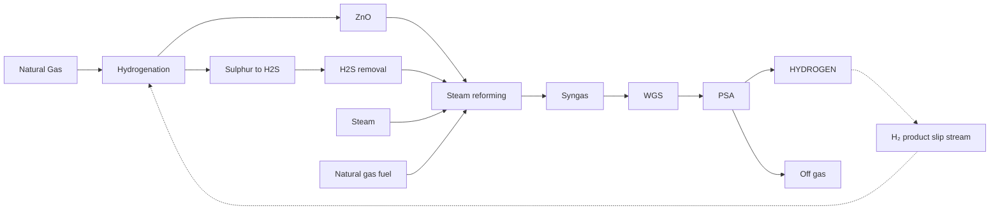
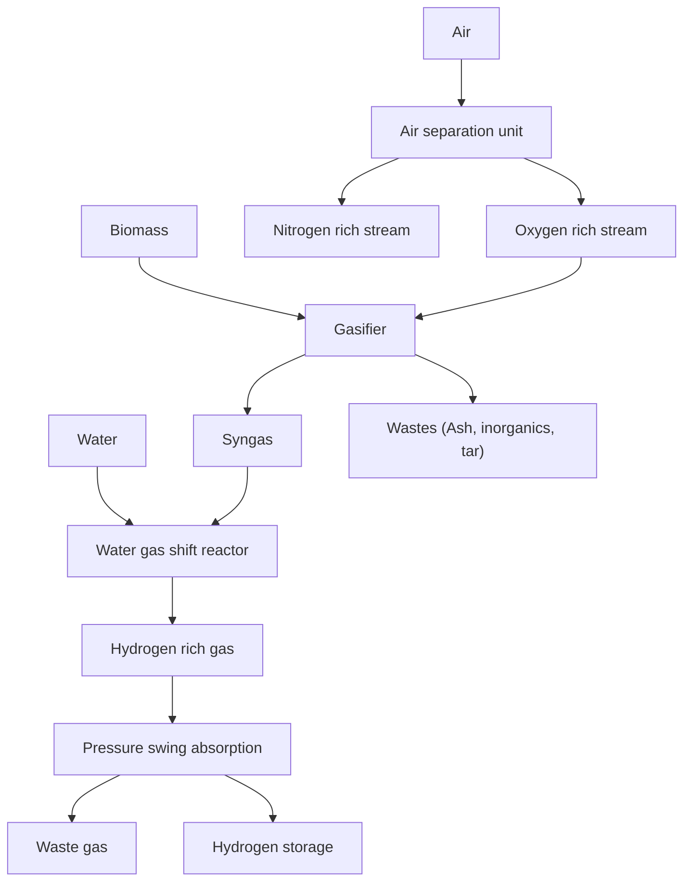
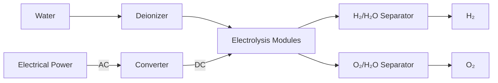
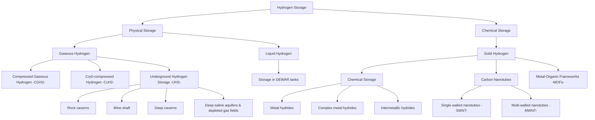

# Hydrogen as a clean energy carrier: advancements, challenges, and its role in a sustainable energy future

Stephen Okiemute Akpasi1,\*, , Ifeanyi Michael Smarte Anekwe2, Emmanuel Kweinor Tetteh1, , Ubani Oluwaseun Amune3, , Sherif Ishola Mustapha2,4,  and Sammy Lewis Kiambi5, 

1Green Engineering Research Group, Department of Chemical Engineering, Faculty of Engineering & the Built Environment, Durban University of Technology, PO Box 1334, Durban 4000, South Africa
2School of Chemical and Metallurgical, University of Witwatersrand, PO Wits 2050, Johannesburg, South Africa
3Department of Chemical Engineering, Edo State University, PMB 04, Auchi, Uzairue, Nigeria
4Department of Chemical Engineering, University of Ilorin, PMB 1515, Ilorin, Kwara State, Nigeria
5Department of Chemical Engineering, Vaal University of Technology, X021, Vanderbijlpark 1900, South Africa
\*Corresponding author. E-mail: stephenakpasi48@gmail.com; 21958199@dut4life.ac.za

## Abstract

This comprehensive review examines hydrogen’s potential as a pivotal clean energy carrier, focusing on its role in replacing fossil fuels across various industries. This study also examines recent advancements in hydrogen production technologies, including electrolysis, steam methane reforming, and biomass gasification, emphasizing their economic and environmental impacts. Special attention is given to hydrogen produced from renewable sources like solar and wind energy, emphasizing its benefits in reducing carbon emissions and contributing to a sustainable energy future. The review discusses technological challenges, cost factors, and the necessary infrastructure for hydrogen production and storage, particularly in relation to achieving global energy transition goals. Furthermore, the study stresses the importance of government policies and international collaboration to drive the adoption of hydrogen technologies. The study concludes by outlining the transformative potential of hydrogen in decarbonizing key sectors such as transportation and heavy industry. It demonstrates the significant contribution of hydrogen to a low-carbon global energy system and provides valuable insights into its role in improving grid stability, energy security, and supporting sustainable industrial practices.

## Graphical abstract

**Keywords:** solar; hydrogen; renewable energy; fossil fuels; hydrogen production

---

# 1. Introduction

The global rise in human population has accelerated economic development and increased civilization worldwide, leading to a heightened demand for energy. Meeting this growing demand is one of the world’s most urgent challenges today, as it directly impacts both global prosperity and environmental sustainability [1]. Historically, fossil fuels have been the primary driver of economic expansion and industrialization, constituting around 88% of the energy sources used in industries [2]. Derived from hydrocarbons like coal, oil, and natural gas, fossil fuels have been favoured due to their high energy density and well-established infrastructure for extraction, transportation, and refinement [3]. However, the continued reliance on these energy sources raises significant sustainability concerns, both in terms of depletion and the environmental damage they cause [4]. The burning of fossil fuels contributes to the release of significant amounts of greenhouse gases (GHGs), primarily carbon dioxide (CO2), which is a major driver of global warming and climate change [5]. This environmental impact is particularly concerning in the context of international climate goals, such as the United Nations Sustainable Development Goals (SDGs), specifically SDG 13 (climate action) and SDG 7 (affordable and clean energy). The carbon emissions from fossil fuel consumption directly counteract the global push towards net-zero emissions by 2050, an essential target for stabilizing global temperatures and preventing the worst impacts of climate change [6]. Fossil fuel usage also poses public health challenges, aligning with SDG 3 (good health and well-being), as pollution from the extraction and combustion of fossil fuels is linked to respiratory, cardiovascular, and developmental health issues, particularly in vulnerable populations like children [7]. According to Jiang et al. [8], burning fossil fuels releases approximately 21.3 billion tons of CO2 annually, with a significant portion attributed to the transportation sector. This highlights the urgent need for transitioning to cleaner, renewable energy sources, such as solar, wind, and hydrogen, which can provide sustainable alternatives without the environmental costs associated with fossil fuels [9]. The shift toward renewable energy is crucial for achieving net-zero emissions and supporting sustainable development worldwide. Renewable energy not only mitigates the harmful effects of fossil fuel dependence but also ensures energy security, reduces pollution, and supports economic growth in line with global climate commitments [10].

Renewable energy, derived from naturally regenerative sources, is reliable and sustainable and enhances environmental quality without hindering economic growth [11]. The switch to renewable energy signifies an essential socioeconomic change that affects development and quality of life, as recognized by the United Nations SDG 7, which seeks to guarantee that everyone has access to dependable, affordable, modern, and sustainable energy by 2030 [10]. Investments in renewable energy are essential for attaining green development and an economy that is carbon-neutral because they lower carbon intensity, encourage cleaner output, and facilitate the energy transition, lowering energy costs, enhancing price stability, and improving energy security and payment balances in nations with low energy [12]. This energy, which could be derived from wind, geothermal resources, solar radiation, water resources, solid biomass, biogas, and liquid biofuels, is crucial for rapid deployment to achieve decarbonization and mitigate climate change [13]. Among the various end products derived from renewable energy sources, hydrogen has recently gained significant attention.

Lately, hydrogen has come to light as a crucial component in the transition to green energy, offering a versatile, efficient, and eco-friendly substitute for fossil fuels across various sectors. While hydrogen is not a renewable energy source, it can be generated using renewable energy sources like solar, biomass, and wind, making it a viable choice for the future [13]. With the increasing integration of renewable technologies into the energy sector, hydrogen can mitigate seasonal imbalances and stabilize the inconsistent supply, facilitating the transition to renewable energy [14]. This is because hydrogen is an exceptionally efficient and clean fuel that generates only water vapour when burned, releasing no harmful emissions and having a large potential to cut down on air pollution and greenhouse gas emissions [15, 16]. Also, it is a highly flammable, colourless, and odourless fuel that could be employed in various applications, such as internal combustion engines (ICEs), rocket engines, and fuel cells [17]. Due to its energy density, which is over three times more than that of gasoline, it is highly efficient for energy storage and electricity production, with its generation utilizing various biological, photosynthetic, and chemical methods [18]. Clean hydrogen can be produced using different domestic resources, such as coal gasification (CG), nuclear power, natural gas, and renewable energy sources like biomass, solar, wind, geothermal, hydro, and ocean thermal energy conversion (OTEC) [19].

Nonetheless, the majority of the energy used to produce hydrogen, roughly 75–100 Mt, annually comes from fossil fuels using a process called steam methane reforming (SMR) [14]. From Fig. 1, only a small portion comes from the electrolysis as shown. With global electricity having a renewable share of about 33%, only around 1% of the world’s hydrogen production is derived from renewable energy sources [20].

Electrolysis, which splits water using electricity, and SMR are the two most used processes for creating hydrogen. It becomes much more important when electrolysis—a procedure that splits water into hydrogen and oxygen using electricity—is powered by renewable energy sources like solar, wind, and hydroelectric power [21]. This process yields green hydrogen, which is entirely carbon-free and represents the pinnacle of clean energy production. A comparative analysis and environmental effect evaluation of hydrogen production techniques using renewable and non-renewable resources was carried out in a recent review article [22]. Among renewable energy sources, hydrogen generated from biomass gasification boasts higher exergetic and energetic efficiencies than hydrogen derived from solar and geothermal methods [23]. Presently, hydrogen is recognized as a vital source of energy for an environmentally friendly future, prompting extensive global efforts to prioritize its research, development, and innovation across industrialized and rapidly growing nations [1]. Numerous projects centred around hydrogen are now garnering financial support worldwide. For instance, the Pacific Northwest Hydrogen Hub (PNWH2 Hub) has been awarded a $1.2 billion grant from the US government to support hydrogen production [24]. The PNWH2 Hub plans to establish eight nodes across Montana, Oregon, and Washington, utilizing the region’s advanced technology and abundant renewable energy resources. This initiative aims to address some of the most challenging sectors to decarbonize, including public transit, agriculture, medium- and heavy-duty transport, and the electric power industry [24]. Elsewhere, Climate Impact Corporation (CIC), a prominent global developer of renewable energy and green hydrogen projects, has announced plans to develop two 10 GW green hydrogen projects in central Australia. These projects, valued at US$10 billion, will utilize CIC’s proprietary modular technology for renewable hydrogen production [25].

---

| Source       | Percentage |
| ------------ | ---------- |
| Natural Gas  | 47         |
| Coal         | 27         |
| Crude Oil    | 22         |
| Electrolysis | 4          |

Figure 1. Hydrogen production by source [20].

Siemens Energy has secured a contract from German utility EWE to supply a 280-megawatt electrolysis system for a plant in Emden, Germany [26]. Scheduled to begin operations in 2027, this facility will produce up to 26 000 tons of green hydrogen annually for diverse industrial applications in the region. The green hydrogen generated could potentially replace fossil fuels, reducing CO₂ emissions by approximately 800 000 tons per year in industries like steel production [26]. Moreover, BP has secured funding from the joint efforts of BMWK and the Lower Saxony Government as part of the European IPCEI Hy2Infra initiative to support a green hydrogen project in Germany [27]. This funding will facilitate the development of a 100 MW green hydrogen facility adjacent to BP’s Lingen Refinery. The project involves installing a 100 MW electrolyser, which is expected to produce an average of 10–11 kilotons of green hydrogen annually [27]. Several other funded hydrogen projects are discussed in Table 1. Figure 2 shows the public budgets for Research Development & Demonstration (RD&D) on hydrogen since 2018. Government investment in hydrogen technology RD&D surges in 2022, continuing a trend from the mid-2010s and reaching a historic high of 7.5% of clean energy budgets [28].

Regarding the endeavours to reduce carbon emissions, integrating hydrogen as a fuel source offers a promising and sustainable alternative to conventional ICE vehicles in the transportation sector [38]. These vehicles can be refuelled quickly and have a longer range compared to battery-electric vehicles, addressing some of the limitations associated with electric mobility [39]. Moreover, hydrogen has applications in the shipping and aviation industries, which have historically proven challenging to decarbonize [40]. Beyond transportation, hydrogen is instrumental in energy storage and grid stability [41]. Since renewable energy sources like solar and wind are intermittent, hydrogen can be used to store excess energy during high-production periods and release it during low-production periods [42]. This capability helps balance the grid, enhances energy security, and ensures a reliable supply of clean energy.

Additionally, industrial applications also see significant benefits from hydrogen adoption. Industries such as chemical manufacturing, refining, and steel production can utilize hydrogen to replace carbon-intensive processes, drastically reducing their carbon footprints [43]. This transition not only supports environmental goals but also opens new economic opportunities and drives technological innovation.

Hydrogen, despite its numerous advantages as a clean energy carrier, faces several significant challenges on its path to becoming a widely adopted renewable energy source. These include high production costs, the need for extensive infrastructure for storage and distribution, and the necessity for technological advancements to improve scalability and efficiency. However, with ongoing research, increased funding, and supportive legislation, many of these barriers are being addressed, paving the way for a hydrogen-powered future. This study explores decentralized hydrogen production, providing a thorough analysis of how hydrogen can be generated at various levels within the energy infrastructure. It also examines the potential of local and regional hydrogen production, highlighting the benefits of reducing dependence on centralized facilities and enhancing energy security. Additionally, the study will assess the risks involved in the production, storage, and distribution of hydrogen, offering strategies to mitigate associated safety concerns.

The primary objective of this research is to assess the economic feasibility of hydrogen as a large-scale replacement for fossil fuels. With the global demand for clean energy increasing, this study focuses on hydrogen’s potential as a sustainable, environmentally friendly energy carrier, particularly when produced from renewable sources such as biomass, wind, and solar. The research delves into the technological advancements, environmental benefits, and economic challenges surrounding hydrogen production, storage, and distribution, and compares them to traditional fossil fuel systems. Ultimately, the goal is to determine whether hydrogen can play a pivotal role in supporting the global transition to a low-carbon economy, reducing greenhouse gas emissions, and decreasing reliance on fossil fuels, while ensuring its economic viability.

# 2. Hydrogen as a clean energy carrier

Hydrogen does not exist freely in nature and must be produced by breaking down compounds such as methane (CH₄) or water (H₂O). Consequently, hydrogen is regarded as a clean energy carrier rather than a primary energy source. A variety of technologies have been developed to produce hydrogen from a diverse range of feedstocks. In cases where a particular feedstock, like natural gas, becomes unavailable, production could shift to alternative sources. However, this would require either the establishment of redundant facilities capable of producing hydrogen from multiple feedstocks or adaptable plants that can handle various inputs. For electricity generation, a trade-off exists between enhanced energy security and the cost associated with maintaining backup generation capacity. Unlike electricity, hydrogen can be stored relatively cheaply in underground caverns as a gas, which reduces the need for extensive spare capacity.

Hydrogen is a promising energy carrier proposed as a replacement for current energy infrastructures in renewable energy systems [44, 45]. As a ‘sustainable energy carrier’, hydrogen is not depleted by continuous use, poses no environmental threats, produces no pollutants, and does not exacerbate health issues [46]. Hydrogen, the most abundant and lightest element, exists in compound form rather than as a free element in nature. It can be readily produced from water and conveniently stored and transported. It offers a high energy content per unit mass compared to other fuels. However, as an energy carrier rather than

---

Table 1. Overview of funded hydrogen projects.

| Company                                                          | Financial support           | Project location                 | Key features                                                                                                                                                               | Decarbonization sectors                                                 | Expected outcomes                                                                                                               | Ref.  |
| ---------------------------------------------------------------- | --------------------------- | -------------------------------- | -------------------------------------------------------------------------------------------------------------------------------------------------------------------------- | ----------------------------------------------------------------------- | ------------------------------------------------------------------------------------------------------------------------------- | ----- |
| HNH Energy                                                       | $11 billion                 | Magallanes region, Chile         | Largest investment to reach environmental assessment in Chile; includes port infrastructure for ammonia exports                                                            | General green hydrogen and ammonia production                           | Annual production capacity increased from 850 000 to 1.3 Mt of green ammonia                                                    | \[29] |
| Catalina Green Hydrogen                                          | €2.35 billion (first phase) | Near Andorra, northeastern Spain | 500 MW phase to produce 84 000 tons of green hydrogen annually. Includes 504 MW onshore wind power, 571 MW solar power, 300-ton hydrogen storage, and a 221-km H₂ pipeline | Fertilizer production, local gas grid injection                         | Significant contribution to green hydrogen production. Entry into operation by December 2027                                    | \[30] |
| MadoquaPower2X                                                   | €1.1 billion                | Port of Sines, Portugal          | Produce 50 000 tons of green hydrogen/year for local gas grid, and 300 000 tons of green ammonia for maritime transport and fertilizer production                          | Maritime transport, fertilizer production                               | Enhanced production capacity for green hydrogen and ammonia                                                                     | \[31] |
| Nordic Ren-Gas Lahti Plant                                       | EUR 45 million              | Lahti, Finland                   | Develop competitive green hydrogen production, leveraging sector integration and existing infrastructure                                                                   | Renewable hydrogen production                                           | Produce 122 000 tons of renewable hydrogen over the next 10 years, avoiding nearly 1 Mt of CO₂ emissions                        | \[32] |
| Shell                                                            | €149 million                | Shell Refinery, Germany          | 100 MW green hydrogen project, producing 44 tons of H₂ per day from 2027; driven by EU’s renewable hydrogen targets; complies with strict criteria for renewable H₂        | Refining transport fuels, potential supply to other industrial users    | Displace grey H₂ at Shell Energy and Chemicals Park Rheinland; contribute to renewable H₂ goals                                 | \[33] |
| Electric Hydrogen                                                | $100 million                | Natick, MA, USA                  | Manufacturing and deployment of 100 MW electrolyser plants for lowest cost green hydrogen production                                                                       | Steel, fertilizer, shipping, aviation                                   | Enable gigawatt-scale electrolyser plants, supporting industry decarbonization                                                  | \[34] |
| Lhyfe’s Renewable Hydrogen Plant                                 | SEK 125.6 million           | Trelleborg, Sweden               | Build a local renewable hydrogen production system with 10 MW electrolysis capacity to produce up to 4 tons of green hydrogen per day                                      | Transport, logistics, mobility                                          | Support hydrogen refuelling stations and contribute to zero carbon emissions                                                    | \[35] |
| Hydrogen Optimized Inc. (subsidiary of Key DH Technologies Inc.) | Over $3.5 million           | Owen Sound, Ontario              | Automate and expand RuggedCell™ water electrolyser manufacturing capacity, increasing production 5-fold to 5000 units/year, creating 50 full-time jobs                     | Large-scale clean hydrogen production for major industrial applications | Enhance global clean hydrogen capacity, support industrial decarbonization, create high-quality jobs                            | \[36] |
| Vireon (subsidiary of Norwegian Hydrogen)                        | €9.2 million                | Finland, Denmark                 | Construction of green hydrogen production and refuelling stations for heavy-duty vehicles                                                                                  | Transportation network, heavy-duty vehicles                             | Transition to a decarbonized transportation network in Europe; establish a vital corridor for zero-emission heavy-duty vehicles | \[37] |

a primary energy source, hydrogen is produced from a variety of sources, such as water, biomass, and fossil fuels. Although it has a gravimetric energy content two to three times greater than conventional fuels, its volumetric energy density is relatively low [47]. Hydrogen technology has numerous applications, such as hydrogen-powered industries, hydrogen villages, and hydrogen-powered jet aircraft. It is suitable for all domestic energy needs and can be used for electricity generation. Hydrogen can be used to store energy as electricity with the assistance of fuel cells. Table 2 provides a summary of the key physical properties of hydrogen (H₂) [48].

Hydrogen is increasingly being considered as a key component of future energy solutions due to its potential to meet energy demands while reducing CO₂ emissions. Unlike fossil fuels, which emit GHGs when burned, hydrogen produces clean energy with water as the only byproduct. Figure 3 compares the technologies associated with hydrogen and fossil fuels. Utilizing hydrogen from conventional sources in fuel cells can reduce carbon emissions by nearly 20%. Moreover, producing hydrogen from renewable energy sources can significantly reduce carbon emissions, potentially reaching zero emissions [49]. Therefore, hydrogen can be a clean energy source, provided that the associated technologies

---

| Year | America (USD Million) | Asia & Oceania (USD Million) | Europe (USD Million) | Share clean energy RD\&D (%) |
| ---- | --------------------- | ---------------------------- | -------------------- | ---------------------------- |
| 2018 | 150                   | 400                          | 600                  | 3.0                          |
| 2019 | 150                   | 450                          | 700                  | 3.5                          |
| 2020 | 180                   | 550                          | 850                  | 4.0                          |
| 2021 | 150                   | 500                          | 1450                 | 5.5                          |
| 2022 | 350                   | 750                          | 1750                 | 7.5                          |

Figure 2. Government RD&D expenditure on hydrogen technologies by region (2018–22) [28].

Table 2. Properties of hydrogen (H₂) under ambient conditions. Adapted from Sharma et al. [48].

| Properties           | Value                |
| -------------------- | -------------------- |
| Lower heating value  | 119.93 MJ/kg         |
| Higher heating value | 141.86 MJ/kg         |
| Triple point         | −259.3°C at 0.07 bar |
| Critical point       | −240.2°C at 12.7 bar |
| Melting point        | −259°C               |
| Boiling point        | −252.87°C            |
| Volumetric density   | 0.08376 kg/m³        |
| Energy density       | 10.05 MJ/m³          |
| Molecular mass       | 2.01568 amu          |
| Atomic mass          | 1.00784 amu          |
| Atomic number        | 1                    |

are environmentally friendly. However, it cannot yet be regarded as a completely clean fuel because current hydrogen production methods and technologies remain largely conventional.

Hydrogen is increasingly being recognized as a promising alternative to fossil fuels for several reasons. The primary reason is its environmentally friendly nature; using hydrogen has no adverse effects on the environment since burning it in the air produces only water as a byproduct. Additionally, hydrogen is easily portable; it can be transmitted in the form of energy through power lines or transported over long distances via pipelines. Another advantage is its recyclability; as it oxidizes to form water, it can be separated back into its constituent elements to produce hydrogen again. Its cost-effectiveness relative to its energy density is also a significant factor, with hydrogen prices ranging from 0.8 to 4 USD/kg depending on technology and raw material costs [50]. According to the Hydrogen Council (2020) [50], hydrogen energy was extensively used in 2020 and has the potential to meet over 8% of the global energy demand at a cost

of around 2.50 USD/kg. It is estimated that by 2030, the cost of producing hydrogen will decrease to about 1.80 USD/kg, potentially addressing around 15% of the world’s energy demand. By 2050, hydrogen supply and demand are expected to reach 10 EJ annually, with demand projected to grow by approximately 5%–10% per year. Hydrogen could potentially provide 18% of the world’s energy needs by 2050. Given its high energy density, low production costs, and minimal carbon emissions, hydrogen is poised to become a highly attractive option in the future energy landscape [51].

Another key factor is hydrogen’s versatility in storage, with a wide range of options available. While there are currently significant challenges in achieving efficient hydrogen storage, these can be optimized through advancements in storage media in the near future. Additionally, hydrogen can be produced sustainably using abundant, clean water, making it a highly appealing option across various industries, including its use as a chemical fuel. Overall, hydrogen offers numerous advantages over fossil fuels, suggesting its potential as a future energy source [52].

The International Energy Agency (IEA) has highlighted the potential of green hydrogen to reduce carbon emissions, though this will depend on overcoming key challenges such as infrastructure, safety, and production costs. Currently, conventional hydrogen production methods generate around 843 million metric tons of CO₂ annually, which is equivalent to the combined emissions of the UK and Indonesia. The global demand for hydrogen is projected to increase from 70 to 120 Mt between 2019 and 2024. To address this demand and align with the United Nations seventh SDG of ‘clean and affordable energy’, the development of hydrogen technologies is crucial [52, 53].

In this regard, the world’s largest green hydrogen plant is expected to be operational by 2025, with a capacity to produce 237 250 tons of hydrogen per year. This facility will generate 4 GW of renewable energy from solar and wind through electrolysis, significantly advancing the shift toward sustainable energy [54].

---

<page_header>
Downloaded from https://academic.oup.com/ce/article/9/1/52/7942071 by guest on 16 May 2026
</page_header>

| HYDROGEN TECHNOLOGIES FOSSIL FUELS C + O2 → CO2      | HYDROGEN TECHNOLOGIES Hydrogen from Natural Gas Combustion GENERATION CH4 + 2H2O → 4H2 + CO2 COMBUSTION 2H2 + O2 → 2H2O | HYDROGEN TECHNOLOGIES Hydrogen from Natural Gas Fuel Cells | HYDROGEN TECHNOLOGIES Hydrogen from Renewable Energy (Solar Hydrogen) (Solar Hydrogen) GENERATION H2O --hv--> H2 + 1/2 O2 COMBUSTION H2 + 1/2 O2 → H2O |
| -------------------------------------------------------- | --------------------------------------------------------------------------------------------------------------------------------------- | ------------------------------------------------------------------ | -------------------------------------------------------------------------------------------------------------------------------------------------------------------------- |
| Full Scale Mission of Greenhouse Gases and Air Pollution | \* Urban Areas Free of Toxic Gases \* Full Scale Emission of Greenhouse Gases in Industrial Areas                                   |                                                                    | Zero Emission Level                                                                                                                                                        |

Figure 3. Comparison of carbon emissions from fossil fuel and hydrogen combustion. Reproduced and adapted from Nowotny and Veziroglu [49] with permission from Elsevier.

## 2.1 Hydrogen cycle

Unlike oil, coal, and natural gas, hydrogen is not considered a primary fuel; rather, it serves as an energy carrier, similar to electricity. As a secondary form of energy, hydrogen is produced from fundamental energy sources. Advocates of the Hydrogen Economy argue that hydrogen offers a more environmentally friendly alternative for consumers, particularly in the transportation sector, as it does not emit harmful pollutants at the point of use.

Hydrogen production is initiated by green power plants that start the hydrogen cycle [55]. Renewable energy sources, such as hydropower plants, wind turbines, photovoltaic (PV) cells, geothermal facilities, and biomass plants, are utilized to generate the necessary energy without producing nuclear waste or CO₂ emissions [56]. The use of hydrogen as an energy source involves three main phases: (i) production, (ii) storage, and (iii) utilization through combustion, as shown in Fig. 4, which forms the closed hydrogen cycle.

When derived from renewable energy sources, the hydrogen cycle operates as follows: renewable energy (e.g. solar, hydro, wind) is converted into electricity using PV cells or turbines. This electricity is then used to split water into hydrogen and oxygen, with the oxygen being released into the atmosphere. The hydrogen is subsequently stored, transported, and distributed. The cycle is completed when the stored hydrogen is recombined with oxygen from the atmosphere to produce electricity and heat, releasing water vapour back into the atmosphere.

## 2.2 Hydrogen as a decarbonization agent

Exploiting hydrogen as an energy carrier is critical to mitigating climate change through a decarbonized energy transition towards a zero-carbon economy. Herein, the dependency of global energy on fossil fuels contributed to CO₂ emissions reaching 37.9 billion tons is causing the earth’s high temperature with unforeseeable risks to human future [57]. Notwithstanding, the industrial (petrochemical, fertilizer, steel, cement) reliance on carbon-based energy for electricity, transportation, and heating also contrib-

utes to CO₂ emissions [58, 59]. This has intensified the search for alternative energy sources to the Paris Agreement’s objective of achieving carbon neutrality by 2050 [60]. In this context, many countries have prioritized producing and deploying hydrogen strategies as a roadmap for decarbonization and a sustainable environment [59, 61, 62]. However, the demand and supply of hydrogen as an energy alternative to carbon-based fuels (fossil, coal, natural gas, and oil) must be balanced, as these contribute over 85% of global energy [62]. As shown in Fig. 5, some of the hydrogen production technologies and their future energy mix applications must be capacitated to meet the carbon-neutral by 2050 [57]. For instance, green hydrogen has a high market value in a 100% renewable energy future with intrinsic versatility as a chemical and non-emissive energy transport [60]. This is because its sustainable development and energy conversion can be generated from renewable sources via water electrolysis without greenhouse gas emissions [57, 62].

# 3. Hydrogen production methods

Due to its abundance, hydrogen (H₂) is present in a variety of natural substances (e.g. in freshwater and seawater, fossil fuels hydrogen sulphide, and biomass). When extracting H₂ from sources such as CO₂ or fossil fuels, it is essential to remove pollutants through processes like capture or sequestration to produce H₂ with minimal or no environmental impact, often referred to as "green" hydrogen. Consequently, sustainable production [64] would be possible by utilizing the potential of feedstocks and energy sources such as renewable biomass, wind, and solar energy in addition to non-renewable fossil fuels. As shown in Fig. 6, H₂ can be produced by various processes; currently, the majority of H₂ is produced from fossil fuels [65].

## 3.1 Thermochemical processes

To produce H₂ gas, hydrocarbons or water are used in thermochemical processes to catalyse chemical reactions that release H₂ gas [3]. This process has the advantage of a higher overall

---

**Figure 4.** The hydrogen cycle. Adapted from Sharma et al. [48].

efficiency (thermal to hydrogen) of η ~ 52% and lower production costs [4]. Lignocellulosic biomass can be converted into H₂ via thermochemical processes (steam gasification and pyrolysis) [5]. Natural gas/steam reforming is the most widely used thermochemical process to produce H₂ [3].

### 3.1.1 Natural gas/steam reforming

As shown in Fig. 6, the most popular and cost-effective method of producing H₂ is steam reforming. In this method, natural gas is purified, mixed with steam, and then passed through an externally heated reactor. The result is carbon monoxide and hydrogen gas, as shown in Equation (1). Subsequently, CO and H₂O are converted to H₂ and CO₂ by a catalytic water–gas shift reaction, as shown in Equation (2). The H₂ gas is then refined. In large quantities (e.g. 100 000 tons annually), yields of over 80% can be obtained with this method [66]. More compact steam reformers generally have a lower efficiency (especially for small fuel cells).

$$ CH_4 + H_2O \rightarrow CO + 3H_2 \quad (1) $$

$$ CO + H_2O \rightarrow H_2 + CO_2 \quad (2) $$

A major drawback of steam reforming methods is that, in addition to generating H₂, they also discharge significant amounts of CO₂ emissions into the atmosphere. This is due to the fact that the processes use fossil fuels for both the heat source and the production process. The block flow diagram of a simple SMR plant for the production of H₂ is illustrated in Fig. 7 [22].

### 3.1.1.1 Reaction mechanisms of steam reforming

The catalysts, particularly the active metal and type of support, play a critical role in influencing the steam reforming reaction mechanism. Previous research on methane steam reforming kinetics was based on the assumption of methane adsorption. Khomenko et al. applied the quasi-steady-state approximation using the Temkin identity to bypass the rate-determining step. This approach successfully led to the development of a rate expression applicable within the 470°C–700°C temperature range [67].

$$ r = \frac{k \cdot P_{CH_4} \cdot P_{H_2O} \left( 1 - \frac{P_{CO} P_{H_2}^3}{K_{eq} P_{CH_4} P_{H_2O}} \right)}{f(P_{H_2O}, P_{H_2}) \left( 1 + \frac{K_{H_2O} P_{H_2O}}{P_{H_2}} \right)} \quad (3) $$

where, $K_{eq}$ represents the equilibrium constant for the overall reaction, and $f(P_{H_2O}, P_{H_2})$ is a polynomial function of $P_{H_2}$, and $P_{H_2O}$.

One of the earliest rate expressions based on a detailed reaction mechanism was proposed by Xu and Froment [68]. They investigated the kinetic and mechanistic aspects using a Ni/MgAl₂O₄ catalyst and developed the following mechanism:

s1: CH₄ + S = CH₄ · S

s2: H₂O + S = CH₄ · S

s3: CO · S = CO + S

s4: CO₂ · S = CO₂ + S

s5: H · S + H · S = H₂ · S + S

s6: H₂ · S = H₂ · S + S

s7: CH₄ · S + S = CH₃ · S + H · S

s8: CH₃ · S + S = CH₂ · S + H · S

s9: CH₂ + O · S = CH₂O · S + S

s10: CH₂O · S + S = CHO · S + H · S

s11: CHO · S + S = CO · S + H · S (rate determining step)

s12: CHO · S + O · S = CO₂ · S + H · S (rate determining step)

s13: CO · S + O · S = CO₂ · S + S (rate determining step)

Where S represents the surface catalyst. The rate equations derived from the rate-determining steps correspond to the reaction CH₄ + H₂O = 3H₂ + CO.

$$ r_1 = \frac{k_1}{P_{H_2}^{2.5}} \left( P_{CH_4} \cdot P_{H_2O} - \frac{P_{H_2}^3 P_{CO}}{K_1} \right) / (DEN)^2 \quad (4) $$

---

| Category             | Sub-category                     | Details                                        | Percentage |
| -------------------- | -------------------------------- | ---------------------------------------------- | ---------- |
| Hydrogen Production  | Steam Reforming of Natural Gas   | (1.5 - 2.9 $/kg H2) CO2 emissions: Low     | 49%        |
| Hydrogen Production  | Partial Oxidation of Hydrocarbon | (1.0 - 2.1 $/kg H2) CO2 emissions: Medium  | 29%        |
| Hydrogen Production  | Coal Gasification                | (1.2 - 2.1 $/kg H2) CO2 emissions: High    | 18%        |
| Hydrogen Production  | Electrolysis                     | (3.6 - 5.8 $/kg H2) CO2 emissions: Minimal | 4%         |
| Hydrogen consumption | Fuel                             | Fuel Cells                                     |            |
| Hydrogen consumption | Fuel                             | Engines/Turbines                               |            |
| Hydrogen consumption | Fuel                             | Energy Storage                                 | 2%         |
| Hydrogen consumption | Chemical                         | Metal Processing & Fabrication                 | 4%         |
| Hydrogen consumption | Chemical                         | Methanol Production                            | 42%        |
| Hydrogen consumption | Chemical                         | Petroleum Recovery Refining                    |            |
| Hydrogen consumption | Chemical                         | Ammonia Production                             | 47%        |

Figure 5. Hydrogen production technologies and application as energy mix for decarbonization. Reproduced and adapted from Hoang et al. [57] and Kumar and Lim [63] with permission from Elsevier.

For CO + H₂O = H₂ + CO₂

$$ r_2 = \frac{k_2}{P_{H_2}} \left( P_{CO} P_{H_2O} - \frac{P_{H_2} P_{CO_2}}{k_1} \right) / (DEN)^2 $$ (5)

For CH₄ + 2H₂O = 4H₂ + CO₂

$$ r_3 = \frac{k_3}{P_{H_2}^{3.5}} \left( P_{CH_4} P_{H_2O}^2 - \frac{P_{H_2}^4 P_{CO_2}}{K_3} \right) / (DEN)^2 $$ (6)

$$ DEN = 1 + K_{CO}P_{CO} + K_{H_2}P_{H_2} + K_{CH_4}P_{CH_4} + K_{H_2O}P_{H_2O}/P_{H_2} $$

Several research groups have built upon the work of Xu and Froment, proposing their own mechanisms. Rostrup-Nielsen et al., for example, introduced a similar model [69, 70]:

$$ s1: CH_4 + 2 \cdot S = CH_3 \cdot S + H \cdot S $$
$$ s2: CH_3 \cdot S + S = CH_2 \cdot S + H \cdot S $$
$$ s3: CH_2 \cdot S + S = CH \cdot S + H \cdot S $$
$$ s4: H_2 + 2 \cdot S = 2H \cdot S $$

In this case, S denotes a catalyst surface site. A more intricate mechanism is described in Compton’s book for methane reforming with steam on a nickel surface. Here, S represents the catalyst surface, and the final two steps, 5 and 6, are in equilibrium, denoted by the symbol ≈ [70].

$$ s1: CH_4 + S = S \cdot CH_2 + H_2 $$
$$ s2: S \cdot CH_2 + H_2O = S \cdot CHOH + H_2 $$
$$ s3: S \cdot CHOH = S \cdot CO + H_2 $$
$$ s4: S \cdot CO = S + CO $$
$$ s5: S + H_2O \approx S \cdot O + H_2 $$
$$ s6: S \cdot O + CO \approx S + CO_2 $$

Another mechanism was proposed by Wei and Iglesia [71], who studied the reactions of CH₄ with CO₂ and H₂O on Rh clusters. Their findings showed that the reaction rates were proportional to the partial pressure of CH₄ but independent of CO₂ and H₂O

---

**Conversion Methods:**

Figure 6. Sources and production methods of hydrogen.

Figure 7. Simplified flow diagram of steam methane reformer for producing H₂.

pressures, leading to the conclusion that C–H bond activation steps were the sole kinetically relevant processes. They observed that the Rh surface could be uncovered by reactive intermediates due to the rapid activation of co-reactants and the scavenging of chemisorbed carbon intermediates during CH₄ activation. Additionally, the activation of C–H bonds was found to be irreversible, and the recombinative desorption of H atoms with OH groups resulted in the formation of H₂ or H₂O.

s1: CH₄ + 2 · S → CH₃ · S + H · S (rate determining step)

s2: CH₃ · S + S → CH₂ · S + H · S

s3: CH₂ · S + S → CH · S + H · S

s4: CH · S + S → CS + H · S

s5: CO₂ + 2 · S ↔ CO · S + O · S

s6: CS + O · S ↔ CO · S + O · S

s7: CO · S ↔ CO + S

s8: H · S + H · S ↔ H₂ · S + S

s9: H · S + O · S ↔ OH · S + S

s10: OH · S + H · S ↔ H₂O · S + S

s11: H₂O · S ↔ H₂O + S

Comparing the mechanisms proposed by Wei and Iglesia [71] and Xu and Froment [68] reveals key differences. In Xu and Froment’s [68] mechanism, the reactions of carbon intermediates with oxygen are the rate-determining steps, highlighting the significant role of oxygen in reaction kinetics. This underscores the importance of oxygen-conducting supports, such as ceria. In contrast, Wei and Iglesia’s [71] mechanism suggests that the overall reaction kinetics are governed by the metal’s reactivity towards C–H bond cleavage.

### 3.1.2 Biomass gasification

Biomass gasification involves the burning of biomass under restricted air conditions to produce CO₂, H₂, CH₃, CO, N₂, and steam (Fig. 8). Combustible gas-containing char, tars, and ash particles are also produced, which are represented in Equations (7) and (8)

---

Figure 8. H₂ production schematic using biomass gasification.

[5]. Compared to combustion, gasification is a much cleaner conversion process because syngas is produced instead of burning fuel, which prevents the emission of numerous pollutants, such as NOx, SOx, and other particles that are produced at higher temperatures than normal gasification [6].

$$ \text{Biomass} + \text{Air} \rightarrow \text{H}_2 + \text{CO}_2 + \text{CO} + \text{N}_2 + \text{CH}_4 + \text{other CHs} + \text{tar} + \text{H}_2\text{O} + \text{char} \quad (7) $$

$$ \text{Biomass} + \text{Steam} \rightarrow \text{H}_2 + \text{CO} + \text{CO}_2 + \text{CH}_4 + \text{other CHs} + \text{tar} + \text{char} \quad (8) $$

Studies have shown that biomass gasification using steam can yield an average hydrogen composition of 40%, with a gas heating value ranging from 10 to 18 MJ/Nm³ [72, 73]. This is comparable to oxygen gasification, which also produces an average hydrogen composition of 40% but with a higher heating value (HHV) range of 12–28 MJ/Nm³. In contrast, air gasification generates a lower hydrogen composition, averaging 15%, with a gas heating value of only 4–7 MJ/Nm³ [74–76]. Figure 9 illustrates the overall steam gasification reaction of biomass.

### 3.1.3 Biomass-derived liquid reforming

Similar to natural gas reforming, this process utilizes liquids from biomass resources, such as C₂H₆O and bio-oils reformed to produce H₂. Liquids derived from biomass can be produced semi-centrally or even distributed to fuelling stations as they are easier to transport than their biomass feedstocks. Given the difficulties of storing and transporting H₂, this process is a promising technological route in the medium term.

When biomass-derived liquids are reformed to H₂, the high-temperature reaction of the liquid fuel with water vapour in the presence of a catalyst produces a reformate gas consisting mainly of H₂, CO, and a small amount of CO₂. Through a process known as ‘water–gas shift reaction’, high temperature steam and CO (produced in the first step) react to produce more H₂ and CO₂. The H₂ is finally extracted and refined.

The steam reforming of biomass feedstocks using the different materials listed in Table 3 has become the subject of recent research progress. These developments aim to further improve the process as the primary method of producing renewable H₂, which is considered the optimal choice for the world’s energy future [85–88]. Thermodynamic studies have shown that steam reforming of biomass-derived raw materials at temperatures above 400°C can produce H₂ gas. In addition, several studies have shown that the H₂ yield is increased by increasing the temperature and steam content of the reforming process and drastically reduced by high pressure [85, 89–91]. The use of inexpensive Ni-based catalysts is also common in this process [89, 92, 93].

### 3.1.4 Solar thermochemical hydrogen

Solar thermochemical hydrogen (STCH) production has been investigated as a possible alternative fuel source [94]. The method usually consists of two stages and produces H₂ gas by utilizing metal oxide materials and concentrated solar energy to split water [95, 96]. The first stage of a standard STCH cycle involves the thermal reduction of the metal oxide in an inert atmosphere at temperatures above 1200°C using a concentrated solar thermal flux [97]. This reduction process creates oxygen gaps in the metal oxide and releases O₂ gas. In the second phase of re-oxidation, H₂ gas is formed from H₂O and oxygen-deficient metal oxides. This process takes place at a lower temperature and in the presence of steam. This process also regenerates the metal oxide required for the subsequent water-splitting cycles.

STCH, which is primarily fuelled by heat, has a number of significant advantages over water electrolysis, which uses renewable electricity. For example, STCH is able to utilize the entire solar spectrum.

---

Figure 9. Mechanism of chemical reactions in steam gasification of biomass. Adapted from Sasikala et al. [77] and Kadier et al. [78].

In addition, STCH thermal energy storage systems are economical and can compensate for the fluctuations observed with renewable energy sources [98]. The drawbacks of current STCH systems [99–101] include the decomposition of the redox material, the high cost, and the low efficiency of converting heat into hydrogen. Figure 10 illustrates the material cycles that take place at a thermal reduction temperature of TTR for a solar thermochemical reduction process and at an oxidation temperature of TOX for water splitting. Through the feedback of heat between hot and cold particles, a STCH process is able to conserve energy and increase its overall efficiency. An advantageous configuration for the chemical reduction of metal oxide involves a receiver reactor that directly absorbs solar radiation. The chemical processes require a solar receiver reactor with high thermal efficiency and the ability to operate at high temperatures. Although a planar receiver configuration is optimal for this goal, a specific STCH material and process will be associated with a specific design.

## 3.2 Electrolytic processes

Water electrolysis is a well-established and widely used technology for producing high-purity hydrogen. There are several processes for water electrolysis, ranging from the mature alkaline systems to more advanced methods like proton exchange membrane (PEM) electrolysis. Alkaline water electrolysis, the conventional method, has been a reliable technology for decades with efficiencies typically ranging from 70% to 80% (based on HHV). Ongoing efforts aim to enhance its efficiency by increasing the operating temperature or using pressurized electrolysers. Currently, the investment cost for alkaline electrolysis is approximately 500 USD/kW [63, 103]. Although the cost of hydrogen production through alkaline electrolysis is higher than SMR, their efficiencies are comparable.

PEM electrolysis, which uses a solid polymer membrane as the electrolyte instead of an alkaline solution, is gaining attention for its potential to significantly reduce system volume. However, its investment cost is currently over 1000 USD/kW [103, 104], largely due to the high cost of components, which remains a major drawback. Besides the substantial capital investment, the electricity required for electrolysis is a key cost driver, making water electrolysis the most expensive method for hydrogen production among current commercial processes. Consequently, electrolysis is primarily used in small-scale plants.

Renewable energy sources, such as wind, PV systems, solar thermal, and hydropower, are efficient providers of the electricity needed for water electrolysis. Although hydrogen produced from renewable-based electricity is currently more expensive than other methods, it is highly desirable due to its purity and its role as a clean energy carrier. In the long term, producing hydrogen from renewable energy sources will be essential to reduce fossil fuel consumption and minimize greenhouse gas emissions.

Water electrolysis powered by renewable energy generates only hydrogen and oxygen, completely avoiding CO₂ emissions. As large-scale hydrogen production from renewable sources becomes more common in the future, significant quantities of byproduct oxygen will also be generated. In the electrolysis process, when direct current (DC) electricity is applied between two electrodes (the anode and cathode) submerged in water, hydrogen is produced at the negatively charged cathode, and oxygen is produced at the positively charged anode, as illustrated in Fig. 11.

$$ 2H_2O \rightarrow 2H_2 + O_2 $$ (9)

* PEM

Anode:

$$ 2H_2O \rightarrow O_2 + 4H^+ + 4e^- $$ (10)

---

Table 3. Production of H₂ via steam reformation of various biomass-derived feedstocks.

| Feedstock                   | Catalyst              | Reactor and process parameters                              | Challenges                                            | Products               | Key findings                                                                                   | Ref.  |
| --------------------------- | --------------------- | ----------------------------------------------------------- | ----------------------------------------------------- | ---------------------- | ---------------------------------------------------------------------------------------------- | ----- |
| Biogas                      | Ni-based catalysts    | Tubular reformer, 700–850°C, 2–5 steam-to-carbon ratio      | High energy requirements due to endothermic reactions | H₂, CO₂, CO            | Selective removal of CO₂ or H₂ can help overcome equilibrium limitations at lower temperatures | \[79] |
| Liquid biomass wastes       | Various (e.g. Ni, Co) | Fluidized-bed reactor, 650–850°C, 3:1 steam-to-carbon ratio | Moisture content impacts efficiency                   | H₂, CO₂, CO            | Effective bio-hydrogen production from liquid biomass                                          | \[80] |
| Biodiesel feedstock         | Ni/Ca–Al and Ni/Ce–Zr | Fixed-bed reactor, 600–800°C, 3:1 steam-to-carbon ratio     | High operational costs for catalyst materials         | H₂, CO                 | Good hydrogen yield (91% and 94% respectively), and economic feasibility                       | \[81] |
| Agricultural biomass wastes | Ni and Co catalysts   | Batch reactor, 500–700°C, 1:2 steam-to-carbon ratio         | Variability in feedstock composition                  | H₂, CO, biochar        | Significant hydrogen and syngas production observed                                            | \[82] |
| Biomass tar                 | Ni-based catalysts    | Fixed-bed reactor, 600–800°C, 2:1 steam-to-carbon ratio     | Tar composition complexity affects reactions          | CH₄, CO₂, H₂           | Efficient conversion to hydrogen-rich gas                                                      | \[83] |
| Food waste                  | Ni-based catalysts    | Tubular reformer, 700–850°C, 2–5 steam-to-carbon ratio      | Carbon deposition at low steam/carbon ratios          | H₂, CO₂, CO            | Energy efficiency of 89% can be achieved                                                       | \[79] |
| Biomass-derived oxygenates  | Ni-based catalysts    | Fluidized-bed reactor, 600–900°C, 3:1 steam-to-carbon ratio | Efficient separation and purification required        | H₂, light hydrocarbons | Low-emission hydrogen generation potential                                                     | \[84] |

Figure 10. Illustration of a two-stage STCH standard process for the production of hydrogen. Adapted from Ma et al. [102].

Cathode:

$$ 4H^+ + 4e^- \rightarrow 2H_2 $$ (11)

* Alkaline and SOEC:

Anode:

$$ 4OH^- \rightarrow O_2 + 2H_2O + 4e^- $$ (12)

Cathode:

$$ 2H_2O + 2e^- \rightarrow 2OH^- + H_2 $$ (13)

For example, 5000 kWh of electricity can generate 1000 Nm³ of hydrogen and 500 Nm³ of oxygen when the electrolysis efficiency is 71%. By fully utilizing the byproduct oxygen, electricity consumption is reduced to 4750 kWh, increasing the electrolysis efficiency to 76%. This improvement occurs because 250 kWh of electricity would otherwise be needed to produce 500 Nm³ of oxygen via cryogenic air separation. While electrolysis is not a competitive method for oxygen production, the byproduct oxygen could enhance the viability of PEM electrolysis for hydrogen production.

There are a number of challenges that need to be solved when producing hydrogen by water electrolysis. The energy consumption of water electrolysis is significantly higher than that of other technologies. The key challenge in water electrolysis is the

---

Figure 11. Flow diagram of the water electrolysis process.

cost-effective production of hydrogen at a certain cost (EUR/kW) that is consistent with demand and tax criteria [105]. Electrolysis processes are considered less attractive when production costs are taken into account [106]. The main objective of the commercialization of hydrogen production by electrolysis is to reduce investment and operating costs for both alkaline water electrolysis and PEM. Therefore, in recent years, there has been a great deal of interest in the application of an innovative principle, such as solid oxide electrolysers (SOEs). The most expensive aspect of electrolysis is that the energy required for the process is provided by heat and not electricity. Currently, SOEs are in the research and development phase, and there is still much work to be done to improve their efficiency and longevity [107].

## 3.3 Direct solar water-splitting processes

Through the use of solar energy, water can be split directly into H₂ gas without going through the intermediate electrolysis step. This process is known as direct solar water splitting. The method of water splitting, in which water is split into pure and clean H₂ fuel, has proven to be a promising energy technology. As one of the green fuels, this H₂ fuel can be used for a variety of purposes. In order to ensure the commercial viability of this technology, different materials have been used consistently in this field. So far, metal oxides have emerged as an important group among the various materials. However, due to their limited stability in aqueous media, insufficient charge separation and transport, low light absorption in the visible spectrum, and other drawbacks, the application of bare metal oxides is limited to a certain extent. The use of engineered metal oxides has helped to overcome these challenges and improve the performance of water splitting. In a study by Galán-González et al. [108], a photoanode was fabricated from co-doped ZnO nanorods and then coated with ZIF-8 metal–organic frameworks (MOFs) to increase the efficiency of water splitting. In the present study, it was observed that the bare ZnO technique overcame its retarded properties, facilitating the transport and observation of the redshift. Compared to the bare ZnO (about 35% at 350 nm), the incident photon-to-current efficiency (IPCE) of the modified ZnO (75% at 350 nm) was almost twice as high, leading to an overall improvement in water splitting efficiency.

As a promising method for the direct conversion and storage of solar energy into chemical energy, photocatalytic water splitting into H₂ and O₂ has been intensively studied in the fields of

artificial photosynthesis and solar hydrogen technologies. Since the discovery of the Honda–Fujishima effect [109], TiO₂ semiconductor photoanodes have been widely used for water splitting, providing a low-cost route to H₂ production. A variety of photoanodes and powdered photocatalysts have been explored [110, 111], with oxide semiconductors receiving particular attention due to their ease of preparation via calcination in air and their stability in the O₂ evolution reaction.

Figure 12 illustrates the reaction mechanisms for water splitting into H₂ and O₂ in both photocatalyst and photoanode systems. In n-type semiconductor photoanodes, O₂ has evolved at the photoanode, while H₂ is produced at the metal cathode. An external bias is typically applied between the electrodes to provide additional potential for the reaction. In powdered photocatalyst systems, a cocatalyst is often loaded onto the semiconductor surface to enhance reaction rates. Since both oxidation and reduction reactions occur on small semiconductor particles, photocatalytic reactors can be simplified and easily scaled up for large-scale applications. The reaction mechanisms depicted in Fig. 1 resemble the photoexcitation processes seen in semiconductor PVs, offering high theoretical solar energy conversion efficiencies of up to 30% [113, 114].

### 3.3.1 Photoelectrochemical process

Photoelectrochemical (PEC) water splitting is a process based on solar radiation that produces H₂ from water. It is an additional method to supply water-splitting systems with electrolyte for the conversion of light into H₂. The scalability and suitability of the method, as well as the direct utilization of sunlight, a renewable resource, are all advantages of producing H₂ gas in this way. However, the disadvantages of the method are the sub-optimal efficiency, the irregularity of the solar energy, and the difficulties in obtaining stable photoelectrodes.

Kelly et al. [115] utilized two inexpensive and uncomplicated PEC reactors to split solar water to produce H₂. Increased solar irradiation can potentially contribute to a cost reduction for the entire H₂ production system. The anode and cathode chambers are connected to the negative and positive terminals of the PV module, respectively. The PV module generates electricity when exposed to sunlight. This current then enables a chemical reaction that leads to the formation of hydrogen at the cathode and oxygen at the anode of the system. The PV electrolysis system developed in the experiment by Jia et al. [116] was the most

---

<page_header>
Downloaded from https://academic.oup.com/ce/article/9/1/52/7942071 by guest on 16 May 2026
</page_header>

Figure 12. Reaction mechanisms of water splitting into H₂ and O₂ in (a) powdered photocatalyst and (b) photoanode systems. Reproduced and adapted from Miseki and Sayama [112] with permission from John Wiley & Sons, Inc.

Figure 13. A basic illustration of an energy conversion system using PEC.

Figure 14. Photobiological H₂ production and its utilization in a H₂ fuel cell. Adapted from Aziz et al. [117].

efficient solar-to-hydrogen (STH) system to date. Two PEMs were connected in series with a high-efficiency triple-junction solar cell to form the system. Over the course of 48 hours, this system produced H₂ with an average STH efficiency of 30%. An advan-

tage of this system is its cost-effectiveness and high efficiency. However, the output of the PV cell is reduced by optical losses in the lenses or mirrors that focus the incident sunlight. Figure 13 illustrates a PEC energy conversion system.

### 3.3.2 Photobiological

H₂ production via photobiology is a desirable substitute for photoautotrophic organisms that produce H₂ from light and water (Fig. 14). This method is crucial and the most efficient to avoid the use of fossil fuels [118–120]. Photobiological H₂ production is renewable and sustainable as it utilizes naturally occurring CO₂ gas to produce O₂ and biomass. Green algae, sulphur-free purple bacteria, dark fermentative bacteria, and cyanobacteria are some of the microorganisms used to produce biohydrogen. When sunlight interacts with photosynthesis, nicotinamide adenine dinucleotide phosphate (NADPH) and adenosine triphosphate (ATP) are produced, which serve as a reducing agent and energy source, respectively. Organic compounds are synthesized in the absence of light using CO₂ and H₂O. Photobiological H₂ production can be achieved by two different mechanisms: (i) direct photobiological H₂ production, which involves the storage of carbohydrates or glycogen and the direct generation of H₂ gas

---

by hydrogenase activity, without the need for intermediate molecules such as carbohydrates; and (ii) indirect photobiological production of H₂ involving glycogen or stored carbohydrates [121, 122]. Photochemical hydrogen H₂ production by microalgae requires the use of electron-donating substances to donate e⁻.

## 3.4 Biological processes

Biological processes for the production of H₂ are considered renewable and ecologically sustainable. They enable the production of carbon-neutral and renewable hydrogen. Alternative methods of producing H₂ through photofermentation or fermentation of biomass are presented with obstacles, including reduced yield and increased reactor volume requirements. However, biological waste is abundant and inexpensive, which is an advantage in terms of raw materials. Photofermentation uses nitrogenases as catalysts to convert biomass into H₂ in a low-nitrogen medium using solar energy. However, the production of biohydrogen using this method is subject to several limitations, including lower solar conversion efficiency, dependence on an adequate supply of ATP, and lower H₂ production. Equation 14 represents the overall process underlying the photoproduction of H₂ from glucose [84].

$$ C_6H_{12}O_6 + 12H_2O \leftrightarrow 6CO_2 + 12H_2 \text{ (14)} $$

In this context, biohydrogen production (BHP) using bacteria is widely regarded as an economical and sustainable method for hydrogen generation. BHP is an environmentally friendly process that operates under mild conditions and relies on renewable re-

sources [123]. Various microorganisms, including photosynthetic bacteria, cyanobacteria, algae, and fermentative bacteria, are commonly used in BHP (Fig. 13). Chemoheterotrophic species such as Enterobacter and Clostridium participate in dark fermentation, a light-independent anaerobic process. In this process, hydrogen is produced through the anaerobic fermentation of carbohydrates or other organic substrates, where electrons generated during substrate catabolism are captured by protons, resulting in hydrogen formation. Additionally, photofermentation, a light-dependent process, also produces hydrogen. This process involves non-oxygenic photosynthetic bacteria, such as purple non-sulphur and green sulphur bacteria. Unlike dark fermentation, which uses carbohydrates, photofermentation utilizes alternative reduced compounds like organic acids and hydrogen sulphide as electron donors. A third approach, biophotolysis, is unique to photoautotrophic organisms. Green algae and cyanobacteria exhibit the highest potential for hydrogen production through this mechanism (Fig. 15).

Processes such as biophotolysis, photofermentation, and dark fermentation are key BHP methods that have been extensively studied to reduce costs. Previous studies focusing on these methods demonstrate that axenic cultures of the oxygenic phototrophic bacteria *Synechococcus* sp. OU 103 and *S. cedrorum* are capable of producing hydrogen with high yields. In these experiments, malate was used as the electron donor for *Synechococcus* sp. OU 103, while sulphide was used for *S. cedrorum* [124]. Additionally, *Rhodobacter* species have been widely investigated for their ability

Figure 15. The mechanisms of biological hydrogen production. In biophotolysis (a), light energy is converted into chemical energy within the thylakoid membranes of phototrophic organisms such as cyanobacteria and blue-green algae. (b) Purple sulphur bacteria predominantly carry out photofermentation using light-harvesting complexes within their photosystems. In both of these processes, protons are converted into hydrogen through the action of hydrogenases or nitrogenases. (c) Heterotrophic microorganisms, like *Clostridium* and *Escherichia coli*, undergo dark fermentation under anaerobic conditions, where hydrogen is produced as a byproduct along with secondary metabolites formed through fermentation. Reproduced and adapted from Mahidhara et al. [123] with permission from Springer Nature.

---

to produce photobiological hydrogen, showing significant potential for high hydrogen yields [77, 125].

## 3.5 Microbial biomass conversion

Microbial biomass conversion is a novel and potentially promising approach to produce hydrogen through the catalytic activity of microorganisms. Initially, in 2005, Kadier et al. [78] reported their observations on the efficiency of electrolysis in microbial biomass conversion. In this process, active bacteria are assisted in releasing CO₂, electrons, and protons from organic material to the cathode via an external wire, as shown in Fig. 16. When protons cross the membrane of the solution without O₂, H₂ is produced (cathode). Although the energy input for this process is relatively low (0.2–0.8 V) compared to conventional water electrolysis (1.23–1.8 V), a significantly higher yield of H₂ is achieved, ranging from

Figure 16. The operational mechanism of H₂ production via microbial electrolysis. Reproduced and adapted from Aziz et al. [117] with permission from Elsevier.

80% to 100% [126]. The reactions that take place in both chambers when acetate is used as a substrate in microbial electrolysis are described as follows:

$$ C_2H_4O_2 + 2H_2O \rightarrow 2CO_2 + 8e^- + 8H^+ \text{ (15)} $$

$$ 8e^- + 8H^+ \rightarrow 4H_2 \text{ (16)} $$

## 4. Hydrogen storage types and comparisons

Hydrogen storage is a critical factor to take into account during the transition to a hydrogen-based economy. Analogous to traditional and renewable energy sources like solar and wind, problems with real-time utilization in a wide range of functionalities, geographical restrictions over hydrogen gas production and distribution, and inertness of the storage medium have presented prospects for investigation into hydrogen storage technologies. The storage of hydrogen gas can be broadly grouped into two major forms: physical storage, which involves storing hydrogen in physical structures, and chemical storage, which involves the storage of hydrogen based on chemical reactions [127], as shown in Fig. 17. A comparative analysis of these technologies is essential to understand their capabilities and limitations in practical applications.

The energy density of fuels has a significant impact on their storage methods. Hydrogen fuel has significant advantages over other energy sources owing to its high gravimetric energy density (120 MJ/kg), which is substantially higher than that of conventional fuels, such as gasoline (44 MJ/kg) and methane (56 MJ/kg). This means that increasing the mass of hydrogen results in a proportional increase in the energy content. However, hydrogen has a lower volumetric energy density compared to other fuels, necessitating a much larger storage volume to achieve energy equivalency with gasoline, complicating logistics and infrastructure requirements. Therefore, effective usage of hydrogen as a

Figure 17. Classification of hydrogen gas storage forms.

---

greener fuel replacement requires a balance between gravimetric and volumetric energy densities, a balance between hydrogen production, storage, and transportation procedures with safety as a major determinant.

Also, the safety of hydrogen fuel and the management of associated risks are paramount to selecting a storage method and the overall adoption of hydrogen fuel. As a highly reactive and diffusive (light weight) fuel, hydrogen is an extremely flammable gas with a flammability range of 71% (lower flammability limit: 4% and upper flammability limit: 75%) under ambient conditions. Therefore, special procedures and equipment are imperative for safe production, storage, transportation, and utilization to prevent leaks and minimize risks [128]. Addressing these concerns is crucial for the successful deployment of hydrogen as a greener fuel. Additionally, a thorough evaluation of environmental impacts and distribution considerations is essential to inform storage method choices.

This section explores conventional hydrogen gas storage technologies, examining their associated challenges and recent advancements aimed at achieving higher hydrogen density accumulation. It will include a comparative analysis of the cost, efficiency, scalability, and environmental impact of these technologies. Notably, innovative solutions, such as the use of MOFs, liquid organic hydrogen carriers (LOHCs), and advanced materials based on nanotechnology and machine learning, will be discussed, highlighting their potential to overcome current challenges in the hydrogen storage landscape and transition towards a sustainable economy.

## 4.1 Gas storage

The most conventional and popular method is storing it in its natural state (gas), typically under high pressure via compression. Compressed gaseous hydrogen (CGH₂) is usually kept in cylinders whose construct varies from the conventional metallic containers (Type I) with a maximum pressure of 20 MPa (~3000 psi) to composite (resin and fibre) containers with a maximum pressure of ~80 MPa (~10 000 psi) [129–131]. This was a major improvement from the initial 12 MPa (~1800 psi) that was originally used in wrought iron pressure vessels in 19th-century military vehicles [130]. The principle behind the storage of compressed hydrogen gas and the gradual change in the nature of the vessels is energy density. As the pressure increases, the volumetric energy density of hydrogen in the vessel increases and reaches a maximum, as shown in Fig. 18, while the gravimetric energy density decreases with the pressure increase [129]. Hence, in compressed systems, it is important to create a balance between the gravimetric and volumetric densities. The use of compressed hydrogen is limited by factors such as the volume of the vessel, as higher energy densities would require larger vessels, which would not be practicable in vehicles and as transportation fuels. Furthermore, although recent Type III and IV containers have been created which are resilient, lightweight, and more suited for vehicular and fuel cell-powered transportation where weight and space are an important consideration [16], they are, however, more expensive than Types I and II and hence limited by production costs. In general, pressurized vessels will always possess additional safety risks, such as a maximum pressure capacity and rupture or leakages.

Additionally, hydrogen can be stored in gaseous form but under relatively low cryogenic temperatures and pressures, as shown in Fig. 18. The cryogenic gaseous hydrogen (CcH₂) production process refers to all treatments carried out under relatively low temperatures (–252.77°C to −40°C) depending on the operating pressure (13–880 bar). This specialized storage form is

| Temperature \[K] | LH2 (4 bara) | LH2 (12.84 bar) | CcH2 (20 bar) | CcH2 (150 bar) | CcH2 (250 bar) | CcH2 (350 bar) | CcH2 (500 bar) | CcH2 (700 bar) | CcH2 (880 bar) | CGH2 (350 bar / 288 K) | CGH2 (700 bar / 288 K) | Annotation 1           | Annotation 2           | Annotation 3 |
| ---------------- | ------------ | --------------- | ------------- | -------------- | -------------- | -------------- | -------------- | -------------- | -------------- | ---------------------- | ---------------------- | ---------------------- | ---------------------- | ------------ |
| 20               | 71           |                 |               |                |                |                |                |                |                |                        |                        |                        |                        |              |
| 33               | 71           | 12              |               |                |                |                |                |                |                |                        |                        | LH2 - 1 bara           |                        |              |
| 38               |              |                 |               |                |                |                |                |                | 80             |                        |                        | CcH2 - 300 bar / 38 K  | 80 g/L                 |              |
| 40               | 60           | 10              |               |                |                |                |                |                |                |                        |                        | LH2 - 4 bara           |                        |              |
| 80               |              |                 | 10            |                |                |                |                |                |                |                        |                        | 20 bar                 |                        |              |
| 120              |              |                 |               | 30             | 45             | 55             | 65             | 75             |                |                        |                        |                        | 63 g/L                 | +27%         |
| 160              |              |                 |               | 20             | 35             | 45             | 55             | 65             |                |                        |                        |                        |                        |              |
| 200              |              |                 |               | 15             | 25             | 35             | 45             | 55             |                |                        |                        |                        |                        |              |
| 240              |              |                 |               |                |                |                |                |                |                | 25                     | 45                     |                        |                        |              |
| 288              |              |                 |               |                |                |                |                |                |                | 23                     | 40                     | CGH2 - 350 bar / 288 K | CGH2 - 700 bar / 288 K | 40 g/L       |
| 300              |              |                 |               |                |                |                |                |                |                | 22                     | 38                     |                        |                        |              |

Figure 18. Hydrogen energy density with temperature and pressure. Reproduced and adapted from Brunner and Kircher [3] with permission from John Wiley & Sons, Inc.

---

<page_header>
Downloaded from https://academic.oup.com/ce/article/9/1/52/7942071 by guest on 16 May 2026
</page_header>

especially utilized for rocket propulsion fuels as a result of its uniquely higher energy density, i.e. double the hydrogen energy density maximum for CGH₂ at approximately half the pressure.

A more recent way of storing hydrogen in its gaseous form is the use of subsurface and depleted reservoirs, also known as underground hydrogen storage (UHS) [132]. This technology has been proposed for large-scale (GWh to TWh), medium and long-term storage (i.e. days to years) (Fig. 19) and is rapidly gaining attention and research in various countries, including Poland [134], Germany [135], Spain [136], Canada [137], the UK and the USA [133], and China [138]. Although this technology is still in its exploratory stage for widespread adoption, several UHS formations have been suggested, including salt formations (caverns), depleted oil and gas reservoirs, mining caverns, and aquifers. UHS in salt formation is the oldest subsurface technology adopted in the UK, i.e. Teesside, in 1972 by Sabim Petroleum, and the USA, i.e. Clemens, in 1982 by Conoco Philips [139], and was used because of its hydrogen-favourable properties such as low permeability and porosity, absence of water, and natural viscoplastic behaviour [134]. UHS in depleted reservoirs is the most attractive physical structure because of already-established oil and gas technology, which is the same as that for hydrogen storage. Additional benefits of UHS include the relatively cheap cost of adoption and usage and the availability of well-recognized underground formations. Challenges associated with the use of UHS include chemical reactions with other compounds such as hydrocarbons (e.g. CH₄ and H₂S) in depleted reservoirs, limited storage flexibility, and a lack of extensive experience with pure hydrogen storage. Additionally, the presence of microbial activity, such as hydrogenotrophs and methanotrophs, along with complex interactions between fluids and rock formations, further complicates its implementation [140]. Finally, the method for injecting hydrogen requires further thorough research [139].

cess in bottling gaseous hydrogen is relatively energy intensive and slightly more complex, compared to the compression of other gaseous fuels like methane and other hydrocarbons [141]. According to Makridis [142], hydrogen gas deviates significantly from the ideal gas equation (PV = nRT) but this is accounted for by a compressibility factor of 1.2 (i.e. Z = 1.2 in PV = nZRT) at standard temperature and pressure of 300 bar as shown in the compressibility chart in Makridis’ study [142]. This indicates that 120 kg of hydrogen gas would occupy the vessel, even though it was originally calculated to hold 100 kg of hydrogen gas based on the ideal gas equation [141]. Furthermore, the compression energy requirement and mass density attainment for hydrogen are non-linear compared to popular methane gas. Numerically, hydrogen gas requires about 23 MJ/kg to reach 800 bars in order to compress about 40 kg/m³ of the gas, while methane requires about 2.5 MJ/kg to reach the same 800 bar and would compress about 315 kg/m³ of the gas [142, 143]. This challenge highlights the need for continued exploration into more energy-efficient and by extension, cost-effective compression and storage techniques compared to alternative energies, alongside advancements in vessel design, which could potentially mitigate the existing energy demands, improve the practicality of hydrogen storage systems, and the final adoption by regulatory bodies [142, 144]. Alternatively, solid and liquid hydrogen storage are promising alternatives that can be integrated into hydrogen energy adoption.

Despite the advances made in the storage of gaseous hydrogen ranging from Type I to Type IV, with each succeeding vessel type being an improvement on the preceding vessel, several demerits still laden the adoption of hydrogen storage in gaseous form, opening avenues for improvement. Firstly, the compression pro-

Additionally, the safety of gaseous hydrogen storage is another major concern, due to its high combustibility with risks of deflagration-to-detonation transition (DDT) in the presence of air [145], necessitating robust storage systems safety measures. Particularly, safety during transportation and filling, release, and refilling mechanisms are a key consideration for hydrogen fuels, and hence require complex infrastructure, as most existing techniques are only able to attain low storage within acceptable safety limits [146]. However, advances such as the development of composite materials, lightweight vessels, and other improved safety devices such as pressure safety valves (PSVs) and pressure release devices (PRDs) are being developed to mitigate risks and ensure the overall safety of pressurized hydrogen vessels [147,

| Storage Type                               | Discharge Time | Capacity  |
| ------------------------------------------ | -------------- | --------- |
| Aboveground Storage                        | Hours          | kWh       |
| Rock Caverns                               | Hours - Days   | kWh - GWh |
| Mine shafts                                | Days           | GWh       |
| Salt Caverns                               | Days - Weeks   | GWh       |
| Deep Saline Aquifers & Depleted Gas Fields | Weeks          | GWh - TWh |

---

148]. Economics of scale suggests a preference for CGH₂ and CcH₂ for short-distance usage and transportation in pipelines and trucks, but LH₂ for relatively longer distances [149].

## 4.2 Liquid storage (LH₂ and LOHCs)

Hydrogen can equally be stored in liquid form by a process called cryogenic treatment. Hydrogen, which exists naturally in the gaseous form, would be required to undergo this phase conversion to a liquid form for storage in cryogenic tanks (dewar tanks). Hydrogen cannot be converted to liquid above its critical temperature and pressure, as shown in Fig. 20 (−240.15°C and 13 bar). Also, the hydrogen-functionalized cryogenic tanks must be maintained below their boiling point (−252.77°C) at standard atmospheric conditions for effective storage. The importance of liquid hydrogen is generally seen in its higher energy density than the cryo-compressed and normal compressed form due to the action of cryogenic temperatures. At temperatures below its critical temperature and 4 bar absolute, the energy density of liquid hydrogen is almost 15 times greater than cryo-compressed hydrogen. Although liquid hydrogen is disadvantaged by the high liquefaction energy requirements along with the need for specialized storage vessels, which directly translates to higher costs, it is still important for existing aerospace applications. Aside from the higher liquefaction energy requirement, other associated problems include the evaporation of LH₂, i.e. conversion of LH₂ to gaseous H₂ (popularly called boil-off) due a higher heat of conversion than heat of vapourization [151], fractures or damages on the cryogenic vessels, or insulation failures. An improvement on the current venting off the formed gaseous hydrogen includes an integrated refrigeration and storage (IRAS) system by NASA designed with proper pressure and temperature controllers using a heat-exchanger system (Fig. 20).

Unfortunately, this ‘boil-off’ challenge in liquid hydrogen is the least researched area of liquid hydrogen research [151], but it leads to significant losses (1%–5%) [149] that have major financial impacts on its adoption and policies. Recent modifications to tackle the ‘boil-off’ have included the use of adequate insulation technologies such as the multi-layer insulation (MLI) consisting of alternating layers of reflective materials, which help

to reduce heat transfer through radiation, especially in high-vacuum conditions [152]. This is one of the most effective LH₂ insulation methods for storage tanks. Recent advancements in insulation technologies to mitigate “boil-off” tendencies include composite systems such as the combination of MLI with hollow glass microspheres and vapour-cooled shields [153]. Additionally, glass bubble insulation has demonstrated superior performance, reducing LH₂ boil-off by 46% compared to conventional perlite insulation in real-life field demonstrations [154]. Other intricate improvements include optimizing the thermal conductivity of existing insulation materials like hollow glass bubble (HGB) insulation by adjusting the thickness and composition of the insulation material [155] and integrating advanced active-cooling systems in storage tanks [154]. Also, the provision of additional protective covers and structures to safeguard tanks from external damage during transportation has been suggested to avoid LH₂ losses and boil-offs [149]. Recently, NASA has explored aerogel blankets for passive cooling/insulation in aerospace upper stage launch vehicle tanks [156, 157]. The nanoporous structure of aerogel makes it an excellent adsorbent of gasses such as condensed air, while serving as a thermal insulator at cryogenic temperatures [157]. Large-scale spherical tanks by Kawasaki Heavy Industries Ltd have revealed that utilizing large-scale storage tanks of >10 000 m³ can significantly reduce boil-off rates to as low as <0.1% per day (Kawasaki, 2020). However, this is still majorly hampered by the high cost of production and maintenance of storage tanks [151, 158]. Alternatively, the use of LOHCs and solid-state hydrogen storage addresses several challenges associated with LH₂ technology. These include the significant energy demands for cryogenic temperature storage, [159] reduced safety concerns, and consequently, less complex infrastructure requirements [160]. Additionally, these methods mitigate the need for high-maintenance insulation systems or strategies [161].

LOHCs also represent a significant technological discovery in the realm of hydrogen storage. This method primarily utilizes liquid compounds such as unsaturated hydrocarbons, especially those which have a high density of double bonds, to absorb and store hydrogen. LOHC can reversibly absorb hydrogen (hydrogenation and dehydrogenation), without significant loss in hydrogen

Figure 20. Traditional versus recent LH₂ storage vessels [150].

---

[162]. The advantage of using liquids lies in their ease of handling and storage as they do not require the high pressures or extremely low temperatures associated with gaseous hydrogen storage. Consequently, LOHCs can be stored in standard tanks, making them a practical solution for large-scale hydrogen storage. Two major attractive features of LOHCs are the ability to blend into existing infrastructures such as gasoline and other fuel investment, thus minimizing the need for additional capital expenditures [163], and they can take up 25% of the energy densities of existing carbon-intensive fossil fuels [164]. The earliest record of LOHCs dates as far back as 1975 when aromatic compounds, specifically naphthalene, benzene, and toluene, were utilized as carriers of hydrogen with gravimetric energy densities of 7.23, 7.19, and 6.18 wt %, respectively [165].

## 4.3 Storage in solid form

Solid-state hydrogen has emanated as a promising alternative to gaseous and liquid hydrogen storage, storing hydrogen in a safe and compact form, using novel solid materials. Its potential to enhance energy sustainability and security while facilitating transition to a hydrogen economy has made it a very attractive. Solid-state storage systems can effectively address issues such as leakage, volatility, and high volumetric energy density associated with hydrogen, offering improved safety and efficiency. Researchers are exploring various materials, including metals, intermetallic compounds, carbon-based nanomaterials, and MOFs, to optimize the hydrogen storage capacity and performance, making solid-state hydrogen storage a critical area of study in the pursuit of sustainable energy solutions.

### 4.3.1 Chemical storage (metal hydrides)

Chemical storage of hydrogen, sometimes called material-based storage systems, is the storage of hydrogen via chemical bonding with materials, typically metals, either in their pure elemental state, as alloys (intermetallic compounds), or as forming a metallic hydride. This process is generally identified as ‘chemisorption’, which involves four major steps: (i) the dissociation of the hydrogen molecule into atoms, (ii) the diffusion of hydrogen atoms into active sites, step edges, or defects on the metal surface, (iii) the exothermic reaction with the metals within that section of the metal surface, and (iv) the formation of covalent or ionic metal hydride bonds.

$$ \text{Metal} + \text{H}_2 \rightleftharpoons \text{Metal hydride} + \text{heat} \quad \quad \Delta\text{H}_{\text{R}} > 0 \quad \quad (17) $$

This chemisorption process generally occurs under relatively moderate to low pressures and temperatures [166] forming reversible metal hydrides which are safer and cheaper than the conventional processes discussed in previous sections. The selection of material hydrides has also been linked to their specific mode of applications, i.e. stationary and mobile applications [167]. Given equation 17, the release of hydrogen would be a reversible process, occurring as an endothermic reaction, requiring a limited amount of heat, depending on the strength of the metal-hydride bonding and might require some additional processes like electrochemical or catalyst-mediated dehydrogenation. Presently, elemental hydrides are the most studied approach, and they commonly include metals like sodium, magnesium, aluminium, and lithium. Aluminium currently has the largest elemental hydride storage capacity (> 10 wt%) and the lowest dehydrogenation temperature (100°C). It is, however, reversible at unreasonable pressures (15 000 bars) [168] and would require electrochemical processes or the use of additives like titanium catalyst [167]. Magnesium, on the other hand, takes up ~ 8 wt%, has a strong

chemical bond, and is dehydrogenated at about 300°C and pressures not exceeding 20 bar.

Complex metal hydrides, made from light metals such as calcium, lithium, sodium, potassium, and zinc, are commonly grouped into alanates, M(AlH₄)ₙ as in NaAlH₄, borohydrides, M(BH₄)ₙ as in LiBH₄, nitrides, [NH₂]⁻ as in LiNH₂, and ammine, M(NH₃)nXₘ, where M and X represent the metal cation and anion, respectively, while n and m represent stoichiometry. They have higher storage capacities than their other counterparts (18.5% for LiBH₄) and strong covalent bonds and, hence, would require higher dihydrogenation temperatures because of their stable complexes [166]. To overcome this disadvantage, MgH₂ is added to LiBH₄ to destabilize the bond (destabilizing additive) and, therefore, lower the dehydrogenation activation energy. TiCl₃ can also be added to NaAlH₄ to catalyse the dehydrogenation [168]. They have, however, found usage in fuel cells and other high gravimetric hydrogen content requirements. Complex hydrides with sorption temperatures below 373.15 K are generally preferred for transportation and small-scale applications, while those with sorption temperatures above 373.15 K are receiving due consideration [167].

Alloys, also known as intermetallic hydrides, are specifically made from transition and rare earth metals, often nickel, titanium, zirconium, lanthanum, chromium, tin, vanadium, manganese, cobalt, and cerium. Although they have the lowest hydrogen uptake (≤2 wt%) compared to the other metals [166], they have the easiest and highest dehydrogenation ability at relatively very low operating conditions, and, hence, are used in low hydrogen gravimetric applications such as battery electrodes, hydrogen cooling and purification systems, sensors and catalysts, and so on. These alloys are generally in the form AₓByHz, where A and B represent the metallic mix and x, y, and z the stoichiometry. These alloys are discussed extensively by Rusman and Dahari [166] and Nagar et al. [15]. A different kind of alloy called solid solution alloys (vanadium-based) has also been shown to have higher hydrogenation (≤4 wt%) and dehydrogenation ability than intermetallic hydrides. However, substituting the vanadium with nickel can potentially boost the storage capacity at lower operating conditions.

### 4.3.2 Carbon nanotubes

Carbon nanotubes (CNTs) are carbon or graphite sheets rolled into tube-like shapes (cylindrical) that are either single-walled cylinders [i.e. single-walled nanotubes (SWNTs)] or multiple-walled cylinders [i.e. multiple-walled nanotubes (MWNTs)] [166, 169]. CNTs have been explored as potent hydrogen absorbers by a process called ‘physical adsorption or physisorption’, leveraging the weak van der Waals forces between carbon and hydrogen, thereby facilitating easy dehydrogenation. However, this seeming advantage is also disadvantaged by a fairly low hydrogen capacity (1.5 wt%).

The surface area of carbon materials significantly influences their hydrogen uptake [169]. Activated carbon and MWNTs [15, 170] can achieve hydrogen storage capacities of up to ~ 7.0 wt% under optimal conditions. However, when these carbon materials are doped with transition and alkali metals such as potassium, nickel, titanium, lithium, and palladium, their hydrogen storage capacity can be enhanced to as much as 20 wt% in MWNTs. This increased hydrogenation efficiency, though, requires high physisorption conditions to be effective [170]. Graphene, a two-dimensional single-layered atomic sheet, has a significant potential for hydrogen storage primarily because of its large surface

---

area of about 2630 m²/g. However, this single-layered graphene, in its base form, is insufficient for hydrogen storage; hence, a multi-layered graphene material would be required to optimize the potential of the 2-D carbon material. A multi-layered graphene material with an interlayer spacing of 0.6 nm can adsorb ~3 wt% H₂, and increasing this interlayer spacing to about 0.8 nm can double its hydrogen storage capacity. Doping with Ca or Ti would increase the physisorption capacity of graphene. Variants like graphene oxide (GO) have been shown to have ideal anchoring for these metals. Additional forms of carbon-based materials, such as fullerene, a C₆₀ molecule with penta or hexagonal rings, as shown in Fig. 21, provide a large electronegativity to attract electrons from doped metal ions (such as Li, K, Na, and Ca), which, in turn, polarizes and eventually traps molecular hydrogen, up to ~ 9 wt% [170].

### 4.3.3 Physical storage (MOF)

MOFs are a type of crystalline material made up of metal ions or clusters that are linked to organic ligands to form structures that can be one, two, or three dimensions. These frameworks have a highly adjustable permeability and pore structure, good chemical and thermal stability, and a large surface area, which makes them particularly valuable as a formidable physical storage material for hydrogen gas. The metal component (metal nodes) of MOF could be either a single metal ion (such as Zn, Zr, Cu, Fe), metal oxide, or a secondary building unit (SBU) (metal clusters or complexes). Storage of H₂ in MOFs became attractive following the first study by Rosi et al. [171] in 2003 when a 3-D MOF-5 (Zn₄O(BDC)₃) structure, composed of a tetrahedral zinc-oxide cluster as the metal node and a terephthalic acid (1,4-benzene-dicarboxylate, i.e. BDC) as the organic ligand, increased H₂ adsorption from 1 wt% at 298 K and 20 bar pressure to ~4.5 wt% at 78 K and <0.8 bar pressure.

MOFs can be produced by a variety of methods, including solvothermal and hydrothermal, layer-by-layer or hierarchical assembly, mechanical-assisted, microwave and ultrasonic-enhanced, electrochemical, and template-assisted methods. The layer-by-layer method was used to introduce eight different functional groups, including amino (−NH₂), halogen (−Br₂, −Cl₂), nitro (−NO₂), dimethyl (−CH₃)₂, alkyne (−C₄H₄), and alkoxy (−OC₃H₅, −OC₇H₇) groups, into a BDC ligand to produce eighteen multivariate MOFs [172]. This special network interconnectivity ability of MOF pores or channels provides an avenue for the reversible capture of H₂. Modifications or substitutions can also be made on these metal nodes using highly competent metals such as Li, B, or Ca. Common MOFs that can be recorded in H₂ storage are UMCM-2, containing Zn₄O clusters and dicarboxylates as linkers; NU-110, containing Zr₆O₄(OH)₄ clusters and 4,4ʹ,4ʹʹ-s-triazine-2,4,6-triyl-tribenzoate (TATB) as the linker; and other subcategories of MOFs called isoreticular MOF (IRMOF) such as PCN or NOTT. Other popularly developed explorable MOFs include UiO-66, containing a Zr₆O₄(OH)₄ cluster and terephthalic acid as the organic ligand; HKUST-1, containing copper paddlewheel (Cu₂(COO)₄) cluster and benzene-1,3,5-tricarboxylate (BTC) as the organic linker; MIL-53 containing chromium or aluminium trimer (M(OH)₂(COO)₂) and terephthalic acid as the organic linker; MIL-101 with Fe₃O trimer and terephthalic acid as the linker; and MIL-100 with Fe₃O trimer and BTC as the linker.

The use of MOFs in hydrogen storage exceeds the US DOE H₂ requirement of 5.5 wt% [15] as all the MOFs discussed extensively in most reviews by Niaz et al. [170], Lototskyy and Yartys [168], Abdalla et al. [130], and Nagar et al. [15] have ranged between 6 and 15 wt%. However, MOF usage is still limited by costs of synthesis and characterization, storage costs for cryogenic-operated MOFs, and nanoparticle modifications [15, 130].

### 4.4 Comparison of hydrogen storage technologies

Various hydrogen storage methods have been developed, each with distinct advantages and limitations, making it essential to conduct a comparison of these technologies. The feasibility of these technologies is influenced by factors including cost, efficiency, scalability, and environmental impact, which are critical for determining their applicability in different energy systems. Recent studies similarly have highlighted the importance of evaluating hydrogen storage methods based on cost, efficiency, scalability, and environmental impact [173]. Table 4 compares the cost, efficiency, scalability, and environmental impact of existing hydrogen technologies, while highlighting the advances in these storage methods.

# 5. Environmental and economic aspects of hydrogen as a clean energy carrier

Sustainable bioenergy production addresses significant global challenges, representing a shift towards low-carbon, renewable energy that can mitigate climate change, enhance energy security, and promote environmental sustainability. Therefore, examining techno-economic analysis (TEA) and life cycle assessment (LCA), and related policy implications in the context of sustainable bioenergy is essential [190, 191].

## 5.1 Economies of hydrogen production

Analysing the economic viability of hydrogen energy systems requires a detailed evaluation of the costs related to the entire life cycle of H₂-powered energy systems, i.e. production (capital costs, H₂ production costs, H₂O consumption), storage, distribution, and use. The importance of these costs is underlined by evidence suggesting that they can be substantial, reaching up to 95% in certain cases. These costs are likely to contribute to the emerging H₂ era, with the cost of H₂ production in particular exerting a dominant influence, a trend that has been observed in recent decades [52]. The costs of H₂ synthesis are connected to the costs of the main energy supply used in the production process, such as PVs. When conducting economic evaluations of H₂ systems, it is important to acknowledge the myriad assumptions on which these evaluations depend. These assumptions form the basis on which the economic feasibility and potential advances in the production, storage, distribution, and utilization of H₂ technologies are assessed [52].

The economic viability of hydrogen production varies significantly depending on the method used, including SMR, CG, and water electrolysis. Hydrogen production is predominantly based on fossil fuels, with 76% coming from natural gas, 23% from coal, and less than 2% from water electrolysis [192]. SMR is the most cost-effective method, with production costs ranging from 1.52 to 2.32 USD/kg of hydrogen. However, it emits 9.5 kg of CO₂ per kilogram of hydrogen produced [193]. In addition, van Cappellen et al. [194] noted that the cost of steam reforming H₂ is primarily influenced by gas cost, which ranges from 1.7 to 2.1 USD/kg with CO₂ capture [194]. The capital investment for SMR without carbon capture and storage (CCS) is 522 475 USD/MWₜₕ, increasing to 598 773 USD/MWₜₕ with CCS [195]. Conversely, CG is more carbon-intensive, with emissions of 675 g/kWh-H₂. Hydrogen production

---

<page_header>
Downloaded from https://academic.oup.com/ce/article/9/1/52/7942071 by guest on 16 May 2026
</page_header>

**Figure 21.** (a) Hydrogen storage on titanium-doped fullerene and (b) multi-layered fullerene. (a) Reproduced and adapted from Niaz et al. [170] with permission from Elsevier. (b) Reproduced and adapted from Wu and Zeng [169] with permission from American Chemical Society (ACS).

costs from coal range from 1.42 to 2.77 USD/kg, but the capital investment is higher, at 1.27 million/MWth without CCS and 1.46 million USD with CCS [195]. It may become competitive with SMR when natural gas prices are high, but its emissions and costs make it less favourable overall [196].

Methane decomposition, also known as thermal decomposition of methane (TDM), is gaining attention as a low-emission method for hydrogen production. Unlike SMR, it does not generate CO₂, making it a more environmentally sustainable option. The cost of producing hydrogen via methane decomposition is estimated at 1.57–1.67 USD/kg [197]. The economic viability of this process depends on the market value of byproducts like carbon black, used in various industries, with prices ranging from 400 to 2000 USD/ton based on quality [198]. When carbon black is valued above 611 USD/ton, this method becomes economically favourable [199]. Additionally, if carbon emission allowances remain below 49 USD/ton, methane decomposition could become a competitive alternative to SMR and CG.

The electrolysis method involves using electricity to split water into hydrogen and oxygen. Water electrolysis is a cleaner method, especially when powered by renewable energy, but it is more expensive. The capital investment for electrolysis is 1.82 million USD/MWth, with production costs at 130 USD/MWth [195]. This method is ideal for regions with access to renewable electricity or where natural gas is scarce, though cost reductions are needed for widespread adoption. The rise of electrolytic H₂, due to the depletion of fossil fuel and the falling price of renewable energy [200], is on the verge of continuous and large-scale deployment. The current cost of hydrogen production with alkaline electrolysers (AELs) varies between 4.3 and 6.9 USD/kg, while PEM electrolysers (PEMELs) have a cost of 5.5–8 USD/kg [201]. The costs for hydrogen compression, storage, and delivery are 2.4–3.5 USD/kg in the pipeline scenario and 2.8–4 USD/kg in the decentralized scenario. The goal is to reduce these costs to 2.1 USD/kg [202].

For hydrogen generation systems using AELs, capital costs range between 1330 and 1995 USD/kW, such as installation. In contrast, PEMELs have higher capital costs, ranging from 2660 to 3990 USD/kW [201]. Although alkaline water electrolysis has undergone significant development, the generation volume remains relatively low. This is because suppliers of electrolysers produce small quantities for niche markets, thereby increasing the balance-of-plant (BoP) costs. More efficient production methods are needed to reduce the cost of AELs, while further reducing the cost of PEMELs will require breakthrough techno-

logical developments. Stationary fuel cell systems of different sizes cover a wide range of requirements, from residential buildings to industrial applications. Fuel cell micro combined heat and power (micro-CHP) systems designed for single-family homes and small buildings (0.3–5 kW output) currently cost around 13 300 USD/kW. Medium-sized systems for larger buildings (5–400 kW) cost between 5985 and 9975 USD/kW, while large-scale systems (0.4–30 MW) for special industrial applications cost between 2660 and 3990 USD/kW [203]. Due to more mature installation technologies and economies of scale, capital costs are expected to fall considerably in the near future. The target values for capital costs (CAPEX) for 2030 are estimated at 4655, 1995–5320, and 1596–2328 USD/kW for micro-CHP, medium, and large applications [203, 204]. The gradual maturation of technologies is anticipated to drastically reduce the CAPEX of both electrolyser and fuel cell systems by 2030, with a particular focus on reducing stack costs through technological advances [205].

While water electrolysis is a prospective remedy for H₂ synthesis, the associated electricity utilization must be considered. Assuming that H₂ is generated by water electrolysis with an expected efficiency of 60%, meeting today’s H₂ demand requires an electricity consumption of 3600 TWh [206]. One possible remedy to reduce electricity prices is to produce electricity from renewables or nuclear power. As the cost of renewable energy systems (solar and wind power) continues to fall, electricity from renewables is becoming increasingly affordable. Although hydrogen production with renewables struggles with high transmission and distribution costs due to remote locations, the ultimate gain is significant. A cost–benefit assessment of an integrated wind–H₂ system on the island of Corvo found that local renewables could meet 80% of the island’s electricity needs [207]. Projects to install electrolysers in locations with abundant solar and wind energy are underway worldwide, and large-scale industrial deployments are on the horizon. Table 5 shows the cost of hydrogen production from different technologies.

In addition to electricity, H₂O is another crucial factor for H₂ generation by electrolysis. Theoretically, 0.81 L of H₂O is required to generate 1 N m³ of H₂, but in practice, at least 25% more H₂O is utilized, which corresponds to 1 L of water [221]. The literature states that 18 L of H₂O and 54 kWh of electricity are required to generate 1.0 kg of H₂ with a PEMEL [222]. If all of today’s H₂ generation (i.e. 70 Mt) were produced by water electrolysis, the H₂O consumption would correspond to 1.31% of the H₂O requirement of the global energy sector [223]. Another remedy is the employment

---

Table 4. Comparison of hydrogen storage technologies and their recent advances.

| Technology                                                                                             | Cost ($/kg)                                  | Efficiency (%) | Scalability     | Environmental impact                                                                        | Recent advancements                                                                                                                                                                                                                                                                                                                                                        | Ref.                  |
| ------------------------------------------------------------------------------------------------------ | -------------------------------------------- | -------------- | --------------- | ------------------------------------------------------------------------------------------- | -------------------------------------------------------------------------------------------------------------------------------------------------------------------------------------------------------------------------------------------------------------------------------------------------------------------------------------------------------------------------- | --------------------- |
| Compressed gas storage (CcH₂ and CGH₂)                                                                 | 4–10                                         | 90–95          | High            | Moderate (requires energy for compression)                                                  | Improvements in high-pressure tank design; optimized refuelling protocols; development of carbon composite and lightweight materials for higher-pressure vessels (Type IV and V); improved PRDs and PRD materials.                                                                                                                                                         | \[147–149]            |
| Liquefaction (LH₂)                                                                                     | 10–15                                        | 70–90          | Moderate        | High (produces only water as a byproduct)                                                   | Advances in cryogenic technology and insulation materials/systems, e.g. MLI, gas bubbles, composite, advanced cooling systems (aerogel blanket); integration with renewable energy sources for efficient production; CFD studies                                                                                                                                           | \[153, 155, 157, 174] |
| Chemical hydrogen storage (e.g. LOHC)                                                                  | 5–20                                         | 60–85          | Moderate to low | Moderate to low (depends on the chemical process adopted)                                   | Novel hydrocarbon and ammonia-based storage methods; enhanced reaction kinetics and stability of chemical hydrogen carriers; developments in chemical catalysts for release; innovations in organic hydrogen carriers for better thermal stability and easier fracture                                                                                                     | \[175, 176]           |
| Metal hydrides                                                                                         | 6–20                                         | 80–95          | Moderate        | Low (potentially toxic materials)                                                           | Development of new metal hydride alloys and composites; optimization of thermal stability for hydrogen absorption and desorption; addition of catalyst and catalytic dehydrogenation                                                                                                                                                                                       | \[177, 178]           |
| Carbon-based materials (e.g. MOFs/COFs, POPs, and BNHs)                                                | 5–15                                         | 85–90          | High            | Moderate to high (depending on the sustainability of the materials)                         | Development of graphene, CNT, and other nanostructured technologies for enhanced adsorption capacity; improved synthesis methods for cost reduction; increased surface area for hydrogen take-up                                                                                                                                                                           | \[173, 179]           |
| UHS                                                                                                    | 2–5                                          | N/R            | High            | Moderate (depending on the geological site)                                                 | Successful modelling of microbial effects on hydrogen injection; understanding, prediction, and improvement of sealing capacity and well integrity; advanced real-time measurement of formation properties; analysing and eliminating micro-annuli                                                                                                                         | \[180–182]            |
| Hybrid hydrogen storage systems (e.g. hydrogen with batteries, PVs, with wind, with natural gas, etc.) | Varies (integration with other technologies) | N/R            | High            | Variable (depends on components)                                                            | Increasing interest in systems integrating hydrogen with renewable energy sources to increase large-scale and long-term storage capabilities while addressing intermittency issues and improving overall microgrid performance and reliability.                                                                                                                            | \[183, 184]           |
| Machine learning, deep learning, and artificial intelligence                                           | N/R                                          | \~80           | N/R             | N/R                                                                                         | Understanding of formation mechanisms and optimizing promoter molecules; optimizing high-pressure hydrogen storage vessel designs; predicting mechanical properties of composite materials; predicting hydrogen uptake in bio-activated carbon materials; design of electrocatalysts.                                                                                      | \[185–187]            |
| Clathrates and semi-clathrates                                                                         | 5–12                                         | 60–90          | Emerging        | Low to moderate (depending on the synthesis method, chemical bonds formed, uses only water) | Optimization of clathrates structure (e.g. nanoconfinement) for novel materials like silicon thermoelectric and non-hydrogenous frameworks; environmentally benign (organic) clathrates synthesis; integration of semi-clathrates and fuel-cell technologies; use of additives and promoters like THF, HCFC-141b, and acids; improved reactor designs; double H₂ occupancy | \[188, 189]           |

CFD, computational fluid dynamics; N/R, not reported; COFs, covalent organic frameworks; POPs, porous organic polymers; BNHs, boron nitride heterostructures; THF, tetrahydrofuran; HCFC-141b, hydrochlorofluorocarbon-141b.

---

<page_header>
Downloaded from https://academic.oup.com/ce/article/9/1/52/7942071 by guest on 16 May 2026
</page_header>

Table 5. Hydrogen production costs from different renewable and non-renewable sources.

| Method                             | Capital investment (USD/MWₜₕ) | Feedstock price (USD/GJ) | Hydrogen cost (USD/GJ) | Inference                                                                                                                                                                                                        | Ref.        |
| ---------------------------------- | ----------------------------- | ------------------------ | ---------------------- | ---------------------------------------------------------------------------------------------------------------------------------------------------------------------------------------------------------------- | ----------- |
| SMR                                | 107                           | 6.7                      | 11.8                   | SMR is currently the most cost-efficient, but environmental considerations and rising gas prices could impact its dominance.                                                                                     | \[208]      |
|                                    | 267                           | 12.3                     | 19.1                   |                                                                                                                                                                                                                  | \[195]      |
|                                    | 356                           | 3.9                      | 11.1                   |                                                                                                                                                                                                                  | \[209]      |
|                                    | 591                           | 7.7                      | 11.7                   |                                                                                                                                                                                                                  | \[210]      |
| Steam reforming with CCS           |                               |                          | 12.9                   | SMR with CCS and CG with CCS face cost increases due to the added carbon capture technology.                                                                                                                     | \[210]      |
|                                    |                               | 15.7                     | \[211]                 |                                                                                                                                                                                                                  |             |
|                                    |                               | 20.9                     | \[195]                 |                                                                                                                                                                                                                  |             |
|                                    |                               | 19.0                     | \[208]                 |                                                                                                                                                                                                                  |             |
| CG with CCS                        |                               |                          | 22.1                   | CG with CCS is a relatively high-cost hydrogen production method compared to SMR, driven by the inefficiency of coal and the additional expenses for carbon capture.                                             | \[212]      |
|                                    |                               | 23.4                     | \[213]                 |                                                                                                                                                                                                                  |             |
|                                    |                               | 13.7                     | \[210]                 |                                                                                                                                                                                                                  |             |
| Methane decomposition              | 422                           | 1.0                      | 20.4                   | Methane decomposition offers a cleaner alternative to SMR but requires further cost reductions to become more viable.                                                                                            | \[214]      |
|                                    | 849                           | 5.9                      | 16.9                   |                                                                                                                                                                                                                  | \[215]      |
|                                    | 242                           | 7.5                      | 15.2                   |                                                                                                                                                                                                                  | \[216]      |
|                                    | 515                           | 5.9                      | 14.5                   |                                                                                                                                                                                                                  | \[215, 217] |
| Water electrolysis (wind-based)    | 738 USD/kW                    |                          | 72.5                   | Electrolysis methods, particularly wind-based, represent the future of sustainable hydrogen but are currently more expensive. As renewable energy costs drop, these methods will likely become more competitive. | \[218]      |
|                                    | 1328 USD/kW                   |                          | 37.0                   |                                                                                                                                                                                                                  | \[219]      |
|                                    | 1033 USD/kW                   |                          | 43.2–52.4              |                                                                                                                                                                                                                  | \[220]      |
| Water electrolysis (solar-based)   | 1353 usd/kw                   |                          | 34.7                   |                                                                                                                                                                                                                  | \[219]      |
|                                    | 590 usd/kw                    |                          | 61.9–249.3             |                                                                                                                                                                                                                  | \[218]      |
| Water electrolysis (nuclear based) | 738 USD/kW                    |                          | 6.1–11.8               |                                                                                                                                                                                                                  | \[218]      |
|                                    | 1181 USD/kW                   |                          | 64.5–74.1              |                                                                                                                                                                                                                  | \[215]      |

of reverse osmosis for seawater desalination. The electricity cost of desalinating 1 m³ of H₂O is between 0.7 and 2.49 USD and is assumed to have only a little impact on the total H₂ cost production [224]. Efforts are currently being made to integrate seawater into the water electrolysis process seamlessly.

### 5.1.1 Hydrogen transportation and storage

The cost of transporting and storing large quantities of H₂ is usually only a fraction of the total cost of H₂ production. When it comes to large volumes and long distances, transporting H₂ as a compressed gas via pipelines proves to be a cost-effective option that often outperforms other methods. However, this approach requires significant upfront investment in infrastructure development. For shorter distances and smaller quantities, the transportation of gaseous hydrogen in pipe tanks transported by trucks is usually the most economical, according to Ajanovic [225]. In contrast, the transportation costs for liquid H₂ are comparatively less than those for compressed gaseous H₂. Nevertheless, the liquefaction process incurs significant costs, contributing to an increase in the total cost of H₂ supply of around 60%, as emphasized by Ball and Weeda [226]. In scenarios with lower H₂ generation capacities, onsite production proves to be the economically optimal solution, as the additional costs associated with H₂ transportation are eliminated [52].

Various potential applications for H₂ are anticipated to be economically viable in the near future. One significant application of electrolytic hydrogen on a large scale is expected to be in the upgrade of refinery products, where H₂ generated by SMR can be effectively substituted. Another promising avenue is the use of H₂ in the conversion of biomass into methanol. However, a major area of interest is making utilizing H₂

as a transportation fuel economically viable. This underlines the ongoing efforts to improve the economic viability of hydrogen as a major player in the transportation industry.

Hydrogen can be stored using several methods, each with different challenges and considerations. The two main forms of hydrogen storage are gaseous and liquid. Storing hydrogen as a gas is usually done in high-pressure tanks, which require a pressure of 350–700 bar. On the other hand, the storage of H₂ as a liquid requires extremely low temperatures due to its boiling point of − 252.8°C (at 1 bar) [227]. In addition to gas and liquid storage, H₂ can also be effectively stored by adsorption on solid surfaces or by absorption in solid materials. These methods offer unique advantages and challenges and contribute to the diverse landscape of H₂ storage technologies. However, one of the ongoing drawbacks in the field of hydrogen storage is to achieve high storage density, especially in stationary, portable, and transportation applications. Existing storage options often rely on large-volume systems to store hydrogen in its gaseous state. The need for high-pressure tanks or cryogenic temperatures poses a major challenge, especially in the transportation sector, where space and weight considerations play a major role [227, 228]. As hydrogen will contribute to the transition to clean energy, overcoming storage challenges is essential for the widespread adoption of hydrogen-based technologies.

Economic analysis of hydrogen production methods indicates that SMR is currently the most cost-effective option, though its high CO₂ emissions make its future viability dependent on carbon pricing and stricter environmental regulations. Adding CCS to SMR can mitigate emissions, but this significantly raises costs. CG could become a competitive alternative if natural gas prices

---

increase, but its high emissions require carbon capture technologies to make it environmentally viable. Methane decomposition, which does not produce CO₂, offers a promising alternative if valuable byproducts, like carbon black, can be commercialized. Meanwhile, water electrolysis remains the cleanest hydrogen production method, especially when powered by renewable energy, though its high costs largely due to expensive electrolysers and infrastructure limit its widespread adoption.

In the transportation sector, hydrogen produced by these methods can be directly used in ICEs [229, 230], leveraging its high energy density and clean-burning properties. Unlike conventional fuels, which emit carbon dioxide and other pollutants, hydrogen combustion results in only water vapour, making it an environmentally friendly alternative. Hydrogen has shown promise in improving thermal efficiency and reducing harmful emissions in various engine tests [231, 232]. However, using hydrogen in ICEs presents challenges, including the need for engine modifications to manage its rapid combustion rate, low ignition energy, and risk of pre-ignition [232]. Thus, while advancements in hydrogen production and storage are essential, developing ICEs that can reliably utilize hydrogen is equally crucial for supporting the transportation industry’s transition to cleaner energy sources.

## 5.2 Environmental impacts of hydrogen energy systems

As environmental awareness grows, industries and businesses are increasingly evaluating how their activities impact the environment. There is rising concern about the depletion of natural resources and environmental degradation. As a result, the environmental performance of products and processes has become a significant focus, leading to the development of various tools to assess this performance. The use of LCA is proving to be a valuable tool for analysing the ecological impact of hydrogen energy systems. As hydrogen is crucial in future energy systems, LCA needs to be evaluated to understand its performance and gain stakeholder buy-in [233]. Global warming potential (GWP), acidification potential (AP), eutrophication potential (EP), abiotic depletion potential (ADP), and human toxicity potential (HTP) are commonly used indicators for assessing environmental impacts in life cycle analysis. Our focus is on GWP, as it reflects the greenhouse gas emissions throughout the entire process, which is the most prominent environmental concern in hydrogen production. AP and ADP (fossil) are also important, representing emissions of acidic substances and the depletion of fossil fuel resources, respectively [234]. However, there is significant variation in the values reported in different studies, particularly for hydrogen production using clean energy. This discrepancy may stem from the challenges of obtaining standardized parameters for technologies that are not yet in large-scale production, leading to differences in the inventory data or reliance on more self-defined parameters. Instead of presenting range of values, we will provide the average results [234]. Since certain technologies, like microbial hydrogen production, are still in the early research phase, an accurate LCA cannot be performed, and thus, the table does not cover all hydrogen production methods. In addition, given the methodological differences in LCA studies, a general methodological framework is required to enhance decision-making in the H₂ sector [233].

A key factor in understanding the environmental impact is the GWP, which plays a central role in assessing the negative impact on human health and GHG emissions. The analysis of the GWP of the various methods of H₂ production shows clear differences (Table 6). Fossil fuel-based hydrogen production methods, such as CG and steam reforming of certain fuels, are recognized for having the most detrimental environmental impacts due to their high GWP and AP values [246]. The effect of H₂ on the environment is primarily determined by its production method. Presently, H₂ is mostly generated through CG and steam reforming of natural gas, contributing to what is commonly referred to as ‘grey hydrogen’. This method is widely used in industry due to the relatively low cost of steam reforming [49]. However, the production of grey hydrogen not only emits hydrogen but also CO and CO₂. The CO generated is combusted to convert it into CO₂, which is a main contributor to GHG emissions. The synthesis of grey H₂ emits at least 10 kg of CO₂ per kilogram of H₂ produced [247]. With the escalating carbon tax, the economic attractiveness of grey H₂ decreases. Alternatives such as ‘blue hydrogen’ and ‘yellow H₂’ offer themselves as medium-term solutions. Blue H₂ is reformulated from natural gas or coal-derived gas with CCS, achieving a carbon capture rate of 90% and emitting <1.5 kg of CO₂ per kilogram of H₂ generation [247]. While blue H₂ offers emission reductions and cost savings in the short to medium term, it is expected to become more costly in the long term. In contrast, ‘yellow H₂’, which is generated electrolytically using nuclear energy, is a carbon-free option. Ingersoll and Gogan [248] report that the cost H₂ from nuclear energy is 2 USD/kg. This makes it competitive with grey hydrogen and offers a significant advantage by avoiding CO₂ emissions [248].

Steam reforming, which is based on fossil fuels, has a significantly higher GWP, namely around 11.96 kg CO₂-eq. This is accompanied by the H₂-mercury cell, the H₂ diaphragm cell, and the membrane cell with a GWP of 1.05, 0.91, and 0.89 kg CO₂-eq, respectively [249]. CG has a GWP of 22.99 kg CO₂-eq, making it the second highest among hydrogen production methods, surpassed only by grid-based electrolysis. However, as research suggests, integrating CCS technology into fossil fuel hydrogen production can lead to significant reductions in greenhouse gas emissions. For example, incorporating CCS in CG is estimated to reduce GWP by 71.8%–71.7%, while for SMR, the average GWP reduction is around 69.1%. The effectiveness of this reduction depends on the efficiency of CO₂ capture. Despite these promising reductions, CCS has not yet been widely implemented in practice [246].

ADP is another important factor in fossil fuel-based hydrogen production, as fossil fuels serve not only as the energy source but also as feedstocks to supply hydrogen atoms, leading to higher consumption. Studies show that primary energy consumption for SMR ranges from 183.2 to 198.4 MJ, while for CG, it ranges between 213.8 and 333.2 MJ [250], making SMR the more energy-efficient option. Other hydrogen production technologies have lower ADP values since they do not rely on fossil fuels as feedstocks. Consequently, methods using renewable energy sources are often assessed mainly in terms of GWP and AP, which results in less available data on ADP and limits deeper comparisons.

Looking to the future, the generation of ‘green H₂’ from renewable electricity sources (biomass, solar, and wind energy) is promising, as the investment costs for electrolysers are expected to decrease and the capacity of renewable energy increases. Hydrogen production from renewable energy sources greatly reduces emissions, providing a cleaner and more sustainable alternative to fossil fuel-based methods by minimizing GHGs and pollutants. Biomass gasification has moderate GWP and AP values. While it has less environmental impact than fossil fuel-based methods, its impacts are greater than those of electrolysis and thermochemical cycles powered by renewable energy. Given

---

Table 6. GWP and AP of various hydrogen production methods.

| H₂ production methods                         | GWP (kg CO₂-eq)average emission | AP (g SO₂ eq)average emission | Ref.                                                                                          |
| --------------------------------------------- | ------------------------------- | ----------------------------- | --------------------------------------------------------------------------------------------- |
| SMR                                           | 12.0                            | 15.2                          | Moderate emissions; widely used but less sustainable. \[222]                                  |
| SMR with CCS                                  | 3.7                             |                               | Significant emission reduction: effective if CCS is implemented. \[235]                       |
| CG                                            | 23.0                            | 59.6                          | High emissions; environmental concerns; potential for CCS. \[236]                             |
| CG with CCS                                   | 4.9                             |                               | Reduces emissions significantly; still high GWP without CCS. \[237]                           |
| Ethanol reforming                             | 12.2                            | 32.1                          | Moderate emissions; potential for renewable feedstocks. \[238]                                |
| Methanol reforming                            | 17.9                            | 17.2                          | Higher emissions; depends on source of methanol. \[239]                                       |
| Biomass gasification                          | 3.5                             | 22.6                          | Low GWP; renewable source, but emissions from biomass processing can vary. \[240]             |
| Electrolysis (biomass-based)                  | 2.7                             | 29.2                          | Low emissions: renewable source but energy conversion efficiency varies. \[240]               |
| Electrolysis (wind-based)                     | 1.1                             | 4.4                           | Very low emissions; harnesses renewable wind energy. \[240]                                   |
| Electrolysis (solar-based)                    | 1.8                             | 6.0                           | Low emissions; leverages renewable solar energy for sustainable production. \[241]            |
| High-temperature electrolysis (nuclear)       | 1.2                             | 4.3                           | Low emissions: potential for high efficiency but depends on nuclear energy acceptance. \[242] |
| Sulphur–iodine (S–I) cycle (nuclear-based)    | 0.6                             | 3.3                           | Very low emissions: advanced technology, relies on nuclear energy. \[243]                     |
| Copper–chlorine (Cu–Cl) cycle (nuclear-based) | 0.9                             | 6.4                           | Low emissions; efficient method using nuclear heat. \[244]                                    |
| Copper–chlorine (Cu–Cl) (grid-based)          | 14.7                            | 91.6                          | Higher emissions: effectiveness depends on grid’s carbon intensity. \[245]                    |

the current technological advancements, biomass gasification provides a transitional option between fossil fuel-based hydrogen production and water-based hydrogen production [246]. The source of electricity primarily determines the GWP of the electrolysis method of hydrogen production. When grid electricity is used, especially under the current energy mix, it leads to considerable environmental impacts, with a GWP of 29.21 kg CO₂-eq and an AP of 69.0 g SO₂-eq. These values exceed those of CG (22.99 kg CO₂-eq, 59.7 g SO₂-eq) and SMR (11.98 kg CO₂-eq, 15.2 g SO₂-eq) [162]. However, when electrolysis is powered by clean energy sources such as wind, solar, or nuclear, both GWP and AP are significantly reduced [246, 251]. H₂ production by electrolysis, a method based on non-fossil fuel, has a significantly lower GWP of 0.03 kg CO₂-eq [249]. This demonstrates the necessity of coupling electrolysis systems with renewable energy.

The increased GWP of methane steam reforming is closely linked to GHG emissions due to the direct use of methane [249]. The lower GWP of the other processes is due more to the processes prior to use than to the direct use of the feedstocks, which include the production and distribution of the necessary components. The comparison between synthetic fossil fuel and solar-hydrogen energy systems shows remarkable differences. While synthetic fossil fuels are profitable to produce, they have a higher environmental impact compared to conventional fossil fuels [48, 249]. The study of these energy systems from an environmental perspective shows that solar-hydrogen energy systems significantly reduce factors including steam generation, pollution, and environmental degradation compared to their counterparts. Emissions of pollutants (CO₂, CO, SO₂, NOₓ, and unburned hydrocarbons) are very high in fossil fuel-based energy systems and contribute to climate

problems, including acid rain and ozone layer depletion. However, solar-hydrogen energy systems have a negligible environmental impact of around 0%, attributed to the absence of carbon, sulphur, or nitrogen-based compounds [48]. This underlines the ecological superiority of solar-hydrogen energy systems and makes them a sustainable and clean alternative to conventional energy systems based on fossil and synthetic fuels.

Conversely, H₂ itself can be considered an indirect GHG [205]. The proportion of hydrogen emitted during generation, transportation, or utilization within an H₂ energy system can range from 0.2% to 10% [252]. While H₂ technologies can substitute fossil fuels that directly generate GHG, the emissions during H₂ generation, compression, storage, and transportation contribute to the indirect increase in GHG emission [253]. This occurs because hydrogen reacts with hydroxyl radicals and influences the oxidation reactions of hydroxyl radicals and other GHGs such as CH₄ and CO, thereby increasing the GHG effect. In addition, hydrogen oxidation increases the H₂O content in the stratosphere, which cools the lower stratosphere, potentially leading to the formation of more polar stratospheric clouds and hindering the breakup of the polar vortex, resulting in larger and deeper ozone holes [254]. Despite these potential impacts, few studies have systematically investigated the role of H₂ as a GHG in energy systems, highlighting the need for further research before the large-scale deployment of hydrogen.

### 5.2.1 Land and water use

The large-scale hydrogen production raises concerns regarding the availability of sufficient resources (including water and land) needed for non-renewable and renewable energy sources (solar PV

---

panels, wind turbines, and water electrolysis systems). Allocating land for renewable technologies can reduce the area available for cropland expansion, thus constraining food production capacity. The competition for land use, along with population growth, decreases the per capita availability of arable land. Furthermore, the increasing demand for biofuels for energy exacerbates the competition between energy and food systems. Additionally, the infrastructure rewind and PV energy generation can have significant direct environmental impacts. These effects may extend beyond the immediate land used, influencing animal species and ecosystem dynamics [255, 256]. Land use in hydrogen production encompasses the area needed for infrastructure, energy generation, and feedstock cultivation. For non-renewable sources like SMR and CG, the direct land footprint is relatively low because the required infrastructure, such as refineries and power plants, is compact. However, the overall land footprint may increase when factoring in the land used for extracting natural gas or coal, as well as the associated transportation infrastructure. In contrast, renewable sources, especially electrolysis powered by renewable energy, have a more significant land impact. The land requirements vary according to the energy source, especially for renewable energy, including wind, solar, and biomass [255]. Biomass gasification necessitates considerably more land due to the cultivation of biomass feedstocks, depending on crop type and yield. This biomass cultivation competes with food production, raising concerns about land-use changes and the potential for deforestation [255].

According to Blanco [257], an electrolytic hydrogen economy producing 617 Mt of hydrogen per year would consume around 25 billion cubic meters (bcm) of water. Conversely, Tonelli et al. [255] reported a broad range of water withdrawals, from 3.2 to 95.6 cm per year, heavily influenced by the specific demand scenario for hydrogen and renewable energy sources, such as solar PV or onshore wind, used in production. Additionally, Tonelli et al. [255] estimated land use for solar PV panels to be between 0.09 and 0.6 million km², and for onshore wind turbines, between 1.9 and 13.5 million km², depending on electrolytic hydrogen demands ranging from 92 to 646 Mt per year. These land use estimates vary with different methods, likely due to (i) smaller production targets, (ii) the incorporation of economically hybrid hydrogen production systems, and (iii) the respective location-specific environmental impact factors influenced by local renewable energy yields [256].

In contrast to previous research, Terlouw et al. [256] uncover two significant insights: (i) land and water needs increase substantially when biomass-based hydrogen sources are integrated, particularly when green water is considered, and (ii) offshore hydrogen production and desalination can alleviate regional water scarcity. Water desalination, especially in areas with access to brackish water, could serve as an effective technology for purifying seawater, associated with low greenhouse gas emissions and costs of less than 0.02 €/kg of H₂, representing typically less than 1% of the hydrogen production cost [258, 259]. However, proper management of brine disposal in marine settings is essential due to its potential environmental impact. Additionally, reusing and treating wastewater presents another strategy to address water scarcity, although PEMELs necessitate very high water purity [256].

# 6. Overcoming key challenges in the global commercialization and deployment of hydrogen energy systems

The successful global deployment and commercialization of hydrogen energy systems depend on overcoming a variety of critical challenges across technological, economic, policy, and societal domains. Hydrogen, particularly green hydrogen produced from renewable sources like solar and wind, holds immense potential to decarbonize multiple sectors. However, current production methods, such as electrolysis, face significant cost and efficiency barriers. Furthermore, the storage and transportation of hydrogen present challenges due to its low energy density, which requires innovations in compression, purification, and storage technologies across gaseous, liquid, and solid states. For hydrogen fuel cells to be widely adopted, especially in sectors like transportation, heating, and industry, the cost of these technologies must be reduced.

Economically, hydrogen must become cost-competitive with fossil fuels for it to be a viable alternative energy source. Achieving this will require focused efforts on reducing production costs through research and development, improving efficiency, and scaling up production. Simultaneously, sustainable and low-cost solutions for hydrogen storage and distribution are necessary. Studies estimate that hydrogen could contribute 2%–3% of global energy consumption by 2050, particularly in transportation and space heating, where it offers a cost-effective decarbonization option [260–262].

Strong policy and regulatory frameworks are vital to support the hydrogen transition. Governments need to implement incentives such as subsidies and carbon pricing mechanisms to lower the high upfront costs associated with developing hydrogen infrastructure. Favourable policies will encourage research, development, and the adoption of hydrogen technologies. Emission targets, like those outlined in the Paris Agreement, will drive the uptake of hydrogen by making it more economically attractive relative to fossil-based alternatives.

Public and industrial acceptance of hydrogen is another critical factor that influences its successful deployment. Public concerns regarding the safety of hydrogen storage and transport, particularly in applications like heating and transportation, need to be addressed through education, awareness campaigns, and transparent communication. Additionally, collaboration between governments, industries, and investors is essential to developing a robust hydrogen economy. National strategies, such as those in the USA, Japan, and Germany, demonstrate how coordinated efforts can accelerate hydrogen adoption and infrastructure development.

At the core of hydrogen’s future lies ongoing research and development, which remains critical for improving production efficiency, lowering costs, and enhancing fuel cell technology. Innovations such as integrating hydrogen into multigeneration energy systems and smart grids will enable hydrogen to serve as a solution for renewable energy storage, addressing the intermittency challenges of sources like solar and wind. These advancements will contribute significantly to the flexibility and stability of the global energy system.

Global coordination is also crucial for the successful deployment of hydrogen. International cooperation will help establish consistent standards, ensure technological compatibility, and align policies across borders. Leading initiatives in countries like Germany, South Korea, and the USA highlight the importance of global collaboration in scaling up hydrogen technologies and ensuring they play a central role in the future energy mix.

Thus, the commercialization and global development of hydrogen energy systems depend on addressing technological, economic, policy, and societal challenges. By fostering strong investments, innovative research, and international cooperation,

---

hydrogen can play a transformative role in the global transition toward a sustainable, low-carbon energy future.

## 7. Conclusion and future outlook

As fossil fuels like natural gas, oil, and coal become increasingly scarce and concerns over their environmental impact grow, the world is turning to non-fossil energy sources such as nuclear power, wind, and solar. While fossil fuels inherently serve as energy carriers, non-fossil sources need to be converted into suitable carriers for widespread use. Although electricity has emerged as the dominant carrier from these sources, it is not suitable for all applications. Certain sectors, particularly transportation, still require chemical fuels, and hydrogen has emerged as a leading candidate for this role. Hydrogen can be efficiently produced from non-fossil sources or from the electricity they generate, making it a highly flexible energy solution for the future.

To make hydrogen a globally feasible energy solution by 2050, extensive efforts in research, policy, and technology development are essential. Hydrogen production technologies, such as electrolysis powered by renewable energy, are under active development. For large-scale adoption, these methods must become more efficient and cost-effective. Hydrogen production from non-fossil sources is especially critical, as it aligns with the global transition away from fossil fuels. At the same time, storage and transportation of hydrogen require significant advancements. Current technologies allow hydrogen to be stored as a cryogenic liquid, compressed gas, or absorbed onto materials, but these systems must be refined to reduce costs and increase efficiency for widespread use.

Government policies play a critical role in enabling the hydrogen economy. Strong governmental support, such as subsidies and tax incentives, is necessary to make hydrogen competitive with traditional fossil fuels. Additionally, clear carbon reduction goals and national roadmaps should prioritize hydrogen’s role in decarbonizing key sectors, including transportation and heavy industry. Several countries, like Canada, Japan, France, and Germany, are already leading this transition by investing in hydrogen infrastructure and aligning their political strategies with sustainable energy goals.

One of the most significant challenges lies in reducing the cost of hydrogen production, which currently accounts for most of its overall cost. Reducing production costs through innovations in electrolysis and other technologies will make hydrogen more competitive with existing fossil fuel-based methods, such as SMR. Additionally, efforts to scale up the infrastructure required for hydrogen distribution and storage must be supported by large-scale investments. Pipelines, refuelling stations, and storage systems are key enablers of a hydrogen-based economy and will require both private and public investment.

Social acceptance and industry adoption of hydrogen are equally crucial. Educational campaigns to raise awareness about hydrogen’s safety and environmental benefits will help increase its acceptance. The industrial sector, particularly in transportation and chemicals, must collaborate to incorporate hydrogen into existing processes and technologies. Governments can further support this transition by creating incentives for industries to switch from fossil fuels to hydrogen.

The future of hydrogen as an energy carrier is promising, but its success depends on coordinated global efforts. Technological advancements in hydrogen production, storage, and usage are essential, along with strong governmental policies and significant investments in infrastructure. Countries that embrace hydrogen technology will benefit from stabilized fossil fuel supplies and reduced carbon emissions, creating a more sustainable energy future. As the world moves towards a hydrogen economy, the adoption of hydrogen will vary by region, with industrialized nations likely to lead the charge. Although the timelines for full-scale hydrogen adoption remain uncertain, the direction is clear: hydrogen, alongside electricity, will play a dominant role in the global energy landscape in the coming decades.

## Acknowledgement

We extend our sincere gratitude to the anonymous reviewers for their invaluable comments and suggestions, which have significantly enhanced the quality of this work.

## Author contributions

Stephen Akpasi (Conceptualization [equal], Writing—original draft [equal], Writing—review & editing [equal]), Ifeanyi Michael Smarte Anekwe (Conceptualization [equal], Writing—original draft [equal], Writing—review & editing [equal]), Emmanuel Tetteh (Conceptualization [equal], Writing—original draft [equal], Writing—review & editing [equal]), Ubani Amune (Writing—review & editing [equal]), Sherif Mustapha (Writing—original draft [equal], Writing—review & editing [equal]), and Sammy Kiambi (Supervision [equal], Writing—original draft [equal], Writing—review & editing [equal])

## Conflict of interest statement

None declared.

## Funding

This study was fully supported by the DUT Scholarship Scheme Doctoral: 2024 (RFA-ENERGY).

## Data availability

Data sharing is not applicable to this perspective paper, as no new datasets were generated in this research.

## References

[1] Sharma GD, Verma M, Taheri B et al. Socio-economic aspects of hydrogen energy: an integrative review. Technol Forecast Soc Change 2023;192:122574. https://doi.org/10.1016/j.techfore.2023.122574

[2] Le, TT, Sharma P, Bora BJ et al. Fueling the future: a comprehensive review of hydrogen energy systems and their challenges. Int J Hydrog Energy 2024;54:791–816. https://doi.org/10.1016/j.ijhydene.2023.08.044

[3] Brunner T, Kircher O. Cryo-compressed hydrogen storage. Hydrog Sci Eng Mater Process Syst Technol 2016;2:711–32. https://doi.org/10.1002/9783527674268.ch29

[4] Wang J, Azam W. Natural resource scarcity, fossil fuel energy consumption, and total greenhouse gas emissions in top emitting countries. Geosci Front 2024;15:101757. https://doi.org/10.1016/j.gsf.2023.101757

[5] Li X, Wang Q, Wu S et al. Critical upstream technologies for hydrogen energy industry: research progress on ammonia decomposition catalysts. Sustainable Chem Pharm 2024;38:101492. https://doi.org/10.1016/j.scp.2024.101492

---

[6] Kourougianni F, Arsalis A, Olympios AV et al. A comprehensive review of green hydrogen energy systems. *Renew Energy* 2024;**231**:120911. https://doi.org/10.1016/j.renene.2024.120911

[7] Howden-Chapman P, Siri J, Chisholm E et al. SDG 3: Ensure Healthy Lives and Promote Wellbeing for All at All Ages. *A Guide to SDG Interactions: From Science to Implementation*. Paris, France: International Council for Science, 2017, 81–126. https://council.science/wp-content/uploads/2017/03/SDGs-interactions-3-healthy-lives.pdf (12 October 2024, date last accessed).

[8] Jiang W, Liu C, Sun Z. Promoting developments of hydrogen production from renewable energy and hydrogen energy vehicles in China analyzing a public-private partnership cooperation scheme based on evolutionary game theory. *Energy* 2023;**278**:127654. https://doi.org/10.1016/j.energy.2023.127654

[9] Yusaf T, Faisal Mahamude AS, Kadirgama K et al. Sustainable hydrogen energy in aviation—a narrative review. *Int J Hydrog Energy* 2024;**52**:1026–45. https://doi.org/10.1016/j.ijhydene.2023.02.086

[10] Hassan Q, Viktor P, Al-Musawi TJ et al. The renewable energy role in the global energy transformations. *Renew Energy Focus* 2024;**48**:100545. https://doi.org/10.1016/j.ref.2024.100545

[11] Pata UK, Erdogan S, Ozcan B. Evaluating the role of the share and intensity of renewable energy for sustainable development in Germany. *J Clean Prod* 2023;**421**:138482. https://doi.org/10.1016/j.jclepro.2023.138482

[12] Erdogan S, Pata UK, Solarin SA. Towards carbon-neutral world: the effect of renewable energy investments and technologies in G7 countries. *Renew Sustain Energy Rev* 2023;**186**:113683. https://doi.org/10.1016/j.rser.2023.113683

[13] Akpasi SO, Isa YM. Review of carbon capture and methane production from carbon dioxide. *Atmosphere* 2022;**13**:1958. https://doi.org/10.3390/atmos13121958

[14] Lagioia G, Spinelli MP, Amicarelli V. Blue and green hydrogen energy to meet European Union decarbonisation objectives. An overview of perspectives and the current state of affairs. *Int J Hydrog Energy* 2023;**48**:1304–22. https://doi.org/10.1016/j.ijhydene.2022.10.044

[15] Nagar R, Srivastava S, Hudson SL et al. Recent developments in state-of-the-art hydrogen energy technologies—review of hydrogen storage materials. *Solar Compass* 2023;**5**:100033. https://doi.org/10.1016/j.solcom.2023.100033

[16] Hassan Q, Sameen AZ, Salman HM et al. Hydrogen energy future: advancements in storage technologies and implications for sustainability. *J Storage Mater* 2023;**72**:108404. https://doi.org/10.1016/j.est.2023.108404

[17] Hassan Q, Sameen AZ, Olapade O et al. Hydrogen fuel as an important element of the energy storage needs for future smart cities. *Int J Hydrog Energy* 2023;**48**:30247–62. https://doi.org/10.1016/j.ijhydene.2023.03.413

[18] Ali MS, Khan MSH, Tuhin RA et al. Chapter 9—hydrogen energy storage and transportation challenges: a review of recent advances. In: Khan MMK, Azad K, Oo AMT (eds), *Hydrogen Energy Conversion and Management*. Amsterdam, the Netherlands: Elsevier, 2024, 255–87. https://doi.org/10.1016/B978-0-443-15329-7.00001-6

[19] Ishaq H, Dincer I, Crawford C. A review on hydrogen production and utilization: challenges and opportunities. *Int J Hydrog Energy* 2022;**47**:26238–64. https://doi.org/10.1016/j.ijhydene.2021.11.149

[20] International Renewable Energy Agency. Hydrogen. 2024. https://iea.blob.core.windows.net/assets/89c1e382-dc59-46ca-aa47-9f7d41531ab5/GlobalHydrogenReview2024.pdf (26 July 2024, date last accessed).

[21] Ikuerowo T, Bade SO, Akinmoladun A et al. The integration of wind and solar power to water electrolyzer for green hydrogen production. *Int J Hydrog Energy* 2024;**76**:75–96. https://doi.org/10.1016/j.ijhydene.2024.02.139

[22] Acar C, Dincer I. Comparative assessment of hydrogen production methods from renewable and non-renewable sources. *Int J Hydrog Energy* 2014;**39**:1–12. https://doi.org/10.1016/j.ijhydene.2013.10.060

[23] Roy A, Pramanik S. A review of the hydrogen fuel path to emission reduction in the surface transport industry. *Int J Hydrog Energy* 2024;**49**:792–821. https://doi.org/10.1016/j.ijhydene.2023.07.010

[24] Pacific Northwest Hydrogen Association. Pacific Northwest Hydrogen Association Granted Phase 1 Award Status from U.S. Department of Energy. 2024. https://pnwh2.com/pnwh2-doe-phase1-award-status/ (27 July 2024, date last accessed).

[25] Evans K. Climate Impact Corporation Announces 10GW Renewable Hydrogen Projects in South Australia and Northern Territory. 2024. https://www.cic-hydrogen.com/climate-impact-corporation-announces-10gw-renewable-hydrogen-projects-in-south-australia-and-northern-territory/ (27 July 2024, date last accessed).

[26] Nehring C. Siemens Energy Wins Contract for Large-Scale Hydrogen Project from German Utility EWE. 2024, Siemens Energy Berlin. https://www.siemens-energy.com/us/en/home/press-releases/siemens-energy-wins-contract-for-large-scale-hydrogen-project-fr.html (27 July 2024, date last accessed).

[27] British Petroleum. IPCEI Funding Approval Paves Way for Progress at BP’s Lingen Green Hydrogen Project. 2024. https://www.bp.com/en/global/corporate/news-and-insights/press-releases/ipcei-funding-approval-paves-way-for-progress-at-bp-lingen-green-hydrogen-project.html (27 July 2024, date last accessed).

[28] International Energy Agency. *Global Hydrogen Review*. 2023. https://www.iea.org/reports/global-hydrogen-review-2023 (27 July 2024, date last accessed).

[29] Martin P. Chile’s Largest Ever Investment’ | $11bn Green Hydrogen and Ammonia Complex Applies for Environmental Permit. 2024. https://www.hydrogeninsight.com/production/chiles-largest-ever-investment-11bn-green-hydrogen-and-ammonia-complex-applies-for-environmental-permit/2-1-1683125 (27 July 2024, date last accessed).

[30] Parkes R. Who Are the Winners of €720m of European Hydrogen Bank Funding—and Who Will Buy Their Subsidised H2? 28 July 2024. https://www.hydrogeninsight.com/production/who-are-the-winners-of-720m-of-european-hydrogen-bank-funding-and-who-will-buy-their-subsidised-h2-/2-1-1636639 (27 July 2024, date last accessed).

[31] Goncalves S. Portuguese-Danish-Dutch Consortium Plans $1.1 bln Hydrogen Plant in Sines. 2022. https://www.reuters.com/world/europe/portuguese-danish-dutch-consortium-plans-11-bln-hydrogen-plant-sines-2022-04-21/ (28 July 2024, date last accessed).

[32] Häyrinen J. Nordic Ren-Gas Wins in the First EU Hydrogen Auction with EUR 45 million Bid. 2024. https://ren-gas.com/en/news/nordic-ren-gas-wins-in-the-first-eu-hydrogen-auction-with-eur-45-million-bid/ (28 July 2024, date last accessed).

[33] Shell. Shell to Build 100-Megawatt Renewable Hydrogen Electrolyser in Germany. 2024. https://www.shell.com/what-we-do/hydrogen/latest-news-from-shell-hydrogen/shell-to-build-100-megawatt-renewable-hydrogen-electrolyser-in-germany.html#vanity-aHR0cHM6Ly93d3cuc2hlbGwuY29tL25ld3MtYW5kLWluc2lnaHRzL25ld3Nyb29tL25ld3MtYW5kLW1lZGlhLXJlbGVhc2VzLzIwMjQvc2hlbGwtdG8tYnVpbGQtMTAwLW1lZ2F3

---

YXR0LXJlbmV3YWJsZS1oeWRyb2dlbi1lbGVjdHJvbHlzZXItaW4tZ2VybWFueS5odG1s (28 July 2024, date last accessed).

[34] Electric Hydrogen. Electric Hydrogen Secures $100M Credit Facility from HSBC, J.P. Morgan, Stifel Bank and Hercules Capital to Decarbonize Critical Industries at Scale. 2024. https://eh2.com/100m-credit-facility/ (28 July 2024, date last accessed).

[35] Lhyfe. Lhyfe Has Been Awarded a Grant of c.€11m from Klimatklivet for Its Green Hydrogen Project in Trelleborg in Sweden. 2024. https://www.lhyfe.com/press/lhyfe-has-been-awarded-a-grant-of-c-e11m-from-klimatklivet-for-its-green-hydrogen-project-in-trelleborg-in-sweden/ (28 July 2024, date last accessed).

[36] Hydrogen Optimized. Hydrogen Optimized Awarded $3.6-Million Government of Canada Loan to Automate and Expand RuggedCell™ Water Electrolyzer Manufacturing Capacity. 2023. https://www.hydrogenoptimized.com/hydrogen-optimized-awarded-3-6-million-government-of-canada-loan-to-automate-and-expand-ruggedcell-water-electrolyzer-manufacturing-capacity/ (28 July 2024, date last accessed).

[37] Norwegian Hydrogen. Vireon Granted €9.2 Million from EU to Pioneer Green Hydrogen Infrastructure in Finland and Denmark. 2024. https://norwegianhydrogen.com/news/vireon-granted-eur9-2-million-from-eu (28 July 2024, date last accessed).

[38] Soleimani A, Hosseini Dolatabadi SH, Heidari M et al. Progress in hydrogen fuel cell vehicles and up-and-coming technologies for eco-friendly transportation: an international assessment. Multiscale Multidiscip Model Exp Design 2024;7:3153–72. https://doi.org/10.1007/s41939-024-00482-8

[39] Greene DL, Ogden JM, Lin Z. Challenges in the designing, planning and deployment of hydrogen refueling infrastructure for fuel cell electric vehicles. eTransportation 2020;6:100086. https://doi.org/10.1016/j.etran.2020.100086

[40] Fragkos P. Decarbonizing the international shipping and aviation sectors. Energies 2022;15:9650. https://doi.org/10.3390/en15249650

[41] Irham A, Roslan MF, Jern KP et al. Hydrogen energy storage integrated grid: a bibliometric analysis for sustainable energy production. Int J Hydrog Energy 2024;63:1044–87. https://doi.org/10.1016/j.ijhydene.2024.03.235

[42] Hren R, Vujanović A, Van Fan Y et al. Hydrogen production, storage and transport for renewable energy and chemicals: an environmental footprint assessment. Renew Sustain Energy Rev 2023;173:113113. https://doi.org/10.1016/j.rser.2022.113113

[43] Bararzadeh Ledari M, Khajehpour H, Akbarnavasi H et al. Greening steel industry by hydrogen: lessons learned for the developing world. Int J Hydrog Energy 2023;48:36623–49. https://doi.org/10.1016/j.ijhydene.2023.06.058

[44] Dunn S. Hydrogen futures: toward a sustainable energy system. Int J Hydrog Energy 2002;27:235–64. https://doi.org/10.1016/s0360-3199(01)00131-8

[45] Dincer I, Rosen MA. Sustainability aspects of hydrogen and fuel cell systems. Energy Sustain Dev 2011;15:137–46. https://doi.org/10.1016/j.esd.2011.03.006

[46] Kaygusuz K. Renewable energy: Power for a sustainable future. Energy Explor Exploit 2001;19:603–26. https://doi.org/10.1260/0144598011492723

[47] Schlapbach L, Züttel A. Hydrogen-storage materials for mobile applications. Nature 2001;414:353–8. https://doi.org/10.1038/35104634

[48] Sharma S, Agarwal S, Jain A. Significance of hydrogen as economic and environmentally friendly fuel. Energies 2021;14:7389. https://doi.org/10.3390/en14217389

[49] Nowotny J, Veziroglu TN. Impact of hydrogen on the environment. Int J Hydrog Energy 2011;36:13218–24. https://doi.org/10.1016/j.ijhydene.2011.07.071

[50] Hydrogen Council. Path to Hydrogen Competitiveness: A Cost Perspective. Derby, UK: IGEM, 2020. https://hydrogencouncil.com/wp-content/uploads/2020/01/Path-to-Hydrogen-Competitiveness_Full-Study-1.pdf (30 July 2024, date last accessed).

[51] Hydrogen Council. Hydrogen Scaling Up: A Sustainable Pathway for the Global Energy Transition. Derby, UK: IGEM, 2017. https://hydrogencouncil.com/wp-content/uploads/2017/11/Hydrogen-Scaling-up_Hydrogen-Council_2017.compressed.pdf (30 July 2024, date last accessed).

[52] Rosen MA, Koohi-Fayegh S. The prospects for hydrogen as an energy carrier: an overview of hydrogen energy and hydrogen energy systems. Energy Ecol Environ 2016;1:10–29. https://doi.org/10.1007/s40974-016-0005-z

[53] Globe Newswire. Global Hydrogen Market Insights, 2020–2024 by Production Process, End-User, Generation System and Region. https://www.globenewswire.com/news-release/2020/03/05/1995602/0/en/Global-Hydrogen-Market-Insights-2020-2024-by-Production-Process-End-user-Generation-System-and-Region.html (30 July 2024, date last accessed).

[54] Osman AI, Mehta N, Elgarahy AM et al. Hydrogen production, storage, utilisation and environmental impacts: a review. Environ Chem Lett 2022;20:153–88. https://doi.org/10.1007/s10311-021-01322-8

[55] Simons A, Bauer C. Life cycle assessment of hydrogen production. In: Wokaun A, Wilhelm E (eds), Transition to Hydrogen: Pathways toward Clean Transportation. Cambridge, UK: Cambridge University Press, 2011, 13–57. https://doi.org/10.1017/CBO9781139018036.006

[56] Bilgen S, Kaygusuz K, Sari A. Renewable energy for a clean and sustainable future. Energy Sources 2004;26:1119–29. https://doi.org/10.1080/00908310490441421

[57] Hoang AT, Pandey A, Lichtfouse E et al. Green hydrogen economy: prospects and policies in Vietnam. Int J Hydrog Energy 2023;48:31049–62. https://doi.org/10.1016/j.ijhydene.2023.05.306

[58] Amini A, Abedi M, Nesari E et al. The Paris Agreement’s approach toward climate change loss and damage. World Affairs 2023;186:46–80. https://doi.org/10.1177/00438200221147936

[59] Tetteh EK, Sijadu NG, Rathilal S. An overview of non-carbonaceous and renewable-powered technologies for green hydrogen production in South Africa: keywords occurrence analysis. Energy Strategy Rev 2024;54:101486. https://doi.org/10.1016/j.esr.2024.101486

[60] Sadeq AM, Homod RZ, Hussein AK et al. Hydrogen energy systems: technologies, trends, and future prospects. Sci Total Environ 2024;939:173622. https://doi.org/10.1016/j.scitotenv.2024.173622

[61] Hoang AT, Pandey A, De Osés FJM et al. Technological solutions for boosting hydrogen role in decarbonization strategies and net-zero goals of world shipping: challenges and perspectives. Renew Sustain Energy Rev 2023;188:113790. https://doi.org/10.1016/j.rser.2023.113790

[62] Wappler M, Unguder D, Lu X et al. Building the green hydrogen market—current state and outlook on green hydrogen demand and electrolyzer manufacturing. Int J Hydrog Energy 2022;47:33551–70. https://doi.org/10.1016/j.ijhydene.2022.07.253

---

[63] Kumar SS, Lim H. An overview of water electrolysis technologies for green hydrogen production. *Energy Rep* 2022;**8**:13793–813. https://doi.org/10.1016/j.egyr.2022.10.127

[64] Boujjat H, Rodat S, Abanades S. Techno-economic assessment of solar-driven steam gasification of biomass for large-scale hydrogen production. *Processes* 2021;**9**:462. https://doi.org/10.3390/pr9030462

[65] Wang J, Yin Y. Fermentative hydrogen production using various biomass-based materials as feedstock. *Renew Sustain Energy Rev* 2018;**92**:284–306. https://doi.org/10.1016/j.rser.2018.04.033

[66] Royal Belgian Academy Council of Applied Science. Hydrogen as an energy carrier. *Hydrogen as an Energy Carrier*. BACAS, 2006, **1**, 1. https://kvab.be/sites/default/rest/blobs/1125/tw_BACAS_hydrogen_as_an_energy_carrier.pdf (28 November 2024, date last accessed).

[67] Khomenko A, Apel’baum L, Shub F et al. Kinetics of the reaction of methane with water vapor and a reversible reaction of carbon monoxide hydrogenation on nickel. *Kinet Katal (USSR)* 1971;**12**. https://www.osti.gov/etdeweb/biblio/7249895 (30 January 2024, date last accessed).

[68] Xu J, Froment GF. Methane steam reforming, methanation and water-gas shift: I. Intrinsic kinetics. *AIChE J* 1989;**35**:88–96. https://doi.org/10.1002/aic.690350109

[69] Rostrup-Nielsen JR, Sehested J, Nørskov JK. Hydrogen and synthesis gas by steam-and CO₂ reforming. *Adv Catal* 2002;**47**:65–139. https://doi.org/10.1016/S0360-0564(02)47006-X

[70] Compton RG (ed.). *Chemical Kinetics, Vol. 32: Kinetic Models of Catalytic Reactions*, 2nd edn. Vol. **32**. Amsterdam, the Netherlands: Elsevier, 1991.

[71] Wei J, Iglesia E. Structural requirements and reaction pathways in methane activation and chemical conversion catalyzed by rhodium. *J Catal* 2004;**225**:116–27. https://doi.org/10.1016/j.jcat.2003.09.030

[72] Makwana J, Dhass A, Ramana P et al. An analysis of waste/biomass gasification producing hydrogen-rich syngas: a review. *Int J Thermofluids* 2023;**20**:100492. https://doi.org/10.1016/j.ijft.2023.100492

[73] Hoang AT, Huang Z, Nižetić S et al. Characteristics of hydrogen production from steam gasification of plant-originated lignocellulosic biomass and its prospects in Vietnam. *Int J Hydrog Energy* 2022;**47**:4394–425. https://doi.org/10.1016/j.ijhydene.2021.11.091

[74] Parthasarathy P, Narayanan KS. Hydrogen production from steam gasification of biomass: influence of process parameters on hydrogen yield—a review. *Renew Energy* 2014;**66**:570–9. https://doi.org/10.1016/j.renene.2013.12.025

[75] Basu P. *Gasification Theory and Modeling of Gasifiers*. Cambridge, UK: Academic Press, 2010. https://doi.org/10.1016/B978-0-12-374988-8.00005-2

[76] Yang H, Chen H. 11—Biomass gasification for synthetic liquid fuel production. In: Luque R, Speight JG (eds), *Gasification for Synthetic Fuel Production*. Cambridge, UK: Woodhead Publishing, 2015, 241–75. https://doi.org/10.1016/B978-0-85709-802-3.00011-4

[77] Sasikala K, Ramana CV, Rao PR et al. Effect of gas phase on the photoproduction of hydrogen and substrate conversion efficiency in the photosynthetic bacterium *Rhodobacter sphaeroides* OU 001. *Int J Hydrog Energy* 1990;**15**:795–7. https://doi.org/10.1016/0360-3199(90)90015-Q

[78] Kadier A, Simayi Y, Abdeshahian P et al. A comprehensive review of microbial electrolysis cells (MEC) reactor designs and configurations for sustainable hydrogen gas production. *Alex Eng J* 2016;**55**:427–43. https://doi.org/10.1016/j.aej.2015.10.008

[79] Blasi A, Fiorenza G, Freda C et al. 6—Steam reforming of biofuels for the production of hydrogen-rich gas. In: Gugliuzza A, Basile A (eds), *Membranes for Clean and Renewable Power Applications*. Cambridge, UK: Woodhead Publishing, 2014, 145–81. https://doi.org/10.1533/9780857098658.3.145

[80] Chong CC, Cheng YW, Ng KH et al. Bio-hydrogen production from steam reforming of liquid biomass wastes and biomass-derived oxygenates: a review. *Fuel* 2022;**311**:122623. https://doi.org/10.1016/j.fuel.2021.122623

[81] Nahar G, Dupont V, Twigg MV et al. Feasibility of hydrogen production from steam reforming of biodiesel (FAME) feedstock on Ni-supported catalysts. *Appl Catal B* 2015;**168–169**:228–42. https://doi.org/10.1016/j.apcatb.2014.12.036

[82] Akubo K, Nahil MA, Williams PT. Pyrolysis-catalytic steam reforming of agricultural biomass wastes and biomass components for production of hydrogen/syngas. *J Energy Inst* 2019;**92**:1987–96. https://doi.org/10.1016/j.joei.2018.10.013

[83] Yoon, SJ, Choi Y-C, Lee J-G. Hydrogen production from biomass tar by catalytic steam reforming. *Energy Convers Manage* 2010;**51**:42–47. https://doi.org/10.1016/j.enconman.2009.08.017

[84] Taipabu MI, Viswanathan K, Wu W et al. A critical review of the hydrogen production from biomass-based feedstocks: challenge, solution, and future prospect. *Process Saf Environ Protect* 2022;**164**:384–407. https://doi.org/10.1016/j.psep.2022.06.006

[85] Dagle VL, Dagle R, Kovarik L et al. Steam reforming of hydrocarbons from biomass-derived syngas over MgAl₂O₄-supported transition metals and bimetallic IrNi catalysts. *Appl Catal B* 2016;**184**:142–52. https://doi.org/10.1016/j.apcatb.2015.11.022

[86] Quan C, Xu S, Zhou C. Steam reforming of bio-oil from coconut shell pyrolysis over Fe/olivine catalyst. *Energy Convers Manage* 2017;**141**:40–47. https://doi.org/10.1016/j.enconman.2016.04.024

[87] Nanda S, Rana R, Zheng Y et al. Insights on pathways for hydrogen generation from ethanol. *Sustain Energy Fuels* 2017;**1**:1232–45. https://doi.org/10.1039/c7se00212b

[88] Liu S, Mei D, Wang L et al. Steam reforming of toluene as biomass tar model compound in a gliding arc discharge reactor. *Chem Eng J* 2017;**307**:793–802. https://doi.org/10.1016/j.cej.2016.08.005

[89] Chitsazan S, Sepehri S, Garbarino G et al. Steam reforming of biomass-derived organics: interactions of different mixture components on Ni/Al₂O₃ based catalysts. *Appl Catal B* 2016;**187**:386–98. https://doi.org/10.1016/j.apcatb.2016.01.050

[90] Pimenidou P, Rickett G, Dupont V et al. Chemical looping reforming of waste cooking oil in packed bed reactor. *Bioresour Technol* 2010;**101**:6389–97. https://doi.org/10.1016/j.biortech.2010.03.053

[91] Dupont V, Ross A, Hanley I et al. Unmixed steam reforming of methane and sunflower oil: a single-reactor process for H₂-rich gas. *Int J Hydrog Energy* 2007;**32**:67–79. https://doi.org/10.1016/j.ijhydene.2006.06.033

[92] Kaisalo N, Simell P, Lehtonen J. Benzene steam reforming kinetics in biomass gasification gas cleaning. *Fuel* 2016;**182**:696–703. https://doi.org/10.1016/j.fuel.2016.06.042

[93] Kuba M, Havlik F, Kirnbauer F et al. Influence of bed material coatings on the water-gas-shift reaction and steam reforming of toluene as tar model compound of biomass gasification.

---

Biomass Bioenergy 2016;89:40–49. https://doi.org/10.1016/j.biombioe.2015.11.029

[94] Miller JE, McDaniel AH, Allendorf MD. Considerations in the design of materials for solar-driven fuel production using metal-oxide thermochemical cycles. Adv Energy Mater 2014;4:1300469. https://doi.org/10.1002/aenm.201300469

[95] Steinfeld A. Solar thermochemical production of hydrogen––a review. Sol Energy 2005;78:603–15. https://doi.org/10.1016/j.solener.2003.12.012

[96] Smestad GP, Steinfeld A. Photochemical and thermochemical production of solar fuels from H₂O and CO₂ using metal oxide catalysts. Ind Eng Chem Res 2012;51:11828–40. https://doi.org/10.1021/ie3007962

[97] Scheffe JR, Steinfeld A. Oxygen exchange materials for solar thermochemical splitting of H₂O and CO₂: a review. Mater Today 2014;17:341–8. https://doi.org/10.1016/j.mattod.2014.04.025

[98] Patankar AS, Wu X-Y, Choi W et al. Efficient solar thermochemical hydrogen production in a reactor train system with thermochemical oxygen removal. In: ASME International Mechanical Engineering Congress and Exposition, Columbus, OH, 30 October–3 November 2022. New York: American Society of Mechanical Engineers. https://doi.org/10.1115/IMECE2022-94821

[99] Zoller S, Koepf E, Nizamian D et al. A solar tower fuel plant for the thermochemical production of kerosene from H₂O and CO₂. Joule 2022;6:1606–16. https://doi.org/10.1016/j.joule.2022.06.012

[100] Moser M, Pecchi M, Fend T. Techno-economic assessment of solar hydrogen production by means of thermochemical cycles. Energies 2019;12:352. https://doi.org/10.3390/en12030352

[101] Thanda VK, Fend T, Laaber D et al. Experimental investigation of the applicability of a 250 kW ceria receiver/reactor for solar thermochemical hydrogen generation. Renew Energy 2022;198:389–98. https://doi.org/10.1016/j.renene.2022.08.010

[102] Ma Z, Davenport P, Saur G. System and technoeconomic analysis of solar thermochemical hydrogen production. Renew Energy 2022;190:294–308. https://doi.org/10.1016/j.renene.2022.03.108

[103] Kato T, Kubota M, Kobayashi N et al. Effective utilization of by-product oxygen from electrolysis hydrogen production. Energy 2005;30:2580–95. https://doi.org/10.1016/j.energy.2004.07.004

[104] Saba SM, Müller M, Robinius M et al. The investment costs of electrolysis–a comparison of cost studies from the past 30 years. Int J Hydrog Energy 2018;43:1209–23. https://doi.org/10.1016/j.ijhydene.2017.11.115

[105] Younas M, Shafique S, Hafeez A et al. An overview of hydrogen production: current status, potential, and challenges. Fuel 2022;316:123317. https://doi.org/10.1016/j.fuel.2022.123317

[106] Vidas L, Castro R. Recent developments on hydrogen production technologies: state-of-the-art review with a focus on green-electrolysis. Appl Sci 2021;11:11363. https://doi.org/10.3390/app112311363

[107] Xu Y, Cai S, Chi B et al. Technological limitations and recent developments in a solid oxide electrolyzer cell: a review. Int J Hydrog Energy 2024;50:548–91. https://doi.org/10.1016/j.ijhydene.2023.08.314

[108] Galán-González A, Sivan AK, Hernández-Ferrer J et al. Cobalt-doped ZnO nanorods coated with nanoscale metal–organic framework shells for water-splitting photoanodes. ACS Appl Nano Mater 2020;3:7781–8. https://doi.org/10.1021/acsanm.0c01325

[109] Fujishima A, Honda K. Electrochemical photolysis of water at a semiconductor electrode. Nature 1972;238:37–38. https://doi.org/10.1038/238037a0

[110] Lee JS. Photocatalytic water splitting under visible light with particulate semiconductor catalysts. Catal Surv Asia 2005;9:217–27. https://doi.org/10.1007/s10563-005-9157-0

[111] Esswein AJ, Nocera DG. Hydrogen production by molecular photocatalysis. Chem Rev 2007;107:4022–47. https://doi.org/10.1021/cr050193e

[112] Miseki Y, Sayama K. Photocatalytic water splitting for solar hydrogen production using the carbonate effect and the Z-scheme reaction. Adv Energy Mater 2019;9:1801294. https://doi.org/10.1002/aenm.201801294

[113] Bolton JR, Strickler SJ, Connolly JS. Limiting and realizable efficiencies of solar photolysis of water. Nature 1985;316:495–500. https://doi.org/10.1038/316495a0

[114] Rocheleau RE, Miller EL. Photoelectrochemical production of hydrogen: engineering loss analysis. Int J Hydrog Energy 1997;22:771–82. https://doi.org/10.1016/S0360-3199(96)00221-2

[115] Kelly NA, Gibson TL, Ouwerkerk DB. A solar-powered, high-efficiency hydrogen fueling system using high-pressure electrolysis of water: design and initial results. Int J Hydrog Energy 2008;33:2747–64. https://doi.org/10.1016/j.ijhydene.2008.03.036

[116] Jia J, Seitz LC, Benck JD et al. Solar water splitting by photovoltaic-electrolysis with a solar-to-hydrogen efficiency over 30%. Nat Commun 2016;7:13237. https://doi.org/10.1038/ncomms13237

[117] Aziz M, Darmawan A, Juangsa FB. Hydrogen production from biomasses and wastes: a technological review. Int J Hydrog Energy 2021;46:33756–81. https://doi.org/10.1016/j.ijhydene.2021.07.189

[118] Ghirardi ML, Dubini A, Yu J et al. Photobiological hydrogen-producing systems. Chem Soc Rev 2009;38:3505–3505. https://doi.org/10.1039/b718939g

[119] Kruse O, Rupprecht J, Mussgnug JH et al. Photosynthesis: a blueprint for solar energy capture and biohydrogen production technologies. Photochem Photobiol Sci 2005;4:957–70. https://doi.org/10.1039/b506923h

[120] Prince RC, Kheshgi HS. The photobiological production of hydrogen: potential efficiency and effectiveness as a renewable fuel. Crit Rev Microbiol 2005;31:19–31. https://doi.org/10.1080/10408410590912961

[121] Dasgupta CN, Gilbert JJ, Lindblad P et al. Recent trends on the development of photobiological processes and photobioreactors for the improvement of hydrogen production. Int J Hydrog Energy 2010;35:10218–38. https://doi.org/10.1016/j.ijhydene.2010.06.029

[122] Eroglu E, Melis A. Photobiological hydrogen production: recent advances and state of the art. Bioresour Technol 2011;102:8403–13. https://doi.org/10.1016/j.biortech.2011.03.026

[123] Mahidhara G, Burrow H, Sasikala C et al. Biological hydrogen production: molecular and electrolytic perspectives. World J Microbiol Biotechnol 2019;35:116. https://doi.org/10.1007/s11274-019-2692-z

[124] Sasikala C, Ramana CV. Growth and H₂ production by Synechococcus spp. using organic/inorganic electron donors. World J Microbiol Biotechnolo 1994;10:531–3. https://doi.org/10.1007/BF00367660

[125] Sasikala K, Ramana CV, Rao PR. Photoproduction of hydrogen from the waste water of a distillery by Rhodobacter sphaeroides OU 001. Int J Hydrog Energy 1992;17:23–27. https://doi.org/10.1016/0360-3199(92)90217-K

---

[126] Khan M, Nizami A, Rehan M et al. Microbial electrolysis cells for hydrogen production and urban wastewater treatment: a case study of Saudi Arabia. *Appl Energy* 2017;**185**:410–20. https://doi.org/10.1016/j.apenergy.2016.11.005

[127] McCay MH, Shafiee S. 22—Hydrogen: an energy carrier. In: Letcher TM (ed.), *Future Energy*, 3rd edn. Amsterdam, the Netherlands: Elsevier, 2020, 475–93. https://doi.org/10.1016/B978-0-08-102886-5.00022-0

[128] Calabrese M, Portarapillo M, Di Nardo A et al. Hydrogen safety challenges: a comprehensive review on production, storage, transport, utilization, and CFD-based consequence and risk assessment. *Energies* 2024;**17**:1350. https://doi.org/10.3390/en17061350

[129] Züttel A, Remhof A, Borgschulte A et al. Hydrogen: the future energy carrier. *Philos Trans A Math Phys Eng Sci* 2010;**368**:3329–42. https://doi.org/10.1098/rsta.2010.0113

[130] Abdalla AM, Hossain S, Nisfindy OB et al. Hydrogen production, storage, transportation and key challenges with applications: a review. *Energy Convers Manage* 2018;**165**:602–27. https://doi.org/10.1016/j.enconman.2018.03.088

[131] Li M, Bai Y, Zhang C et al. Review on the research of hydrogen storage system fast refueling in fuel cell vehicle. *Int J Hydrog Energy* 2019;**44**:10677–93. https://doi.org/10.1016/j.ijhydene.2019.02.208

[132] Bünger U, Michalski J, Crotogino F et al. 7—Large-scale underground storage of hydrogen for the grid integration of renewable energy and other applications. In: Ball M, Basile A, Veziroğlu TN (eds), *Compendium of Hydrogen Energy*. Cambridge, UK: Woodhead Publishing, 2016, 133–63. https://doi.org/10.1016/B978-1-78242-364-5.00007-5

[133] Jahanbakhsh A, Potapov-Crighton AL, Mosallanezhad A et al. Underground hydrogen storage: a UK perspective. *Renew Sustain Energy Rev* 2024;**189**:114001. https://doi.org/10.1016/j.rser.2023.114001

[134] Lankof L, Tarkowski R. Assessment of the potential for underground hydrogen storage in bedded salt formation. *Int J Hydrog Energy* 2020;**45**:19479–92. https://doi.org/10.1016/j.ijhydene.2020.05.024

[135] Michalski J, Bünger U, Crotogino F et al. Hydrogen generation by electrolysis and storage in salt caverns: potentials, economics and systems aspects with regard to the German energy transition. *Int J Hydrog Energy* 2017;**42**:13427–43. https://doi.org/10.1016/j.ijhydene.2017.02.102

[136] Simon J, Férriz AM, Correas LC. HyUnder–hydrogen underground storage at large scale: case study Spain. *Energy Procedia* 2015;**73**:136–44. https://doi.org/10.1016/j.egypro.2015.07.661

[137] Lemieux A, Sharp K, Shkarupin A. Preliminary assessment of underground hydrogen storage sites in Ontario, Canada. *Int J Hydrog Energy* 2019;**44**:15193–204. https://doi.org/10.1016/j.ijhydene.2019.04.113

[138] Bai M, Song K, Sun Y et al. An overview of hydrogen underground storage technology and prospects in China. *J Pet Sci Eng* 2014;**124**:132–6. https://doi.org/10.1016/j.petrol.2014.09.037

[139] Tarkowski R. Underground hydrogen storage: characteristics and prospects. *Renew Sustain Energy Rev* 2019;**105**:86–94. https://doi.org/10.1016/j.rser.2019.01.051

[140] Gbadamosi AO, Muhammed NS, Patil S et al. Underground hydrogen storage: a critical assessment of fluid-fluid and fluid-rock interactions. *J Storage Mater* 2023;**72**:108473. https://doi.org/10.1016/j.est.2023.108473

[141] Elberry AM, Thakur J, Santasalo-Aarnio A et al. Large-scale compressed hydrogen storage as part of renewable electricity storage systems. *Int J Hydrog Energy* 2021;**46**:15671–90. https://doi.org/10.1016/j.ijhydene.2021.02.080

[142] Makridis SS. Hydrogen storage and compression, methane and hydrogen for energy storage. *Preprint arXiv:1702.06015*, 2016. https://doi.org/10.48550/arXiv.1702.06015

[143] Wischnewski B. Peace software. Calculation of Thermodynamic State Variables of Methane. 2024. https://www.peacesoftware.de/einigewerte/methan_e.html (30 January 2024, date last accessed).

[144] Singh A, Swaminathan N. Impact of efficiency calculation methods on the adoption of energy storage technologies. In: ASME 2024 Power Conference, Washington, DC, 15–18 September 2024. New York: American Society of Mechanical Engineers. https://doi.org/10.1115/POWER2024-129802

[145] Boris K, Alexey K, Alexey K et al. Flame acceleration in the hydrogen-based microfoam. In: 27th ICDERS Conference, Beijing, China, 28 July–2 August 2019. Beijing, China: IDERS. http://www.icders.org/ICDERS2019/abstracts/ICDERS2019-Program.pdf (30 January 2024, date last accessed).

[146] Alhotan M, Delshad M, Sepehrnoori K. Effect of grid resolution on underground hydrogen storage compositional reservoir simulation. In: Middle East Oil, Gas and Geosciences Show, Manama, Bahrain, 19–21 February 2023. Richardson, TX: SPE. https://doi.org/10.2118/213276-MS

[147] Burgess RM, Post MB, Buttner WJ et al. *High Pressure Hydrogen Pressure Relief Devices: Accelerated Life Testing and Application Best Practices*. Golden, CO: National Renewable Energy Laboratory, 2017. https://doi.org/10.2172/1408284

[148] Kostival A, Rivkin C, Buttner W et al. *Pressure Relief Devices for High-Pressure Gaseous Storage Systems: Applicability to Hydrogen Technology*. Golden, CO: National Renewable Energy Laboratory, 2013. https://doi.org/10.2172/1110463

[149] Xie Z, Jin Q, Su G et al. A review of hydrogen storage and transportation: progresses and challenges. *Energies* 2024;**17**:4070. https://doi.org/10.3390/en17164070

[150] Fesmire J. New technology at NASA offers full control of cryogenic liquids. *Cold Facts* 2019;**35**:29–31. https://cryogenicsociety-archive.org/2019/03/04/new_technology_at_nasa_offers_full_control_of_cryogenic_liquids/ (30 January 2024, date last accessed).

[151] Naquash A, Agarwal N, Lee M. A review on liquid hydrogen storage: current status, challenges and future directions. *Sustainability* 2024;**16**:8270. https://doi.org/10.3390/su16188270

[152] Kim K, Shin D, Kim Y et al. Adiabatic performance of layered insulating materials for bulk LH₂ storage tanks. *Trans Korean Hydrog New Energy Soc* 2016;**27**:642–50. https://doi.org/10.7316/khnes.2016.27.6.642

[153] Xu X, Zheng J, Xu H et al. Comparative study on thermodynamic characteristics of composite thermal insulation systems with liquid methane, oxygen, and hydrogen. *J Therm Sci Eng Appl* 2022;**14**:061007. https://doi.org/10.1115/1.4052343

[154] Fesmire J, Swanger A, Jacobson J et al. Energy efficient large-scale storage of liquid hydrogen. *IOP Conf Ser Mater Sci Eng* 2022;**1240**:012088. https://doi.org/10.1088/1757-899x/1240/1/012088 (30 January 2024, date last accessed).

[155] Owens CA-H, Park H, Flores RJ et al. Analytical and numerical modeling of thermal transport in liquid hydrogen tanks. In: ASME 2024 Heat Transfer Summer Conference, Anaheim, CA, 15–17 July 2024. New York: ASME. https://doi.org/10.1115/HT2024-130699

[156] Kim JD, Jeong H-J, Kim H-T et al. M1Or2C-02: performance analysis of insulation materials for LH₂ tanks. In: CEC/ICMC

---

2023, Honolulu, HI, 9–13 July 2023. https://indico.cern.ch/event/1168385/contributions/5355960/contribution.pdf (30 January 2024, date last accessed).

[157] Swanger AM, Guerrero Nacif MA. Passive cooling in aerogel-based insulation systems for liquid hydrogen upper stage launch vehicle tanks. Cryogenics 2022;128:103591. https://doi.org/10.1016/j.cryogenics.2022.103591

[158] Ulucan TH, Akhade SA, Ambalakatte A et al. Hydrogen storage in liquid hydrogen carriers: recent activities and new trends. Prog Energy 2023;5:012004. https://doi.org/10.1088/2516-1083/acac5c

[159] Wang SJ, Zhang ZY, Tan Y et al. Review on the characteristics of existing hydrogen energy storage technologies. Energy Sources Part A 2023;45:985–1006. https://doi.org/10.1080/15567036.2023.2175938

[160] Abdulkadir BA, Jalil AA, Cheng CK et al. Progress and advances in porous silica-based scaffolds for enhanced solid-state hydrogen storage: a systematic literature review. Chem Asian J 2024;19:e202300833. https://doi.org/10.1002/asia.202300833.

[161] Ding Z, Li Y, Jiang H et al. The integral role of high-entropy alloys in advancing solid-state hydrogen storage. Interdiscip Mater 2024;2:1–34. https://doi.org/10.1002/idm2.12216

[162] Lin A, Bagnato G. Revolutionising energy storage: the latest breakthrough in liquid organic hydrogen carriers. Int J Hydrog Energy 2024;63:315–29. https://doi.org/10.1016/j.ijhydene.2024.03.146

[163] Giese LB, Reiff-Stephan J. Hydrogen and usability of hydrogen storage technologies. In: 2nd German-West African Conference on Sustainable, Renewable Energy Systems (SusRES2021), Kara, Togo, 5 April 2021, 97–106. Hannover, Germany: TIB Open Publishing. https://doi.org/10.52825/thwildauensp.v1i.10

[164] Southall E, Lukashuk L. Hydrogen storage and transportation technologies to enable the hydrogen economy: liquid organic hydrogen carriers: overview and perspectives on liquid organic hydrogen carriers technology. Johnson Matthey Technol Rev 2022;66:246–58. https://doi.org/10.1595/205651322x16415717819428

[165] Le TH, Tran N, Lee HJ. Development of liquid organic hydrogen carriers for hydrogen storage and transport. Int J Mol Sci 2024;25:1359. https://doi.org/10.3390/ijms25021359

[166] Rusman NAA, Dahari M. A review on the current progress of metal hydrides material for solid-state hydrogen storage applications. Int J Hydrog Energy 2016;41:12108–26. https://doi.org/10.1016/j.ijhydene.2016.05.244

[167] Drawer C, Lange J, Kaltschmitt M. Metal hydrides for hydrogen storage—identification and evaluation of stationary and transportation applications. J Storage Mater 2024;77:109988. https://doi.org/10.1016/j.est.2023.109988

[168] Lototskyy M, Yartys VA. Comparative analysis of the efficiencies of hydrogen storage systems utilising solid state H storage materials. J Alloys Compd 2015;645:S365–73. https://doi.org/10.1016/j.jallcom.2014.12.107

[169] Wu X, Zeng XC. Periodic graphene nanobuds. Nano Lett 2009;9:250–6. https://doi.org/10.1021/nl802832m

[170] Niaz S, Manzoor T, Pandith AH. Hydrogen storage: materials, methods and perspectives. Renew Sustain Energy Rev 2015;50:457–69. https://doi.org/10.1016/j.rser.2015.05.011

[171] Rosi NL, Eckert J, Eddaoudi M et al. Hydrogen storage in microporous metal-organic frameworks. Science 2003;300:1127–9. https://doi.org/10.1126/science.1083440

[172] Deng H, Doonan CJ, Furukawa H et al. Multiple functional groups of varying ratios in metal-organic frameworks. Science 2010;327:846–50. https://doi.org/10.1126/science.1181761

[173] Osman AI, Nasr M, Eltaweil AS et al. Advances in hydrogen storage materials: harnessing innovative technology, from machine learning to computational chemistry, for energy storage solutions. Int J Hydrog Energy 2024;67:1270–94. https://doi.org/10.1016/j.ijhydene.2024.03.223

[174] Li K, Wen J, Xin B et al. Transient-state modeling and thermodynamic analysis of self-pressurization liquid hydrogen tank considering effect of vacuum multi-layer insulation coupled with vapor-cooled shield. Energy 2024;286:129450–129450. https://doi.org/10.1016/j.energy.2023.129450

[175] Bhalothia D, Krishnia L, Yang SS et al. Recent advancements and future prospects of noble metal-based heterogeneous nanocatalysts for oxygen reduction and hydrogen evolution reactions. Appl Sci 2020;10:7708. https://doi.org/10.3390/app10217708

[176] Noor WB, Amin T. Towards sustainable energy: a comprehensive review on hydrogen integration in renewable energy systems. Future Energy 2024;3:1–17. https://doi.org/10.55670/fpll.fuen.3.4.1

[177] Lu ZC, Zhang LT. Recent advances in sodium borohydride for hydrogen storage. E3S Web Conf 2023;385:04025. https://doi.org/10.1051/e3sconf/202338504025

[178] Tan G, Tang D, He L et al. Magnesium magic: state-of-the-art nanocrystalline materials paving the way for hydrogen storage. Chem Asian J 2024;19:e202400070. https://doi.org/10.1002/asia.202400070

[179] Xu Y, Li Y, Gao L et al. Advances and prospects of nanomaterials for solid-state hydrogen storage. Nanomaterials 2024;14:1036. https://doi.org/10.3390/nano14121036

[180] Fisher Q, Schaefer F, Kaminskaite I et al. Fault and top seals thematic collection: a perspective. Pet Geosci 2021;27:petgeo2020–136. https://doi.org/10.1144/petgeo2020-136

[181] Thirukumaran A, Perera S. Analysing the effect of curing temperature on micro-annuli formation in existing wellbore cement sheath for underground hydrogen storage. In: Proceedings of the 7th International Symposium on Earth Resources Management & Environment. 2023. Department of Earth Resources Engineering. http://dl.lib.uom.lk/bitstream/handle/123/21946/2.Analysing%20the%20Effect%20of%20Curing%20Temperature%20on%20Micro-annuli%20Formation%20in%20Existing%20Wellbore%20Cement%20Sheath%20for%20Underground%20Hydrogen%20Storage.pdf?sequence=1&isAllowed=y (30 January 2024, date last accessed).

[182] Galvis-Silva H, Okoroafor ER, Liu KW. Evaluating geological seals for underground hydrogen storage: a comprehensive assessment. In: ARMA US Rock Mechanics/Geomechanics Symposium, Golden, CO, 23–26 June 2024, D032S038R017. Richardson, TX: SPE. https://doi.org/10.56952/ARMA-2024-0891

[183] Gupta A, Baron GV, Perreault P et al. Hydrogen clathrates: next generation hydrogen storage materials. Energy Storage Mater 2021;41:69–107. https://doi.org/10.1016/j.ensm.2021.05.044

[184] Thakkar N, Paliwal P. Hydrogen storage based micro-grid: a comprehensive review on technology, energy management and planning techniques. Int J Green Energy 2023;20:445–63. https://doi.org/10.1080/15435075.2022.2049797

[185] Glasby LT, Moghadam PZ. Hydrogen storage in MOFs: machine learning for finding a needle in a haystack. Patterns (New York, N.Y.) 2021;2:100305. https://doi.org/10.1016/j.patter.2021.100305

[186] Zitnick CL, Chanussot L, Das A, et al. An introduction to electrocatalyst design using machine learning for renewable energy storage. arXiv preprint arXiv:201009435. 2020.

---

[187] Nachtane M, Tarfaoui M, Abichou M et al. An overview of the recent advances in composite materials and artificial intelligence for hydrogen storage vessels design. J Compos Sci 2023;7:119. https://doi.org/10.3390/jcs7030119

[188] Ghosh D, Devi P, Kushwaha OS et al. Operando generation and storage of hydrogen by coupling monolithically integrated photoelectrochemical cell with clathrate hydrates molecular storage. ACS Appl Energy Mater 2020;3:6834–44. https://doi.org/10.1021/acsaem.0c00945

[189] Zhang Y, Bhattacharjee G, Kumar R et al. Solidified hydrogen storage (Solid-Hy Store) via clathrate hydrates. Chem Eng J 2022;431:133702. https://doi.org/10.1016/j.cej.2021.133702

[190] Osman AI, Fang B, Zhang Y et al. Life cycle assessment and techno-economic analysis of sustainable bioenergy production: a review. Environ Chem Lett 2024;22:1115–54. https://doi.org/10.1007/s10311-023-01694-z

[191] Giacomella L. Techno-economic assessment (TEA) and life cycle costing analysis (LCCA): discussing methodological steps and integrability. Insights Region Dev 2021;3:176–97. https://doi.org/10.9770/ird.2021.3.2(2)

[192] Zhang C, Song P, Sui Y et al. Economic competitiveness of compact steam methane reforming technology for on-site hydrogen supply: a Foshan case study. Int J Hydrog Energy 2022;47:32359–71. https://doi.org/10.1016/j.ijhydene.2022.07.149

[193] Gielen D, Taibi E, Miranda R. Hydrogen: A Renewable Energy Perspective. Abu Dhabi: International Renewable Energy Agency, 2019. https://www.irena.org/-/media/Files/IRENA/Agency/Publication/2019/Sep/IRENA_Hydrogen_2019.pdf (30 January 2024, date last accessed).

[194] van Cappellen L, Croezen H, Rooijers F. Feasibility Study into Blue Hydrogen: Technical, Economic & Sustainability Analysis. Delft, the Netherlands: CE Delft, 2018. https://cedelft.eu/wp-content/uploads/sites/2/2021/04/CE_Delft_9901_Feasibility_study_into_blue_hydrogen_DEF_bak.pdf (30 January 2024, date last accessed).

[195] Mueller-Langer F, Tzimas E, Kaltschmitt M et al. Techno-economic assessment of hydrogen production processes for the hydrogen economy for the short and medium term. Int J Hydrog Energy 2007;32:3797–810. https://doi.org/10.1016/j.ijhydene.2007.05.027

[196] Hantoko D, Khan WU, Osman AI et al. Carbon–neutral hydrogen production by catalytic methane decomposition: a review. Environ Chem Lett 2024;22:1623–63. https://doi.org/10.1007/s10311-024-01732-4

[197] Yousefi Rizi HA, Shin D. Green hydrogen production technologies from ammonia cracking. Energies 2022;15:8246. https://doi.org/10.3390/en15218246

[198] Keipi T, Tolvanen H, Konttinen J. Economic analysis of hydrogen production by methane thermal decomposition: comparison to competing technologies. Energy Convers Manage 2018;159:264–73. https://doi.org/10.1016/j.enconman.2017.12.063

[199] Yuan W, Sammons NE Jr., McGlocklin KH et al. Economic analysis and process integration of hydrogen production strategies. Comput Aided Chem Eng 2008;25:1083–8. https://doi.org/10.1016/S1570-7946(08)80187-3

[200] Osman AI, Elgarahy AM, Eltaweil AS et al. Biofuel production, hydrogen production and water remediation by photocatalysis, biocatalysis and electrocatalysis. Environ Chem Lett 2023;21:1315–79. https://doi.org/10.1007/s10311-023-01581-7

[201] Bertuccioli L. Chan A, Hart D et al. Development of Water Electrolysis in the European Union. Derby, UK: IGEM, 2014.

https://www.scirp.org/reference/referencespapers?referenceid=2141466 (30 January 2024, date last accessed).

[202] Parks G, Boyd R, Cornish J et al. Hydrogen Station Compression, Storage, and Dispensing Technical Status and Costs: Systems Integration. Golden, CO: National Renewable Energy Laboratory, 2014. https://doi.org/10.2172/1130621

[203] Cells F, Undretaking HJ. State-of-the-Art and Future Targets (KPIS). 2017. https://www.clean-hydrogen.europa.eu/knowledge-management/strategy-map-and-key-performance-indicators/fch-2-ju-mawp-key-performance-indicators-kpis_en (30 January 2024, date last accessed).

[204] Ammermann H, Hoff P, Atanasiu M et al. Advancing Europe’s Energy Systems-Stationary Fuel Cells in Distributed Generation. Derby, UK: IGEM, 2015. https://op.europa.eu/en/publication-detail/-/publication/19f1ad71-303c-47fa-a292-90f85643bd2a (30 January 2024, date last accessed).

[205] Yue M, Lambert H, Pahon E et al. Hydrogen energy systems: a critical review of technologies, applications, trends and challenges. Renew Sustain Energy Rev 2021;146:111180. https://doi.org/10.1016/j.rser.2021.111180

[206] Lévêque F. The future of hydrogen. In: Energy, COVID, and Climate Change, 1st IAEE Online Conference, 7–9 June 2021. International Association for Energy Economics, 2021. https://iaee2021online.org/ (30 January 2024, date last accessed).

[207] Parissis O-S, Zoulias E, Stamatakis E et al. Integration of wind and hydrogen technologies in the power system of Corvo island, Azores: a cost-benefit analysis. Int J Hydrog Energy 2011;36:8143–51. https://doi.org/10.1016/j.ijhydene.2010.12.074

[208] Ewan B, Allen R. A figure of merit assessment of the routes to hydrogen. Int J Hydrog Energy 2005;30:809–19. https://doi.org/10.1016/j.ijhydene.2005.02.003

[209] Salkuyeh YK, Saville BA, MacLean HL. Techno-economic analysis and life cycle assessment of hydrogen production from natural gas using current and emerging technologies. Int J Hydrog Energy 2017;42:18894–909. https://doi.org/10.1016/j.ijhydene.2017.05.219

[210] National Research Council and National Academy of Engineering. The Hydrogen Economy: Opportunities, Costs, Barriers, and R&D Needs. Washington, DC: National Academies Press, 2004. https://nap.nationalacademies.org/catalog/10922/the-hydrogen-economy-opportunities-costs-barriers-and-rd-needs (30 January 2024, date last accessed).

[211] Molburg JC, Doctor RD. Hydrogen from steam-methane reforming with CO₂ capture. In: 20th Annual International Pittsburgh Coal Conference, 15–19 September 2003, Pittsburg, PA. https://corpora.tika.apache.org/base/docs/govdocs1/400/400141.pdf (30 January 2024, date last accessed).

[212] Ramsden T, Ruth M, Diakov V et al. Hydrogen Pathways: Updated Cost, Well-to-Wheels Energy Use, and Emissions for the Current Technology Status of Ten Hydrogen Production, Delivery, and Distribution Scenarios. Golden, CO: National Renewable Energy Laboratory, 2013. https://doi.org/10.2172/1107463

[213] Davison J, Arienti S, Cotone P et al. Co-production of hydrogen and electricity with CO₂ capture. Int J Greenhouse Gas Control 2010;4:125–30. https://doi.org/10.1016/j.ijggc.2009.10.007

[214] Mondal KC, Chandran SR. Evaluation of the economic impact of hydrogen production by methane decomposition with steam reforming of methane process. Int J Hydrog Energy 2014;39:9670–4. https://doi.org/10.1016/j.ijhydene.2014.04.087

[215] Parkinson B, Matthews JW, McConnaughy TB et al. Techno-economic analysis of methane pyrolysis in molten

---

metals: decarbonizing natural gas. Chem Eng Technol 2017;40:1022–30. https://doi.org/10.1002/ceat.201600414

[216] Lane J, Spath P. Technoeconomic Analysis of the Thermocatalytic Decomposition of Natural Gas. Golden, CO: National Renewable Energy Laboratory, 2001. https://www.nrel.gov/docs/fy02osti/31351.pdf (30 January 2024, date last accessed).

[217] Parkinson B, Tabatabaei M, Upham DC et al. Hydrogen production using methane: techno-economics of decarbonizing fuels and chemicals. Int J Hydrog Energy 2018;43:2540–55. https://doi.org/10.1016/j.ijhydene.2017.12.081

[218] Nikolaidis P, Poullikkas A. A comparative overview of hydrogen production processes. Renew Sustain Energy Rev 2017;67:597–611. https://doi.org/10.1016/j.rser.2016.09.044

[219] Mason JE. World energy analysis: H₂ now or later? Energy Policy 2007;35:1315–29. https://doi.org/10.1016/j.enpol.2006.03.024

[220] Levene J, Kroposki B, Sverdrup G. Wind Energy and Production of Hydrogen and Electricity—Opportunities for Renewable Hydrogen. Golden, CO: National Renewable Energy Laboratory, 2006. https://www.nrel.gov/docs/fy06osti/39534.pdf (30 January 2024, date last accessed).

[221] Shi X, Liao X, Li Y. Quantification of fresh water consumption and scarcity footprints of hydrogen from water electrolysis: a methodology framework. Renew Energy 2020;154:786–96. https://doi.org/10.1016/j.renene.2020.03.026

[222] Mehmeti A, Angelis-Dimakis A, Arampatzis G et al. Life cycle assessment and water footprint of hydrogen production methods: from conventional to emerging technologies. Environments 2018;5:24. https://doi.org/10.3390/environments5020024

[223] IEA. World Energy Outlook 2022. Paris, France: IEA, 2022. https://www.iea.org/reports/world-energy-outlook-2022 (30 January 2024, date last accessed).

[224] Caldera U, Bogdanov D, Afanasyeva S et al. Role of seawater desalination in the management of an integrated water and 100% renewable energy based power sector in Saudi Arabia. Water 2017;10:3. https://doi.org/10.3390/w10010003

[225] Ajanovic A. On the economics of hydrogen from renewable energy sources as an alternative fuel in transport sector in Austria. Int J Hydrog Energy 2008;33:4223–34. https://doi.org/10.1016/j.ijhydene.2008.06.041

[226] Ball M, Weeda M. The hydrogen economy—vision or reality? Int J Hydrog Energy 2015;40:7903–19. https://doi.org/10.1016/j.ijhydene.2015.04.032

[227] Zohuri B. Hydrogen storage processes and technologies. Hydrogen Energy: Challenges and Solutions for a Cleaner Future 2019, 257–79. https://doi.org/10.1007/978-3-319-93461-7_8

[228] Van Hoecke L, Laffineur L, Campe R et al. Challenges in the use of hydrogen for maritime applications. Energy Environ Sci 2021;14:815–43. https://doi.org/10.1039/d0ee01545h

[229] Shadidi B, Najafi G, Yusaf T. A review of hydrogen as a fuel in internal combustion engines. Energies 2021;14:6209. https://doi.org/10.3390/en14196209

[230] Teoh YH, How HG, Le TD et al. A review on production and implementation of hydrogen as a green fuel in internal combustion engines. Fuel 2023;333:126525. https://doi.org/10.1016/j.fuel.2022.126525

[231] White C, Steeper R, Lutz AE. The hydrogen-fueled internal combustion engine: a technical review. Int J Hydrog Energy 2006;31:1292–305. https://doi.org/10.1016/j.ijhydene.2005.12.001

[232] Stępień Z. A comprehensive overview of hydrogen-fueled internal combustion engines: achievements and future challenges. Energies 2021;14:6504. https://doi.org/10.3390/en14206504

[233] Valente A, Iribarren D, Dufour J. Life cycle assessment of hydrogen energy systems: a review of methodological choices. Int J Life Cycle Assess 2017;22:346–63. https://doi.org/10.1007/s11367-016-1156-z

[234] Ji M, Wang J. Review and comparison of various hydrogen production methods based on costs and life cycle impact assessment indicators. Int J Hydrog Energy 2021;46:38612–35. https://doi.org/10.1016/j.ijhydene.2021.09.142

[235] Susmozas A, Iribarren D, Dufour J. Life-cycle performance of indirect biomass gasification as a green alternative to steam methane reforming for hydrogen production. Int J Hydrog Energy 2013;38:9961–72. https://doi.org/10.1016/j.ijhydene.2013.06.012

[236] Li J, Cheng W. Comparative life cycle energy consumption, carbon emissions and economic costs of hydrogen production from coke oven gas and coal gasification. Int J Hydrog Energy 2020;45:27979–93. https://doi.org/10.1016/j.ijhydene.2020.07.079

[237] Li G, Cui P, Wang Y et al. Life cycle energy consumption and GHG emissions of biomass-to-hydrogen process in comparison with coal-to-hydrogen process. Energy 2020;191:116588. https://doi.org/10.1016/j.energy.2019.116588

[238] Chen W-H, Biswas PP, Ubando AT et al. Design of experiment for hydrogen production from ethanol reforming: a state-of-the-art review. Fuel 2023;342:127871. https://doi.org/10.1016/j.fuel.2023.127871

[239] Mei D, Qiu X, Liu H et al. Progress on methanol reforming technologies for highly efficient hydrogen production and applications. Int J Hydrog Energy 2022;47:35757–77. https://doi.org/10.1016/j.ijhydene.2022.08.134

[240] Althabaiti SA, Khan Z, Malik MA et al. Biomass-derived carbon deposited TiO₂ nanotube photocatalysts for enhanced hydrogen production. Nanoscale Adv 2023;5:3671–83. https://doi.org/10.1039/d3na00211j

[241] Onwuemezie L, Darabkhani HG, Ardekani MM. Integrated solar-driven hydrogen generation by pyrolysis and electrolysis coupled with carbon capture and Rankine cycle. Energy Convers Manage 2023;277:116641. https://doi.org/10.1016/j.enconman.2022.116641

[242] Bhattacharyya R, Singh K, Bhanja K et al. Assessing techno-economic uncertainties in nuclear power-to-X processes: the case of nuclear hydrogen production via water electrolysis. Int J Hydrog Energy 2023;48:14149–69. https://doi.org/10.1016/j.ijhydene.2022.11.315

[243] Li Y, Xu L, Wang L et al. Preparation and characterization of hollow carbon sphere supported catalysts (M@ HCS [M= Pt, Ir, Ni]) for HI decomposition in the iodine–sulfur cycle for hydrogen production. Int J Hydrog Energy 2021;46:14270–6. https://doi.org/10.1016/j.ijhydene.2021.01.196

[244] El-Emam RS, Zamfirescu C, Gabriel KS. Analysis of copper chlorine electrolysis for large-scale hydrogen production. Int J Hydrog Energy 2023;48:22720–33. https://doi.org/10.1016/j.ijhydene.2022.09.192

[245] Mohammadi A, Jianu OA. Novel thermoelectric generator heat exchanger for indirect heat recovery from molten CuCl in the thermochemical Cu–Cl cycle of hydrogen production. Int J Hydrog Energy 2023;48:5001–17. https://doi.org/10.1016/j.ijhydene.2022.10.251

[246] Nnabuife SG, Darko CK, Obiako PC et al. A comparative analysis of different hydrogen production methods and their

---

environmental impact. *Clean Technol* 2023;**5**:1344–80. https://doi.org/10.3390/cleantechnol5040067

[247] Hydrogen Council. *Hydrogen Decarbonization Pathways. A Life-Cycle Assessment*. Derby, UK: IGEM, 2021. https://hydrogencouncil.com/wp-content/uploads/2021/01/Hydrogen-Council-Report_Decarbonization-Pathways_Part-1-Lifecycle-Assessment.pdf (27 June 2024, date last accessed).

[248] Ingersoll E, Gogan K. *Missing Link to a Livable Climate: How Hydrogen-Enabled Synthetic Fuels Can Help Deliver the Paris Goals*. London, UK: LucidCatalyst, 2020. https://www.lucidcatalyst.com/hydrogen-report (27 June 2024, date last accessed).

[249] Suleman F, Dincer I, Agelin-Chaab M. Environmental impact assessment and comparison of some hydrogen production options. *Int J Hydrog Energy* 2015;**40**:6976–87. https://doi.org/10.1016/j.ijhydene.2015.03.123

[250] Sharma M, Kaushik A. Biohydrogen economy: challenges and prospects for commercialization. In: Singh A, Rathore D (eds), *Biohydrogen Production: Sustainability of Current Technology and Future Perspective*. New Delhi, India: Springer, 2017, 253–67. https://doi.org/10.1007/978-81-322-3577-4_12

[251] Ozbilen A, Dincer I, Rosen MA. Life cycle assessment of hydrogen production via thermochemical water splitting using multi-step Cu–Cl cycles. *J Clean Prod* 2012;**33**:202–16. https://doi.org/10.1016/j.jclepro.2012.03.035

[252] van Ruijven B, Lamarque J-F, Vuuren D.P. van et al. Emission scenarios for a global hydrogen economy and the consequences for global air pollution. *Global Environ Change* 2011;**21**:983–94. https://doi.org/10.1016/j.gloenvcha.2011.03.013

[253] O’Hayre R, Cha SW, Colella W et al. Chapter 14: Environmental Impact of Fuel Cells. *Fuel Cell Fundamentals*. Hoboken, NJ: John Wiley & Sons, Inc., 2016, 481–516. https://doi.org/10.1002/9781119191766.ch14

[254] Tromp TK, Shia R-L, Allen M et al. Potential environmental impact of a hydrogen economy on the stratosphere. *Science* 2003;**300**:1740–2. https://doi.org/10.1126/science.1085169

[255] Tonelli D, Rosa L, Gabrielli P et al. Global land and water limits to electrolytic hydrogen production using wind and solar resources. *Nat Commun* 2023;**14**:5532. https://doi.org/10.1038/s41467-023-41107-x

[256] Terlouw T, Rosa L, Bauer C et al. Future hydrogen economies imply environmental trade-offs and a supply-demand mismatch. *Nat Commun* 2024;**15**:7043. https://doi.org/10.1038/s41467-024-51251-7

[257] Blanco H. *Hydrogen Production in 2050: How Much Water Will 74EJ Need?* Energy Post, 2021. https://energypost.eu/hydrogen-production-in-2050-how-much-water-will-74ej-need/ (27 June 2024, date last accessed).

[258] Terlouw T, Bauer C, McKenna R et al. Large-scale hydrogen production via water electrolysis: a techno-economic and environmental assessment. *Energy Environ Sci* 2022;**15**:3583–602. https://doi.org/10.1039/d2ee01023b

[259] Khan M, Al-Attas T, Roy S et al. Seawater electrolysis for hydrogen production: a solution looking for a problem? *Energy Environ Sci* 2021;**14**:4831–9. https://doi.org/10.1039/d1ee00870f

[260] Chapman A, Itaoka K, Hirose K et al. A review of four case studies assessing the potential for hydrogen penetration of the future energy system. *Int J Hydrog Energy* 2019;**44**:6371–82. https://doi.org/10.1016/j.ijhydene.2019.01.168

[261] Pathak PK, Yadav AK, Padmanaban S. Transition toward emission-free energy systems by 2050: potential role of hydrogen. *Int J Hydrog Energy* 2023;**48**:9921–7. https://doi.org/10.1016/j.ijhydene.2022.12.058

[262] Ogden JM. *Hydrogen as an Energy Carrier: Outlook for 2010, 2030, and 2050*. 2004. https://escholarship.org/uc/item/9563t9tc (27 June 2024, date last accessed).